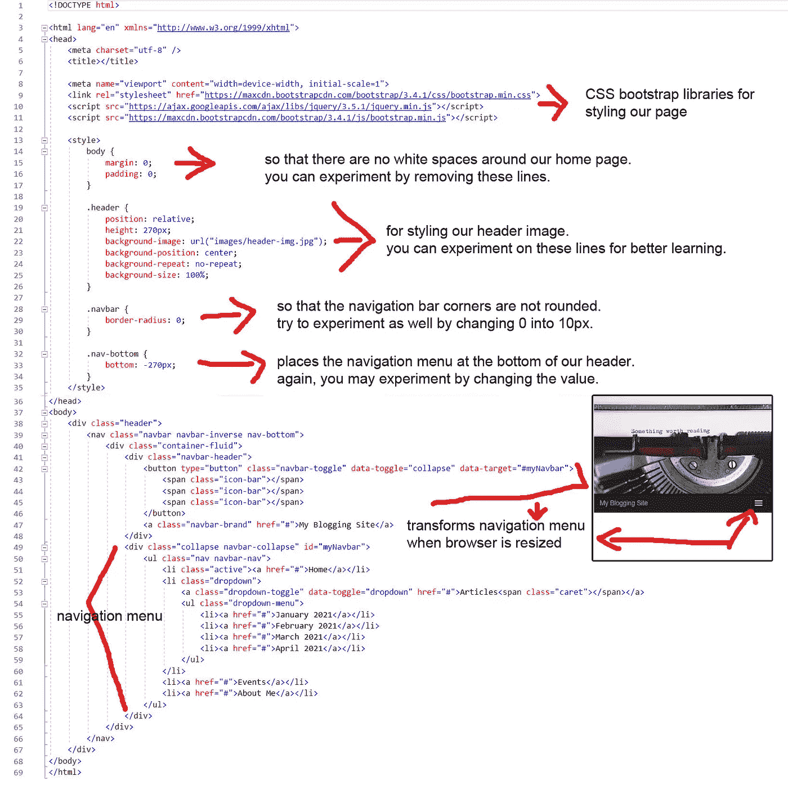

# 如何建立你的博客网站:教程，第 1 部分

> 原文：<https://medium.com/codex/how-to-build-your-blog-site-a-tutorial-part-1-830bf4f52f16?source=collection_archive---------2----------------------->

## 今天学习基础知识，将来成为大师

[真诚媒体](https://unsplash.com/@sincerelymedia?utm_source=medium&utm_medium=referral)在 [Unsplash](https://unsplash.com?utm_source=medium&utm_medium=referral) 上拍摄的照片

T4:写作很有趣，同时也很有教育意义。我们中的一些人把写作作为一种爱好，而一些人热衷于写作并有自己的博客网站。如今，拥有自己的博客网站比十年前容易多了。许多博客服务提供预先创建的博客模板。你所要做的就是为服务付费，选择你的模板，写你的博客，瞧！

但是，如果您不是程序员，并且对开发您的博客站点感兴趣，请继续阅读，学习博客站点编程的基础知识。

# 对 HTML 有什么想法吗？

在本教程中，我们将使用创建网页的最基本形式— HTML。那么，你对 HTML 有什么想法吗？如果还没有，请访问我以前的文章来学习基础知识。下面是链接。

 [## 了解如何在 10 分钟内创建一个网页

### 你想学习如何创建自己的网页吗？如果你的答案是肯定的，请继续读下去！

medium.com](/codex/learn-how-to-create-a-webpage-in-10-minutes-a5c595175f69) 

# 你将从本教程中学到什么

从本教程的整体来看，你应该学会如何建立你的博客网站。当然，在这个过程中，您应该了解 HTML、CSS、Javascript 和其他技术是如何工作的。

# 您将从本教程的第 1 部分学到什么

从教程的这一部分，我将教你如何创建你的博客的标题和布局你的博客的导航菜单。

# 我们将构建的预览

这是我们的部分主页在第一部分 ***，*** 之后的样子，我们将在这里构建主页的标题和导航菜单。

# 我们将构建的 HTML 代码的预览

下面是我们将在本 ***教程第 1 部分*** 中构建的 HTML 代码的预览。

# 我们开始吧！

为了不让你感到厌烦，我在本教程中的解释将尽可能简短。我会尽量简洁。

为了保持有组织的学习，请为本教程创建一个专用文件夹。我们先把你的文件夹命名为“MyBlogSite”。我也为自己创建了一个，它就在我的“D:”驱动器下(你可以使用任何你想要的驱动器)。所以，我的文件夹的路径是“D:\MyBlogSite”。

你需要一个编辑来为你的博客网站写网页。我推荐你下载 Notepad++因为这是 HTML 友好的。不过，任何编辑都可以。

# 1.HTML

创建一个文件，命名为“home.html”。

在您的 home.html 文件中，添加以下基本 HTML 结构。然后，保存您的文件。

# 2.引导程序

Bootstrap 是一个流行的 CSS 样式框架。我们将使用它来建立我们的博客网站。我们必须通过在标签中添加以下内容来引用它的库。你可以参考前面章节中我们将要构建的 的 HTML 代码的 ***预览，来知道在哪里插入下面的代码。***

# **3。标题图像**

我们将把标题图像放在一个

标签中。一个标签作为一个容器。它可能是 HTML 中使用最广泛的标签。

在标签后添加以下代码行。

你可能会问，“上面代码中的图像在哪里？”。这个问题的答案是图像在“header”类中。“header”是一个 CSS/style。请注意，总是使用“class”属性来引用样式。我们将在“标题”中定义图像。下面是代码。

在标签中添加以下代码。您可以参考前面章节中我们将要构建的 的 HTML 代码的 ***预览，以了解在哪里插入下面的代码。***

该图像在 ***背景图像*** 属性中定义。我用了苏西·黑兹尔伍德的照片，那是她在 pexels.com 上分享的。你可以使用这个图像，或者随意使用你喜欢的图像。注意，我把图片命名为***【header-img . jpg】***，它位于 ***【图片】*** 文件夹中。现在，为了清楚起见，在我们之前创建的“MyBlogSite”文件夹下创建一个名为***“images”***的文件夹。然后，将图像文件放在 ***【图像】*** 文件夹下。

关于其余的属性在”。*标题样式，它们都是不言自明的。我将把它们留给你去理解。:)*

# *4.导航菜单*

*在*

*标签中添加下面几行代码，这是我们在前一项 ***3 中创建的。标题图像*** 。你可以参考 ***预览我们将在前面章节中构建*** 的 HTML 代码，以了解在哪里插入下面的代码。*

*要理解以上代码，请参考第**项 *6。进一步的解释*** 在下面我指出了简短的解释。*

# *5.其他风格*

*在*

*保存您的 home.html 文件。*

# *6.进一步解释*

*这里是本 ***教程第 1 部分*** 中的完整 HTML 代码，并有进一步的解释。*

**

*第 1 部分带解释的 HTML 代码*

# *如何运行你的 HTML 代码*

*最后，通过双击**“*home.html*“**文件来查看 HTML 代码的输出。它应该会在您的浏览器中打开，如下所示。*

**

*部分主页是教程第 1 部分的输出*

*这就对了。希望你现在可以称自己为实习程序员了，哈哈！请注意本教程的下一部分。那将是 ***如何建立你的博客网站:一个教程，第二部分*** 。我将很快发表它。*

*感谢阅读！*