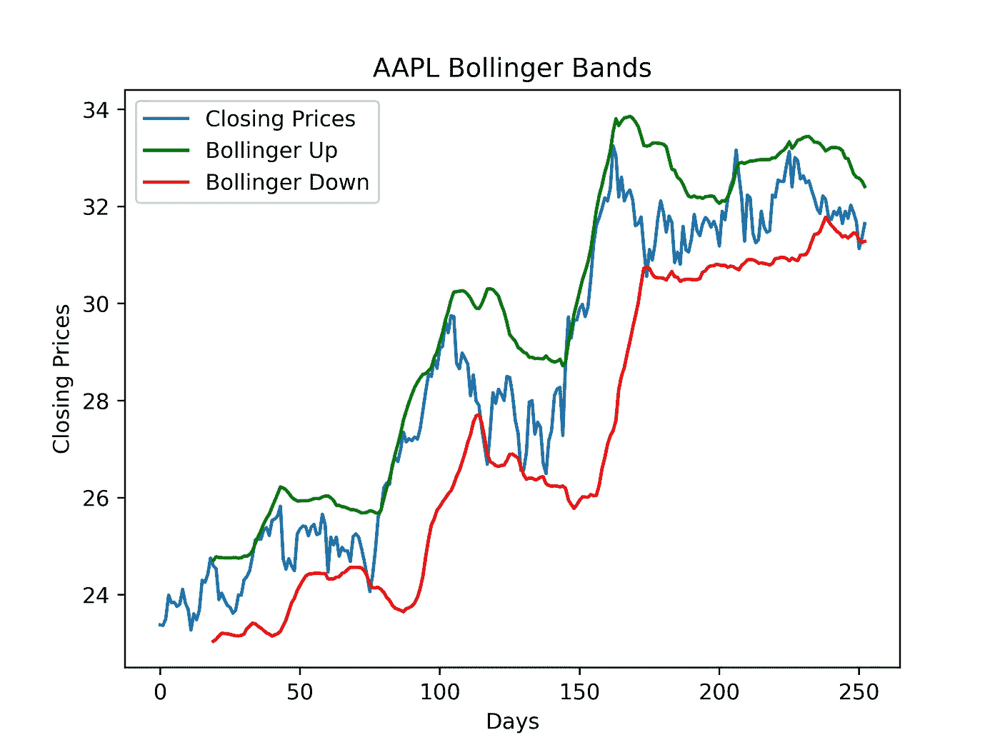
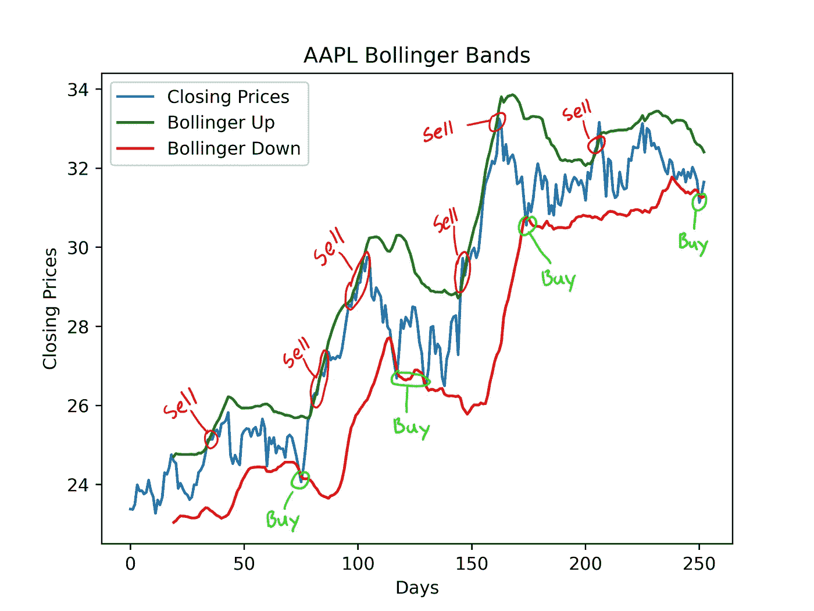
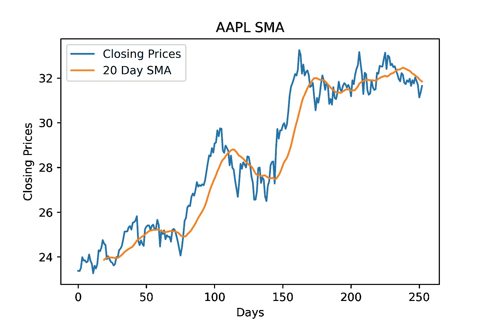
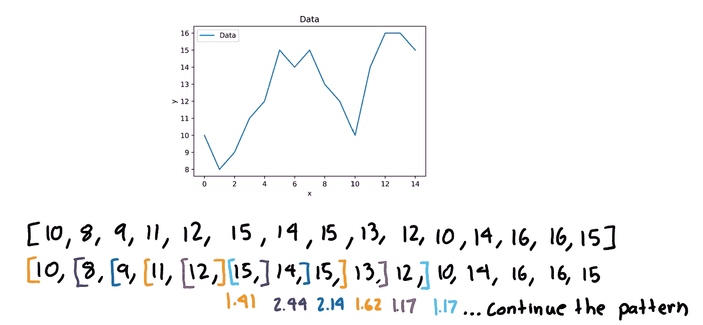

# 如何用 Python 计算一只股票的布林线

> 原文：<https://medium.com/codex/how-to-calculate-bollinger-bands-of-a-stock-with-python-f9f7d1184fc3?source=collection_archive---------1----------------------->


照片由[杰米街](https://unsplash.com/@jamie452?utm_source=medium&utm_medium=referral)

在这篇文章中，我将向你展示如何用 Python 计算任何股票的布林线。

# 第一步。安装模块

下面列出了我们需要的模块，你可以简单地用`pip3 install…`安装它们。

```
numpy==1.20.0
pandas==1.1.4
pandas-datareader==0.9.0
matplotlib==3.3.3
```

# 第二步。了解布林线

虽然我不会太深入布林线的概念，但我会试着提供对它们的基本理解。布林线是一种技术指标，允许交易者分析股票的波动性以及价格在相对基础上是高还是低。顶部波段通常比 SMA 高两个标准差，底部波段通常比 SMA 低两个标准差。这是这些波段被绘制出来时的样子。



AAPL 2014 年 1 月 7 日至 2015 年 1 月 7 日

通过查看该图，您可以快速观察到，该股票的收盘价大多位于两个布林线之间。此外，当价格线触及较低波段时，你可以识别买入信号，当价格线触及较高波段时，你可以识别卖出信号。



AAPL(信号)2014 年 1 月 7 日至 2015 年 1 月 7 日

# 第三步。计算布林线

## 步骤 3.1 计算简单移动平均

计算股票的 SMA(简单移动平均线)是计算布林线的第一步。如果你不知道什么是 SMA，你可以参考我的[文章](https://sohan-dillikar.medium.com/buy-and-sell-signals-with-the-simple-moving-average-crossover-8a51c9fa3e0a)来了解一下。假设你已经知道什么是 SMA，你可以用一个滚动平均值很容易地用熊猫计算出来。当计算布林线的均线时，交易者通常使用 20 日均线。这是你如何计算股票的均线。

股票收盘价和移动平均线的图形如下。



AAPL 20 天 SMA 2014 年 7 月 1 日–2015 年 7 月 1 日

你会注意到，SMA 线直到第一个 20 天后才开始，这是因为，为了计算 20 天的 SMA，你需要最近 20 天的股票价格。当你打印出 SMA 时，你会注意到这一点。

提示:NaN 的意思是“不是一个数字”

## 步骤 3.2 计算标准偏差

正如我前面提到的，布林线是在距离 SMA 两个标准差的地方计算的。标准偏差本质上是衡量数据分布的程度以及它与平均值的距离。

标准差的解释

就像我们如何计算 SMA 每 20 天的平均值一样，我们也将计算每 20 天的标准差。这里有一个例子，我们有一个 15 个数字的列表，我们试图计算 5 天的滚动标准差。在这种情况下，滚动意味着计算 15 天中每 5 天的标准差。



滚动标准偏差示例

继续这种模式后，您将得到以下数组。

```
[1.41, 2.45, 2.14, 1.62, 1.17, 1.17, 1.72, 1.72, 2.0, 2.33]
```

现在让我们来计算我们股票价格的滚动标准差。

股票价格的标准差

## 步骤 3.3 创建布林线

之前我提到布林线距离 SMA 有两个标准差。因此，在计算它们时，我们将对顶部波段使用的公式是`sma + std x 2`，底部波段是`sma — std x 2`。

创建布林线

# 第四步。绘制结果

现在我们有了布林线的上下轨，让我们用 matplotlib 把它们画在图上。

绘制收盘价和布林线

下面应该是结果。


AAPL 布林带

# 结论

希望计算布林线不会太难理解。这是一个非常强大的指标，但当然，你不应该只依赖这一个指标。我希望你在这一课中学到了新的东西，可以用在你未来的项目中！祝你今天休息愉快！