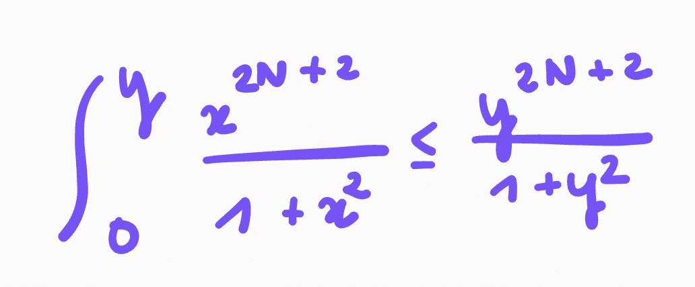

# 圆周率怎么算

> 原文：<https://medium.com/codex/how-to-calculate-pi-fb2789c0aa62?source=collection_archive---------19----------------------->

这篇文章展示了我们如何使用一点数学和函数编程来近似圆周率。

它从引入`Seq`开始，它允许在 F#中操作无限序列。在第二部分，我们将看到如何使用 F#序列来计算收敛序列的极限。然后我们将推导出圆周率的莱布尼茨公式，我们将用它来近似圆周率。


[雨果·艾特肯](https://unsplash.com/@hugoaitken?utm_source=medium&utm_medium=referral)在 [Unsplash](https://unsplash.com?utm_source=medium&utm_medium=referral) 上拍摄的照片

# 操纵序列

## 基础

F#中的序列可以是有限的，也可以是无限的，但我们将重点讨论无限序列。

为了创建一个无限序列，我们使用函数`Seq.initInfinite`。它采用一个将索引映射到相应值的函数。它返回一个序列。

例如，我们可以创建将 *i* 映射到第 *i* 个正奇数的序列:

```
let oddPositive = Seq.initInfinite (fun index -> 1 + index * 2)
```

序列是惰性的，这意味着除非我们请求，否则不会计算值。我们可以使用`Seq.item`检索索引为 *n* 的元素。例如:

```
Seq.item 6 oddPositive
// returns 13
```

`Seq.item`仅计算所需索引的值。

另一个有用的函数是`Seq.append s s'`，它将*s’*连接到 *s* 。它以常数时间运行，可用于实现为序列预先赋值的函数:

```
let prep x sequence =
    Seq.append (Seq.singleton x) sequence
```

我们将在整篇文章中使用上面声明的函数`prep`。

## 缓存序列

有时，我们可能希望计算并记住一个序列的所有先前值。这就是缓存序列的用途。我们可以创建一个，如下所示:

```
let cachedSequence = Seq.cache mySequence
```

`Seq.item n cachedSequence`计算所有索引 *k* ≤ *n* 的`Seq.item k mySequence`，因此`Seq.item k mySequence`尚未计算。它返回`Seq.item n mySequence`。如果我们请求一个已经计算过的项目，那么这个值会立即返回。

## 归纳定义的延迟和序列

函数`Seq.delay`将函数 *f: unit → seq* 作为参数，并从 *f* 返回的序列中构造一个惰性序列。正如我们将看到的，这对于构建由递归关系定义的序列很有用。

例如，我们可以构建如下几何序列:

# 计算(某些)数列的极限

这一节给出了逼近某些收敛序列极限的一种方法，只要它们足够好。

我们考虑一个收敛序列 *S* 并固定一个正容限阈值𝜀.我们将遍历序列的所有值，直到找到两个距离小于𝜀.的连续值 *S* ( *n* )和 *S* ( *n +* 1)此时， *S* ( *n* )将足够接近极限。

好吧，我承认这种说法在总体上是不正确的: *S* 可能有点迂回，值可能在一段时间内非常接近，然后彼此非常远离，在这种情况下 *S* ( *n* )可能仍然远离极限。因此有了“行为良好假说”。

我们将使用以下函数:

枚举数提供了一种遍历序列的优雅方式。当 is 找不到值时，返回 false(这种情况不应该发生，因为我们处理的是无限序列)。如果它返回 true，我们可以使用`enumerator.Current`找到序列的当前值。对`MoveNext`的下一个调用将检索下一个*当前值* *值*。

每次递归调用都会记住前一个值，这样我们就可以比较每一对连续的值。初始*前一个值*(本例中为-1.0)的选择是任意的，但是我们需要确保它不会太接近序列的第一项。

# 𝜋系列

这一节展示了我们如何利用目前所学来近似𝜋.为此，我们需要找到一个收敛于𝜋.的级数我们将使用莱布尼茨公式，因为它很容易推导。

一切从一个几何数列的求和公式开始(对于所有的 *a* ， *b* ，( *a* ， *b* )表示开区间{*x*|*a*<*x*<*b*}):


因此:


对于所有的 *x* ， *x* 属于开区间(-1，1)当且仅当- *x* 属于开区间。因此我们可以替换为 *x* = - *x* :


两边取积分:


被积函数通过其在 *y* 处的值递增并被上述值限制。因此:



上面表达式的左手边趋于 0 随着 *N* 趋于无穷大(因为| *y* | < 1)。通过挤压定理，积分趋于 0。

这给出了等式:


我们现在得知*Arctan*1 =*Pi*/4。由于*反正切*连续为 1， *Pi* /4 是*反正切* *y* 趋于 1 时的极限。

通过取极限并在两边乘以 4，我们得到圆周率的以下表达式:


# 把所有东西放在一起

我们使用`Seq.delay`构建系列，如下所示:

级数收敛得相当慢。通过 *ε* = 10^{-9}到`approximateLimit`，我们得到近似值 **3.1415926** 。

这种方法可以扩展到使用幂级数计算一个数的指数、正弦或余弦，幂级数可以从泰勒定理导出。

# 支持我！

感谢阅读！如果您觉得这篇文章很有帮助，请考虑关注我，帮助我达到继续加入中型合作伙伴计划所需的 100 名关注者的门槛。这是免费的，真的很有帮助。

也可以使用我的推荐链接订阅 Medium: [成为会员](/plans?subscribeToUserId=b705ec524bd3&source=entity_driven_subscription-b705ec524bd3------------------------------------)。你可以访问 Medium 上所有会员专用的文章，你的会员费将直接支持我。

🐙