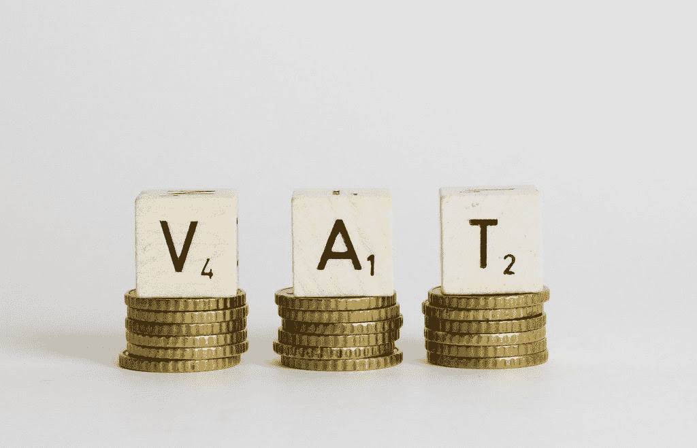

# 如何使用 Python 计算增值税

> 原文：<https://medium.com/codex/how-to-calculate-vat-using-python-856a1640d04d?source=collection_archive---------1----------------------->

因为我已经工作了近 50 年，担任过许多角色，所以在某个时候我学习并获得会计资格是不可避免的。当我开始学习会计时，学生们必须购买练习册来学习和工作。我的学习助手是一个用来做笔记和完成练习题的笔记本，一支铅笔或圆珠笔，还有一个用来计算的计算器。