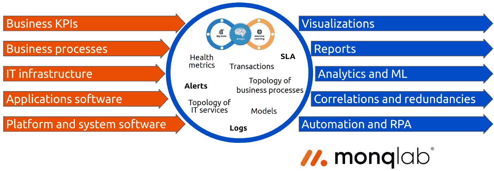
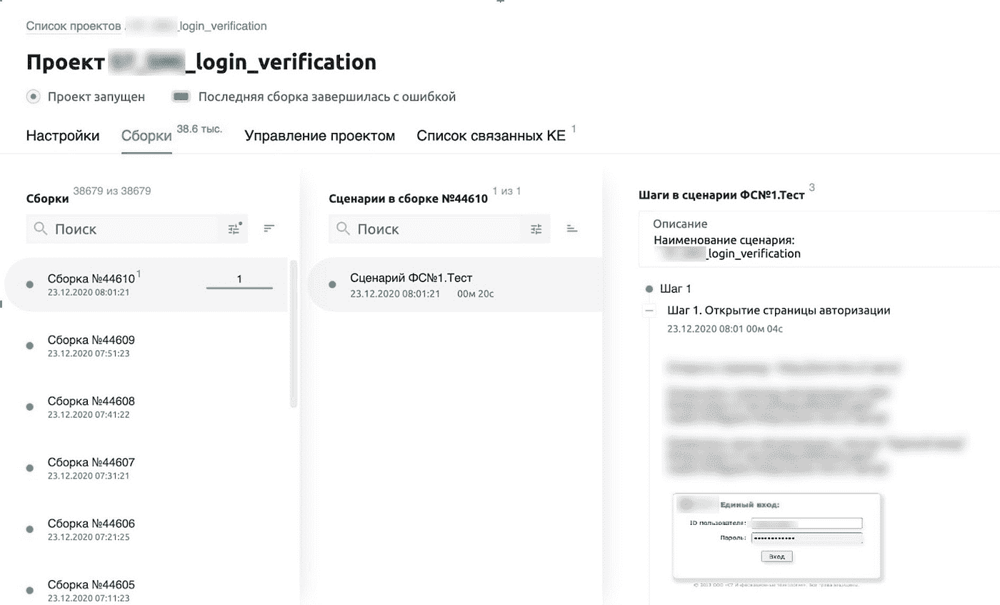
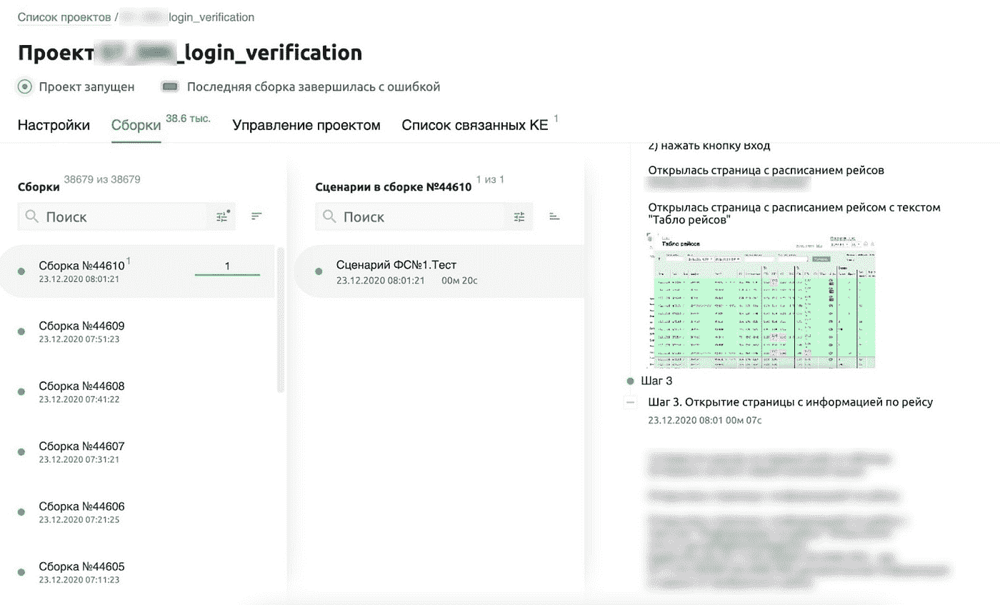
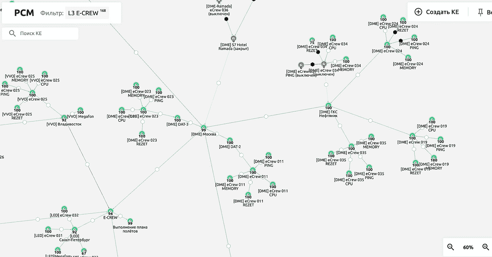
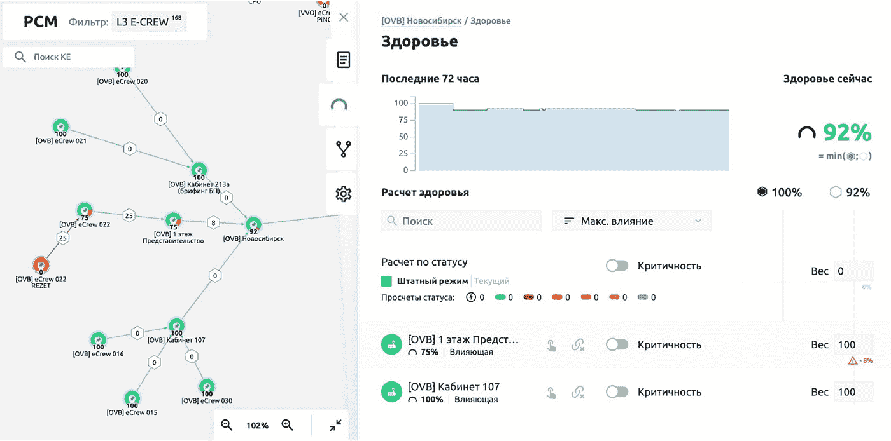
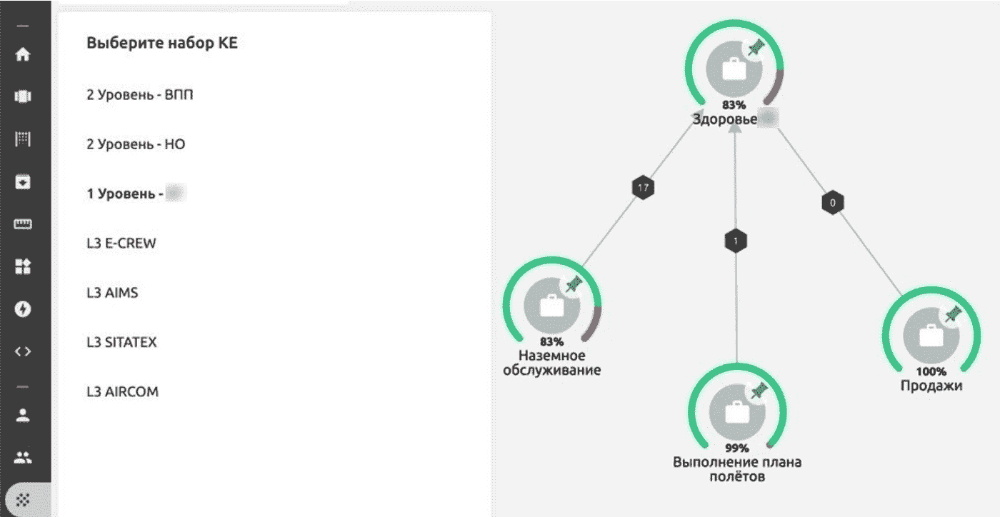

# 如何检查你的 IT 系统健康状况？

> 原文：<https://medium.com/codex/how-to-check-your-it-system-health-2b57420e2ac8?source=collection_archive---------2----------------------->

## **无 APM 的应用性能监控和运行状况指标**

我已经写过关于 AIOps 和处理 IT 事件的机器学习方法，关于混合伞监控和各种服务管理方法。现在，我想分享一个非常具体的算法，即如何使用综合监控快速获得有关业务应用程序运行状况的信息，以及如何在此基础上构建业务服务的健康指标，而无需特殊成本。这个故事基于一个将算法实现到一家航空公司的 IT 系统中的真实案例。

目前有许多 APM 系统，如 Appdynamics、Dynatrace 等，内部都有一个使用综合检查的 UX 控制模块。如果任务是比客户更快地了解故障，我会告诉你为什么不需要所有这些 APM 系统。此外，现在健康指标是 APM 的一个流行特性，我将展示如何在没有 APM 的情况下构建它们。



**既然已经有几个 IT 监视器，为什么还要另找一个解决方案呢？**

配置良好的 IT 监控允许删除许多 IT 支持任务，但它在解决几个问题时有一些限制:

**1 首先，飞机**

技术监控不允许评估现场 IT 系统和基础设施的业务功能状态。例如，当站点上的通信信道丢失时，这是网络工程师的事件，而不是企业的事件。我们有更复杂的情况，当有几个带有航站楼的房间时，机组人员必须通过登机手续，每个房间最多有五个航站楼。据了解，在“起飞”期间，一个房间中的一个或两个终端的故障不会影响程序，但三个或四个故障可能会为飞行机组人员创建队列，这可能会影响重要指标之一“飞行计划的实现”的性能，因此，必须将一部分飞行机组人员发送到另一个房间。由于失去了五个终端，我们失去了这个房间中的许多业务功能，并且启动了 BCP(业务连续性规划)程序，这是一个在企业无法访问 IT 系统的情况下工作的行动计划。用简单的技术监控很难建立这样的案例，产品团队需要一个简单的工具，它不需要在 It 监控方面有很深的能力。

**2 检查应用程序的性能，但不要深究结果的处理**

通过监控指标或日志来提供复杂系统的 100%覆盖几乎是不可能的。监控中总会隐藏一些东西，因此系统的业务功能可能不可用或降级。在这里，通过使用合成交易的方法模拟客户的动作来检查系统状态的方式变得很方便，即，模拟浏览器或应用客户端中的人如何点击按钮并获得特定结果。这样的模拟保证告诉其他用户业务功能的可用性。但是可能有许多系统和测试，查看每个系统和测试的结果既费力又耗时。这就是为什么我们还需要一个工具来“编排”合成测试和可视化结果。

**3 停止打电话询问“唯一知道的人”**

在拥有大型 IT 基础设施的组织中，所有系统都通过集成相互交织在一起，因此有时很难理解一个系统的终点和另一个系统的起点。因此，如果一个系统发生故障，它将如何影响其他系统一点也不明显。关于系统互连的信息通常只存储在一个“存储库”中——产品团队技术领导的头脑中。有必要使这些数据开放和可访问，以便在发生故障时，没有必要从员工那里探听任何可用的信息。这个问题可以通过资源服务模型(RSM)来解决，该模型将反映基础设施的各种元素对业务稳定性的影响。

休斯顿，我们有一个问题…或者没有？

具体来说，这家航空公司使用了几个监控系统:

1.  监控系统、服务器和通信渠道:Zabbix、Prometheus for systems in Kubernetes、
2.  麋鹿家族(elastic — logstash — kibana)平台上日志的监控。

这些组件中的任何一个都可能会报告偏差，而且一般来说，没有一个公共的地方可以看到组件的整体状态。

**5 篇报道不是为了报道**

管理层希望看到业务功能的健康状况，而不是 IT 组件的健康状况，无论是回顾还是实时。报告应该在一个地方可用，并带有“非技术人员”可以理解的可视化，而不是在工程师为工程师创建的界面中(如 Zabbix 或 Grafana 仪表板)。这种报告应该是每日的，并且反映一天中在不同执行者的责任范围内发生了什么，以及什么事件影响了特定服务的降级。以前，这样的报告通常是主观的，因为它们是基于工程师提供的关于重大事件的总结。通常，管理层必须亲自给每个负责人打电话，澄清细节。

**6 先往哪里跑？**

还需要考虑对业务的影响来计算 SLA。例如，每周三有一趟飞往某个城市的航班。其他日子和机场沟通不上，以及起飞前五点左右的航班当天，其实对业务没有影响。我希望在分析该期间的 SLA 时考虑到这一点。此外，SLA 应该帮助工程师区分行动的优先次序:如果一个事件发生在出发时间前后，当你必须对它做出 24/7 的紧急反应时，这是一回事，如果没有人计划在不久的将来使用它的功能，那么这种事件可以被放在公共队列中是另一回事。人们希望用一种直观的工具来解决这些问题，这种工具不需要产品团队具备深厚的技术能力。

我们开始实施一个解决方案，该方案将涵盖 IT 监控无法正确处理的所有这些任务。因此，我们提出了以下一组监控组件:

1.  Zabbix 和普罗米修斯进行度量分析，
2.  用于分析日志的 ELK，
3.  Jenkins 管理实际上是自动测试的合成检查的启动，加上 Selenium 作为用 Python 编写自动测试的库，
4.  Monq 用于聚合所有事件、编排合成检查、组合分析和过程自动化。

在这种情况下，前两个组件已经就位，后两个组件必须安装并相互集成。

有必要解决以下任务:

1.  确保该解决方案可以作为来自所有当前监控系统的数据聚合的单一公共场所，
2.  将 web 界面和桌面应用程序的功能综合测试结果可视化并显示在一个屏幕上，
3.  在整个 IT 基础设施中构建服务的资源服务模型，
4.  配置基于警报的自动响应，并测试基于脚本的自动化功能。

为了安装平台和必要的功能监控环境，我们需要分配 11 台虚拟机(4 台用于 monq，7 台用于 Jenkins 节点)。分配资源可能是我们项目中最长的阶段。

# **合成监控**

综合监控是对用户或外部系统可能执行的操作的模仿，然后监控这些操作的结果。它有时也被称为功能监控或综合事务监控。

正如我在上面写的，在这个项目中，我们需要向客户展示我们可以测试 web 界面、桌面应用程序，并检查业务功能的可用性。

因此，编写了许多功能性自动测试来测试业务功能。测试相对较小，由几个步骤组成，启动测试的周期为 5 分钟。关键问题是检查系统中的授权，并检查向最终用户交付可视化的重要信息。对于测试中的每个步骤，触发器都被配置为超过步骤关键执行时间。

最后，我们看到了测试结果，根据测试结果，已经有可能评估我们的应用程序的业务功能的工作，这是因为这样一个事实，即一个错误，由于这个错误，一个或另一个步骤失败了，在界面上是可见的，并且错误的屏幕截图在任何时候都是可用的。



*内部网门户上的授权检查示例*



*查看航班表可用性的示例*

我将一步一步更详细地描述 web 测试的逻辑(图片大部分是俄语的，因为它们是一家俄罗斯航空公司的实际安装截图)。

**1。打开授权门户页面。检查是否有文本—“单点登录”:**

```
browser.timeout = 25with allure.step(‘Step 1\. Opening the login page’):try:browser.get(“https://***/”)browser.xpath("/html/body/div[2]")assert browser.xpath(“/html/body/div[2]/div[1]/span[contains(text(), ‘Single sign-on:’)]”)allure.attach(‘screenshot’, browser.get_screenshot_as_png(), type=AttachmentType.PNG)except:allure.attach(‘error_screen’, browser.get_screenshot_as_png(), type=AttachmentType.PNG)raise
```

**2。我们输入所需的授权数据并点击“登录”按钮:**

```
with allure.step(‘Step 2\. User authorization’):try:smi_login = browser.xpath(“//*[@id=’IDToken1']”)smi_login.click()smi_login.send_keys(“***”)smi_password = browser.xpath(“//*[@id=’IDToken2']”)smi_password.click()smi_password.send_keys(“***”)browser.xpath(“/html/body/div[2]/div[2]/form/input[1]”).click()assert browser.xpath(“/html/body/app-root/div/div/s7-header/div/div/div/div/div[1]/h1[contains(text(), ‘Flight table’)]”)allure.attach(‘screenshot’, browser.get_screenshot_as_png(), type=AttachmentType.PNG)except:allure.attach(‘error_screen’, browser.get_screenshot_as_png(), type=AttachmentType.PNG)raise
```

**3。打开有航班信息的页面。选择一个航班，点击它，航班信息窗口打开，检查文本“航班信息”是否存在:**

```
with allure.step(‘Step 3\. Opening the flight information page’):try:browser.xpath(“//*[@id=’flightTable’]/tbody/tr[1]/td[1]”).click()browser.xpath(“/html/body/app-root/div/div/main/flight-info/div/div/leg-info/div/div/div[1]/div[1]/passengers-summary/div/div[1]/div[2]/div[1][contains(text(), ‘Flight Information’)]”)allure.attach(‘screenshot’, browser.get_screenshot_as_png(), type=AttachmentType.PNG)except:allure.attach(‘error_screen’, browser.get_screenshot_as_png(), type=AttachmentType.PNG)raise
```

# **数字健康服务**

数字健康指标是一种显示 IT 基础架构元素、服务或业务功能在多大程度上满足客户(其他 IT 组件或最终用户)需求的指标。服务运行状况是根据内部审核和其他 RSM 相关 IT 组件的影响来计算的。例如，如果我们有三个数据库节点，其中有一个主节点和两个从节点，并且主节点出现故障，那么运行状况将降为零，如果一个从节点出现故障，那么运行状况将低于 100%，这符合解决方案体系结构中定义的影响加权系数。

因此，在这个阶段，平台已经接收到事件，综合检查的结果已经呈现，我们继续进行最有趣的事情之一——为机组人员办理登机手续的航站楼创建资源服务模型。

我们已经将所有的终端划分为存在点(机场)和它们在建筑物内的实际位置，这样就可以更容易地进行视觉导航，之后也可以更容易地根据位置及其重要性设置自动化。



*RSM 屏幕显示元素之间的关系及其相互影响。如果一个 CU 出现故障，相关的 CU 将以红色亮起。*



还可以查看 RSM 图上元素的状态及其对 CU 健康水平的贡献。

为了方便起见，我们为不同级别的员工设置了几种不同的 RSM 视图。

L1——整体“业务”的健康是显而易见的。

L2——独立信息系统的健康。我们还在这里包括了功能监控的结果。如果我们在测试中发现错误，我们可以更深入、更详细地了解基础架构级别发生了什么，以及哪些事件导致了 IT 系统的降级或不可访问性。

L3 是最详细的视图，描述了基础架构中每个元素的工作方式。



*在顶层，您可以看到公司主要 IT 服务的运行状况。*

基于服务的健康指标，我们设置了自动响应，其中为一些事件设置了脚本来控制终端设备。但这是另一个故事，所以我不会在本文的框架内描述它。最重要的是，在两个月的时间里，我们配置了最重要的业务 IT 运行状况指标的可视化显示，该显示基于对来自 IT 基础架构的日志和指标的综合检查以及根本原因分析。这两个月的软件产品成本不到 15 万卢布(约合 2000 美元)，人工成本——全职 2.5 人。在我看来这是个好结果。任何 APM 解决方案都要贵一个数量级。