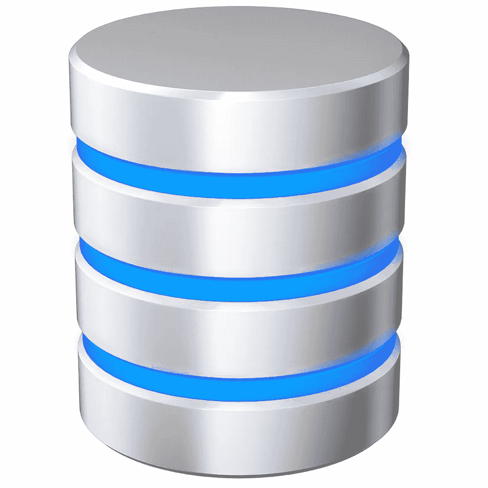

# 如何选择关系数据库

> 原文：<https://medium.com/codex/how-to-choose-a-relational-database-5fbe2b744623?source=collection_archive---------10----------------------->

选择正确的数据库可能很棘手。你正在做一个业余爱好项目吗？还是针对一个拥有庞大开发团队的公司？让我们来看看可能会影响您决策的一些因素！

## 开源与商业

商业数据库已经存在很长时间了。一些流行的是 Oracle 和 IBM DB2。数据库软件的许可费用很高，并且只能用于商业用途。这些是提供有保证的按需技术支持的高级数据库。它们还包括一大套工具，可以解决您或您的客户可能遇到的大多数问题。软件安装和更新由系统专业人员管理。像 Oracle 这样的商业数据库也有系统需求规范。这意味着在使用数据库之前，您的企业可能必须升级其硬件。

开源数据库非常适合小型项目，包括 MySQL、MariaDB、PostgreSQL 和 SQLite 等等。这些都是免费使用的，并得到了大量开发者和用户的支持。软件安装和更新由用户进行，如果需要，用户可以向社区寻求支持，但是没有官方的技术支持。由于它们是开源的，源代码可供查看，用户可以根据自己的需要为自己的数据库更改源代码。

## 开源比较

MySQL 以兼容其他类似的数据库系统而闻名。MySQL 将速度和性能放在首位，但这是以牺牲大多数其他开源数据库的一些特性为代价的。MySQL 是 Oracle 提供的免费层开源数据库，因此背后有强大的技术支持团队。

MariaDB 与 MySQL 完全兼容，因为它实际上是作为 MySQL 源代码的一个分支开始的。创建 MariaDB 是为了提高 MySQL 的速度，在大多数情况下都是这样。MariaDB 是由社区支持的，而不是像 MySQL 这样的公司。因此，虽然 MariaDB 在技术上是一个优于 MySQL 的数据库，但 MySQL 以无与伦比的按需技术服务和支持弥补了这一点。

PostgreSQL 近年来越来越受欢迎，因为它能够处理 SQL 和 NoSQL 数据库类型。它比其他开源数据库有更多的特性，比如支持多种数据类型。很容易在本地或云中实现。一些用户发现缺少 PostgreSQL 文档。

SQLite 不能直接与其他关系数据库相比，因为它是一个无服务器的嵌入式系统，而不是传统的客户机/服务器模型。SQLite 体积小，用于正确的目的时快速有效。常见的用途是恒温器、相机、无人机、医疗设备和低流量网站。最初的用例及其被开发的原因:导弹驱逐舰上的损害控制系统！

## 存储和托管需求—云与本地

随着像 AWS 这样的云服务越来越受欢迎，在本地存储信息和托管数据库一直在下降。如果您正在创建一个用户数量固定或有限的应用程序，那么本地数据库可能是最简单、最便宜的解决方案。也可以免费做。然而，大多数云服务都提供免费层，除非使用的存储量超过某个阈值，否则不会对服务收费。云服务还可以提供许多额外的服务，比如非常有用的分析。安全性也是顶级的，并且成本是内置的，不像必须自己用本地数据库监控它。然而，如果你正在为用户有限的学校构建一个应用程序的演示项目，那么在大多数情况下，本地托管的数据库就可以了，而且还能为你省钱。如果您正在托管大量用户，或者正在期待任何突然的增长，云数据库很可能是最安全和最有效的选择，并且允许轻松的可伸缩性。

如果您想从小型本地数据库开始，但最终迁移到云数据库，PostgreSQL 或 MySQL 提供了本地和云兼容的版本，以便轻松过渡。如果您不打算迁移到云数据库，您可以为本地数据库使用轻量级的简单 SQLite。

## 结论

大量可供选择的免费使用的开源数据库和免费的云服务使数据库进入了一个激动人心的时代。过去大公司是追求质量的唯一选择的日子已经一去不复返了。测试哪个数据库适合您的最佳方法是开始自己探索！尝试使用不同的数据库构建和完成相同的事情，看看哪一个适合您！