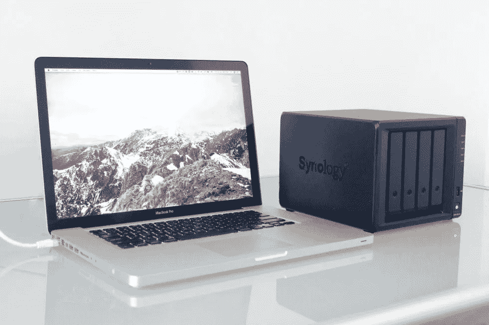
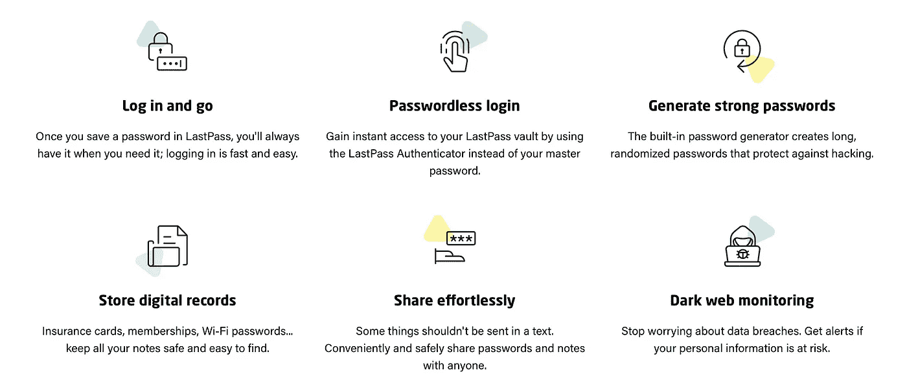
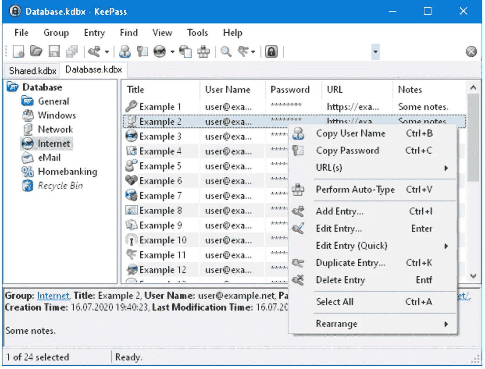
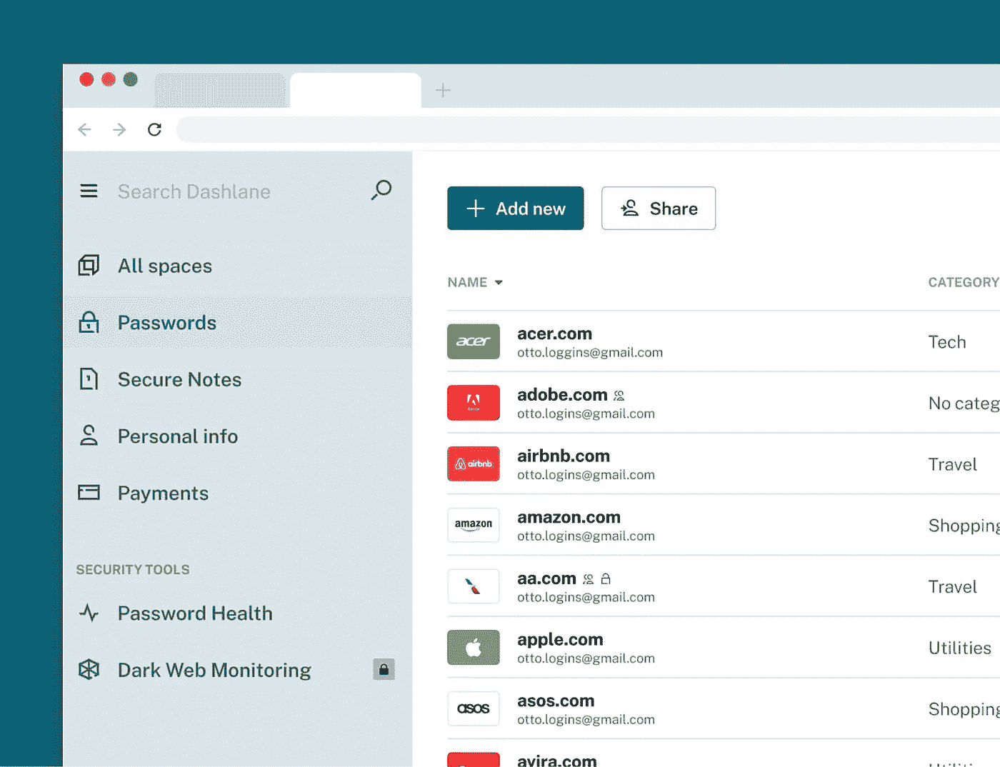
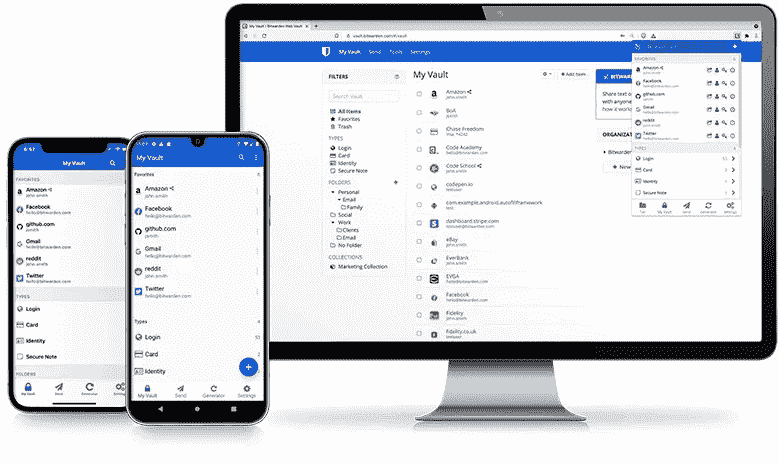

# 如何选择最适合你的密码管理器

> 原文：<https://medium.com/codex/how-to-choose-the-best-password-manager-for-you-546e97d06cbf?source=collection_archive---------11----------------------->

## 在密码管理器中保护您的密码和其他个人数据。还是没有？

如今，人们比以往任何时候都更多地在智能手机和其他设备上存储个人信息。数字时代的兴起也导致了数据泄露和身份盗窃的增加。因此，人们越来越意识到保护个人数据的必要性。

为了确保您的个人信息保持安全，您应该使用密码管理器。本文解释了什么是密码管理器，它相对于其他安全措施的优势，以及当今市场上一些最好的密码管理器。

# 什么是密码管理器？

密码管理器是一个程序或应用程序，可以帮助您创建和存储各种网站和应用程序的密码。因为你只为你使用的所有服务创建一个密码，记住它变得容易多了。不用用几个不同的密码登录不同的网站，你可以把它们都放在一个地方。密码管理器可以是电脑或智能手机上的软件程序或应用程序。或者，它们也可以是手机应用程序，让你在手机上安全地访问密码。

# 使用密码管理器的优势

安全:使用密码管理器最明显的好处是它增加了你的数据的安全性。由于您只需记住一个密码就可以访问您存储的所有信息，因此保护您的信息安全要容易得多。

**效率和便利:**使用密码管理器的另一大好处是，它能让你更高效地访问你的信息。你不必记住几十个日常网站、应用和自动化服务的登录凭证。你只需要一个主密码就可以访问所有的网站。

# 密码管理器是如何工作的？

密码管理器让您可以为各种网站和应用程序创建和存储密码。当您需要访问该信息时，您只需记住一个主密码即可访问该信息。

> *建议对您的主密码使用双因素认证，以增加您的帐户访问的安全性。*

为此，我有一个简单易用的用于 iPhone 的*代码认证器*应用，但商店里还有很多其他应用。

密码管理器要么是**软件程序，要么是手机应用**。它们既可以在线使用，也可以离线使用，因此你可以在电脑、智能手机或平板电脑上使用它们。当你安装或设置密码管理器时，你需要告诉它你想为哪些网站和应用程序存储密码。您还可以选择想要保密的数据，如银行账号和财务信息。密码管理员有他们的用户帐户系统，以便您可以轻松地访问所有设备上的信息。

张宇人摄

# 您应该使用哪种类型的密码管理器？

# 云密码管理器

对于个人或商业用途，这是最常见的密码管理器。通过使用它，您可以将信息存储在您选择的任何服务提供商的服务器上。

> 密码和其他信息被加密，这样即使是他们的员工也看不到。

这是他们告诉我们的，但我宁愿在我的 NAS 设备上安装一个密码管理器，以获得更好的隐私。下一节将详细介绍这一点。

**云**密码管理器的主要优势:

*   您不必自己托管和维护服务
*   跨多种设备(电脑、平板电脑、手机)访问
*   大多数服务提供商提供了几种订阅模式供选择(从几美元起)
*   有些是免费的(不推荐)或内置在操作系统中的(例如，用于苹果设备的 iCloud 钥匙串)

无论你选择哪家云密码管理服务提供商，你都必须信任他们和他们的隐私政策。这对于注重隐私的用户来说是一个很大的缺点。

# 内部密码管理器

如果您想在自己的服务器或设备上托管和管理密码管理器，这种类型适合您。

例如，你可以把它放在 Docker 里的一个 **Synology NAS** 设备上。我是这样用 Bitwarden (Vaultwarden)密码管理器的。NAS 设备是非常强大的机器，不仅用于简单的存储，还可以托管许多有用的服务，如 Docker、Plex、自有云驱动器、照片、日历、联系人、邮件等。但这是另一篇文章。

**内部**密码管理器的主要优势:

*   您在服务器上托管和维护密码管理器，以增加隐私
*   没有月费或年费，但是如果你需要为此购买设备，价格可能会更高
*   您可以将它本地托管在一台电脑上(不能从互联网访问，因此不能在多台设备上同步)
*   将它托管在类似 NAS 设备的服务器上(可以从互联网访问它，并使它在多个设备上可用)

正如我之前提到的，我更喜欢在 NAS 设备上本地使用它，如果我可以做到，您也可以做到。当然，这需要一些时间来学习，但有了这些设备，你可以得到的不仅仅是一个密码管理器。

> *考虑隐私、数据所有权以及您可以通过云做的许多其他事情。*

也许这种类型的主要缺点是你需要在技术上更加精通，但是来自论坛社区的一些帮助足以让你开始做一些基本的事情。

# 移动和基于浏览器的密码管理器

这些密码管理器是最方便的，但我永远不会使用它们。两者都没有不同浏览器之间的同步，基于浏览器的对于共享设备来说真的很危险。

> 浏览器并不是用来做好密码管理的。我肯定会怀疑安全部分。

有人会说这比什么都没有好，或者比在多个网站和服务上使用相同的密码好。我同意这一点，但对于一杯咖啡，你可以得到一个密码管理器，让你安心。

照片由 regularguy.eth 提供

# 哪个最好？

没有最好的密码管理器，因为它取决于您的需求和您选择的类型。它们大部分都共享相同的核心功能，只是有些附加功能。其中大多数都可以在所有主要的桌面平台上使用，包括移动和智能手表。

然而，这里有几个我已经尝试过的和其他几个值得一看的，更侧重于价格，因为几乎所有的都提供类似的功能。

# 最后一遍

如果我没记错的话，这是我尝试的第一个密码管理器。那是 10 年前，我还在用 Windows 和 Android 的时候。

LastPass 的主要特点。截图来自 LastPass 网站。

他们提供了一个免费的计划，有无限的密码，保存和自动填充密码，密码生成器和一些更多的功能，但你只能在一个设备上使用，电脑或手机。查看他们网站上的其他付费计划。

我不得不说，那时我很喜欢使用 LastPass。可能是因为它和我现在用的很像。

# KeePass

KeePass 是一个免费的、开源的、轻量级的、易于使用的密码管理器。使用它很有趣，官方只针对 Windows，但是有很多针对其他平台的[非官方软件包](https://keepass.info/download.html)。

保持主窗口不变。截图来自 KeePass 网站。

这个密码管理器很有趣。它在我的 Windows 笔记本电脑上，在我的 Android 手机上，我正在使用一些应用程序(不记得了)，但它不是很方便。我在寻找一些更容易使用，但仍然有所有的隐私和安全的好处。

# 仪表板

我试过的最好的密码管理器之一。我只玩了很短的时间，所以除了一切都很好之外，我没有太多要说的。它拥有创建密码和存储其他敏感信息所需的一切，但这是有代价的。这是我试过的所有产品中最贵的，但仍然值得一看。

截图来自 Dashlane 网站。

# 比特监狱长

这是我选择的一个密码管理器，我已经用了 4、5 年多了。首先，它是开源的，可以在各种平台上使用，而且免费，没有什么限制，但是你可以选择每月支付不到 1 美元的费用(正如他们网站上所说的)。对我来说，这是一次与 LastPass 非常相似的经历，我不知道 LastPass 现在怎么样，但我也不感兴趣。

截图来自 Bitwarden 网站。

我目前通过 Docker 在我的 Synology NAS 上使用 Bitwarden，它完全符合我的需求。所有数据都在我家里的一个设备上，但我也可以从外部访问它。我不需要马上更换密码管理器，从我的角度来看，这是最值得推荐的存储密码的方式。

> 无论是否是自托管的，Bitwarden 密码管理器都是我要走的路。

# 值得一提的其他密码管理器

有许多密码管理器我还没有尝试过，但我会列出几个我遇到过的。

*   **1 密码**
*   **iCloud 钥匙扣**
*   **诺德帕斯**
*   **机器人形态**
*   **保管员**
*   **Enpass**
*   和许多其他人

# 结论

密码管理器帮助您安全地存储您的密码和其他重要信息。它们还可以让您更轻松地访问不同的设备和服务。

> 如果您想提高数据的安全性，请使用密码管理器。

密码管理器是保护数据的一种很好的方式，但是它们也有缺点(云服务)。它们的使用有时会令人困惑，而且与好的密码策略相比，它们不一定能提供很多额外的安全好处。这取决于你是否需要一个密码管理器，纸和笔，或者用你有的密码系统把一切都记在脑子里。

您使用的是什么密码管理器，如果有的话？请在评论中告诉我。

感谢您的阅读。一直很感激。

汤姆(男子名)

*原载于 2022 年 10 月 3 日*[*https://www.tomathosblog.com*](https://www.tomathosblog.com/how-to-choose-the-best-password-manager-for-you/)*。*