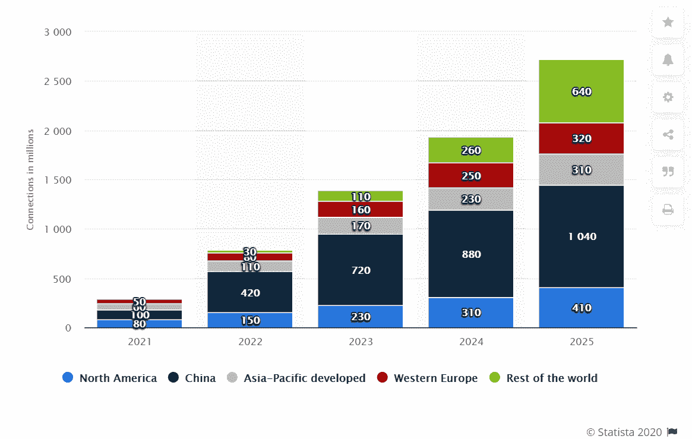

# 如何选择合适的外包开发公司？

> 原文：<https://medium.com/codex/how-to-choose-the-right-outsourcing-development-company-31f9e7a9ac54?source=collection_archive---------17----------------------->

随着技术革命，很多事情都变了。因为现在市场上有如此多的新事物。技术的总体影响是积极的，因为它便利了人类生活和商业运作。

如果你还没有体验过技术的优势(在商业运作中)，现在 [**雇佣软件开发者**](https://bootesnull.com/hire-developers/) 。一个网站可以帮助你与用户全天候互动。此外，技术还有许多好处。

尽管大多数企业并不精通“如何选择合适的外包开发公司？”。如果您有同样的顾虑，我们会全力支持您。今天，我们将带您了解轻松找到可靠公司的最佳途径。

我们开始吧！

# 需要外包开发项目

软件开发项目需要花费大量的时间、金钱和精力。然而，一个公司并不总是拥有在项目中获得成功的一切。比如说；人力、技术专长、时间或其他必要的资源。

在这样的场景下， [**外包一个开发**](https://digibharata.com/advantages-of-having-custom-website-developed-by-expert-web-development-team/) 项目是最好的方案之一。然而，还有很多其他的原因可以解释为什么现在的企业更喜欢外包项目。要了解更多原因，请阅读下面的内容。

*图片来源:* [*daxx*](https://www.daxx.com/blog/development-trends/it-outsourcing-trends)

# 外包项目的原因和优势

*   通过外包一个开发项目，你(你的企业)获得了一个巨大的人才库。这意味着拥有多年经验和顶尖技能的专业人员会为您的项目工作。因此，项目成功的机会是有保证的。
*   当缺乏特定的技术专长时，选择外包是最好的解决方案。因为这有助于企业完成任务/项目并获得成功。此外，这是 IT 行业中一个非常普遍的问题，因为缺乏所需的技术专业知识。
*   外包开发项目时，企业获得的最大优势是成本效率。虽然对于从未外包过任何项目的 [**软件开发公司**](https://digibharata.com/best-software-development-companies/) 来说可能难以置信，但是外包项目节省了大量成本。
*   通过外包项目，你的企业可以获得的另一大优势是进入国际市场和外国合作伙伴。
*   通过外包，你可以减轻内部团队的额外负担，让他们有时间去做其他重要的任务或项目。
*   当你 [**雇佣一个开发公司**](https://digibharata.com/hire-react-native-developers/) 或者外包一个项目时，你的内部团队可以专注于一个核心商业价值。

# 外包开发项目之前要考虑的事情

现在看完了外包项目的理由和优势，你一定会被说服外包你的下一个项目。尽管如此，如果你有任何疑问或第二个想法，那么看看“外包开发项目要考虑的事情”。这将帮助你获得最大的优势。

# 外包服务要考虑的要点

*   你有足够的人力吗？首先，你需要检查你是否有足够的人力或资源来开发这个项目。如果你有软件开发人员，那么放弃外包的想法。相反，如果你没有项目所需的资源或人才，那么外包无疑是最好的选择。
*   你有预算外包吗？现在，当你决定外包开发项目时，确保你有足够的预算。虽然外包是一种经济高效的解决方案，但不要选择极低的代理价格，因为这意味着低质量。而是在同一个地方寻找价格和质量。
*   你有这个领域的专业知识吗？如果你已经有一个拥有项目所需的专业知识和经验的内部团队，那么就不需要外包。然而，当项目中的任何一点缺乏领域专业知识时，选择外包服务。

# 外包模式的类型

首先，你需要 [**了解外包模式**](https://bootesnull.com/blog/outsourcing-vs-offshoring/) 。下面提到了 3 种主要的外包模式。

*   基于位置的
*   基于关系的
*   基于项目的

# 在外包公司找什么？

许多企业发现在初始阶段很难恰当地外包需求，但它促进了整体业务增长。例如，外包是可靠的、高成本效益的，并且加快了产品/服务的上市时间。

然而，如果你第一次踏入 [**IT 外包**](https://digibharata.com/advantages-of-having-custom-website-developed-by-expert-web-development-team/) 市场去寻找一家可靠的软件公司，你可能会被你的选择吓倒。

这只是把一个简单的任务变成了一场大的斗争，害怕一个错误的选择会导致延误、浪费资金，甚至更糟。

## 了解你的需求

在外包项目之前，充分了解和理解你的需求。这将有助于你更好地解释你的商业目标。此外，你会理解技术专家用来解释或愚弄你的术语(如果使用的话)。

## 检查公司的技术专长

无论如何，但是你必须检查公司或他们的专业人员的技术专长，这是你的项目所需要的。否则，成功的机会就会减少。检查技术专长的一些最佳方式是查看公司过去的工作、投资组合、客户评论、处理复杂项目的经验、沟通、应对业务挑战的方法、遵守期限，以及最重要的对建立技术革命的热情。

## 他们有以客户为中心的方法吗

即使外包合作伙伴拥有顶尖的技术专长，但缺乏以客户为中心的方法，那么选择其他人来获得项目的成功。

## 检查他们的市场声誉

在没有交叉验证当前市场声誉的情况下，不要相信任何人。这个小失误会让你的企业或项目付出巨大的代价。

## 与外包合作伙伴匹配您的预算

在金钱方面达成一致是开始的必要条件。此外，把所有与预算相关的东西都写下来，以避免出现问题。

## 检查他们的软件开发模型

询问公司他们提供什么样的外包模式，以确保它符合你的业务和项目需求。

## 考虑金融稳定性

要与一家可靠的开发公司合作，先简单看一下股权结构、合作伙伴、收购计划等因素。避免陷阱。

## 信任和安全因素

当外包一个开发项目时，你将不得不与外包的合作伙伴分享你的关键业务信息。因此，在初始阶段考虑信任和安全因素是很重要的。

## 售后/交付服务和未来支持

开发项目是一个永无止境的过程。这意味着即使在项目完成后，你也需要技术专家的支持。因此，提前询问外包合作伙伴有关交付后或项目完成后的支持。

## 最后但同样重要的是，一定要去试驾

你必须考虑的最后一点是在实际购买前进行试乘。这将使你了解你将从所选择的合作伙伴那里获得的服务类型。

# 选择合适的外包开发公司的步骤

印度是全球 IT 或开发项目的主要外包中心之一。因为它提供了如此多的优势，如预算内的强大解决方案等。但是，您可以选择任何国家或地区的外包合作伙伴。要通过外包开发项目获得巨大的利益，请遵循下面提到的步骤。

# 选择合适的外包开发公司的 5 个步骤

1.  明确你的目标=简明扼要地解释你的目标。
2.  获取技能=在最终确定外包合作伙伴之前，获取他们的技能。
3.  市场价值和头寸=永远不要忘记检查你选择的合作伙伴的市场价值和头寸。
4.  核实细节=始终彻底核实外包公司提供的每个细节，以确保安全。
5.  明智地选择=一旦对一切都确信和满意，做出明智的决定。

# 最后一个音符

现在，你已经掌握了理论知识，所以继续在现实世界中为你的下一个项目利用这些知识。此外，当在美国 雇佣一家 [**网络开发公司时，确保适当地遵循这些步骤以获得更好的结果。**](https://bootesnull.com/usa/)