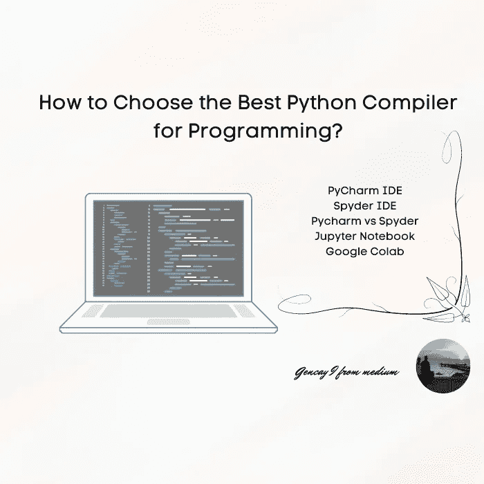

# 如何选择最好的 Python 编译器进行编程？

> 原文：<https://medium.com/codex/how-to-choose-your-python-compiler-and-why-cdb914fe6f87?source=collection_archive---------2----------------------->

## Jupyter 笔记本还是 Google Colab？或者是皮查姆或者斯派德？

作者图片

# 介绍

现在，假设你将开始你的编程生涯，你选择 Python 作为编程语言，但是如何选择你的 Python 编译器(Python 编码环境)，为什么？