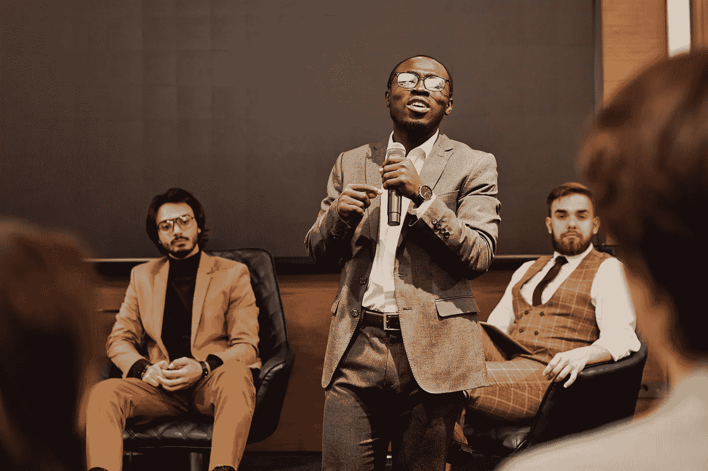

# 如何使用深度神经网络对声音进行分类

> 原文：<https://medium.com/codex/how-to-classify-sound-using-a-deep-neural-network-1dccfadb245f?source=collection_archive---------7----------------------->

## 使用 Keras 的分步示例

[亨利·马蒂厄·圣洛朗拍摄的照片](https://www.pexels.com/photo/a-man-speaking-holding-a-microphone-8349233/)

在本帖中，我们将看到一个实际案例，如何用 Keras 建立一个模型来区分不同的说话者。

由于我的目标是展示创建和训练一个可用于此目的的模型是多么简单，所以我不会详细介绍。