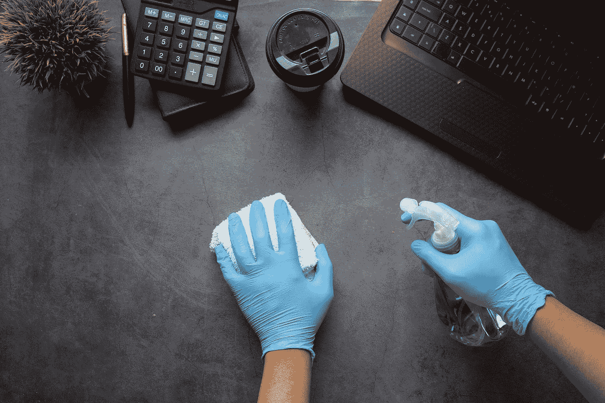

# 如何用 SQL 清理数据

> 原文：<https://medium.com/codex/how-to-clean-data-with-sql-613d1e9ebbb1?source=collection_archive---------0----------------------->

在 [Unsplash](https://unsplash.com?utm_source=medium&utm_medium=referral) 上由[Towfiqu barb huya](https://unsplash.com/@towfiqu999999?utm_source=medium&utm_medium=referral)拍摄的照片

# 介绍

我将在这个项目中使用 PostgreSQL 大部分语法是标准 SQL，它可以在 MySQL 或 BigQuery 等其他数据库中工作。

# 资料组

该数据集是关于 GlassDoor 上的数据科学职位发布的，已经直接从该网站上删除。它包含 15 个描述职位空缺和公司的栏目。可作为公共…