# 如何使用数据可视化比较组间数值？

> 原文：<https://medium.com/codex/how-to-compare-values-between-groups-using-data-visualization-cf07101fd9c?source=collection_archive---------3----------------------->

Giorgio Tomassetti 在 [Unsplash](https://unsplash.com?utm_source=medium&utm_medium=referral) 上拍摄的照片

数据可视化是数据分析的艺术。这是数据探索的重要组成部分。如果没有，人类将面临许多解释数据集的困难，因为通常人眼不能同时处理大量信息，这是数据可视化的工作，使我们更容易理解。

在这篇文章中，我想分享如何使用数据可视化来比较组之间的值。关键部分是“比较价值观”。因为数据可视化有很多用途，比如比较数值，查看数据如何分布，显示随时间的变化，查看关系或相关性，地理数据等等。像往常一样，我们将使用 Google Sheets 作为一般概念，您可以使用任何您喜欢的工具来实现它，比如 R、Python、Tableau 等等。

# 柱状图

这种类型的主要概念是:

1.  用于比较多个类别的值
2.  X 轴上的类别(水平)和 Y 轴上的值(垂直)
3.  有柱形图、**堆积**柱形图、 **100%堆积**柱形图。

让我们使用这个[数据集](https://docs.google.com/spreadsheets/d/1GoO5Dm9fD9-aCctz6No9r-zje1JpyAHa_tpOzbibMMw/edit#gid=1173289685&range=A1:C6)来练习使用柱形图的技巧。

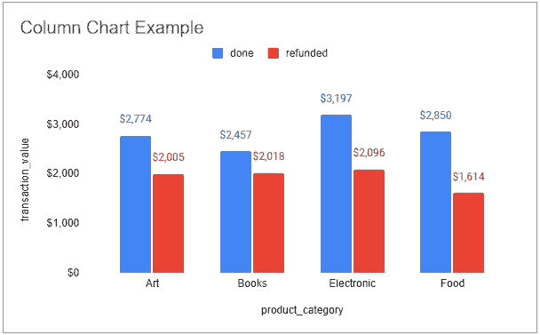

图一。柱形图示例

从图 1 中，我们可以比较每个`product_category`之间的`transaction_value`，但是我们没有得到每个`product_category`的总`transaction_value`的信息，因为它被`transaction_state`分开了。让我们看下一个例子。

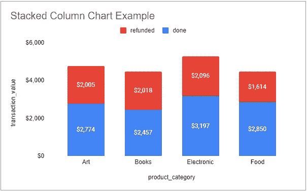

图二。堆积柱形图示例

从图 2 中，我们可以看到每个`product_category`的总数`transaction_value`，因为在比较每个`product_category`的`transaction_value`时`transaction_state`是堆叠的。很酷，对吧？不要惊讶，在这之后我们还有一种柱形图。

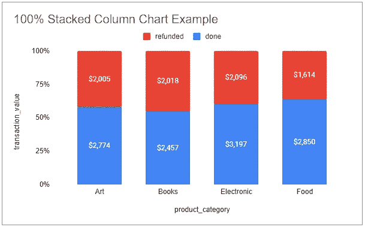

图 3。百分比堆积柱形图示例。

从图 3 中，我们可以得到不同的见解，例如对于`product_category`电子，甚至对于`transaction_state == refunded`的`transaction_value`是最高的 2096 美元，但从比例来看，最高的是图书(几乎占总`transaction_value`的 50%)。

> 那么，未来我们需要使用哪种类型的柱形图呢？看情况。

1.  如果我们想在数字 方面清楚地看到每个类别之间的 ***比较，我们可以使用标准柱形图。***
2.  如果我们希望看到一个清晰的 ***对比，当它被求和为每个类别*** 中的总和时，我们应该使用堆积柱形图。
3.  如果我们想要查看每个类别 的比例比率的清晰 ***对比，我们应该使用 100%堆积柱形图。***

我希望你知道如何使用柱形图。让我们转向下一种类型的比较数据可视化！

# 条形图

这种类型的主要概念是:

1.  它类似于柱形图，不同之处在于 Y 轴(垂直)上的类别和 X 轴(水平)上的类别
2.  如果类别的名称很长或者子类别超过 2 个，我们就需要这种类型。
3.  该条形图的子类型非常类似于柱形图，例如标准条形图、堆积条形图和 100%堆积条形图。

让我们使用这个[数据集](https://docs.google.com/spreadsheets/d/1GoO5Dm9fD9-aCctz6No9r-zje1JpyAHa_tpOzbibMMw/edit#gid=847184697&range=A1:D6)来练习使用柱形图的技巧。

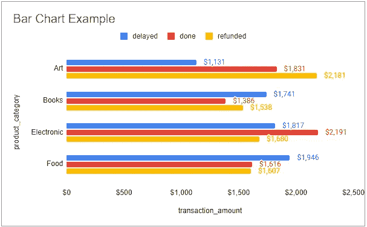

图 4。条形图示例。

从图 4 中，如果我们像这样可视化数据，比较每个类别会更容易，因为如果类别的数量不断增加，如果我们继续使用柱形图，我们将更难比较值。你可以自己试试，把你的看法写在下面。:D

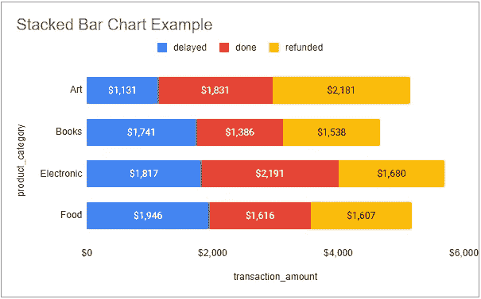

图 5。堆积条形图示例。

从图 5 中，我们可以比较堆叠时的每个类别，就像前面的可视化一样。我们得到的感觉与柱形图非常相似，不同之处就像前面提到的，如果使用条形图像这样转换可视化效果会更容易。

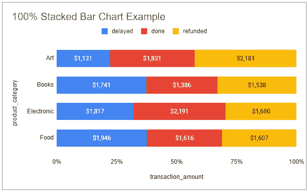

图 6。百分比堆积条形图示例。

从图 6 中，我们可以比较每个类别，同时以 100%的比例堆叠。

> 那么，未来我们需要使用哪种类型的条形图呢？看情况。你可以研究柱形图中的“如果-那么”条件，这是一样的。:)

最后一个例子，假设类别≤ 2，但是名称很长，比如:“美国食品药品监督管理局批准的食品”和“美国食品药品监督管理局尚未批准的食品”。可视化应该是这样的:

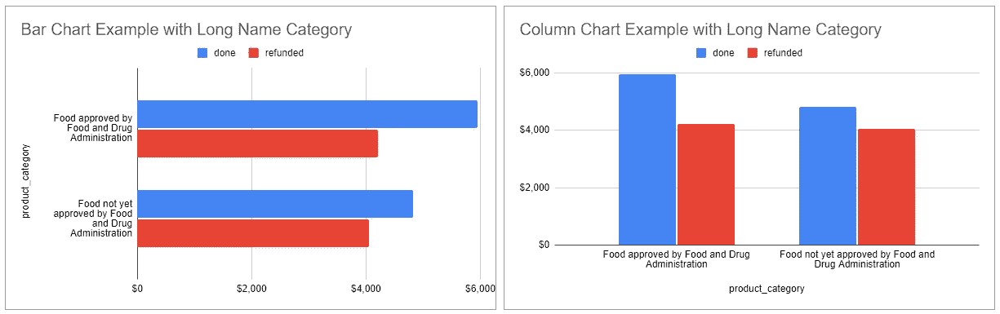

图 7。[当类别名称较长时，条形图和柱形图的比较](https://docs.google.com/spreadsheets/d/1GoO5Dm9fD9-aCctz6No9r-zje1JpyAHa_tpOzbibMMw/edit#gid=878118476&range=A1:C4)。

就可读性而言，使用条形图比柱形图更好。你可以试着自己添加更多的类别，看看当你同时有长名称类别和许多类别时，条形图有多大的帮助。告诉我们你的想法！

# 散点图

这种类型的主要概念是:

1.  当 X 轴和 Y 轴是数值并且我们有要比较的类别时，我们使用这种类型。
2.  通常，它可以告诉我们每个类别的 X 和 Y 之间的相关性。
3.  使用点(dot)来可视化我们拥有的数据点。

让我们使用这个[数据集](https://docs.google.com/spreadsheets/d/1GoO5Dm9fD9-aCctz6No9r-zje1JpyAHa_tpOzbibMMw/edit#gid=137144685)来练习使用散点图的技巧。

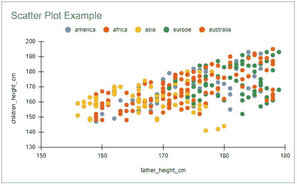

图 8。散点图示例

从图 8，请仔细看。

1.  X 轴`father_height_cm`的最小值为 150，Y 轴`children_height_cm`的最小值为 130。我们可以通过在谷歌工作表中编辑图表来决定这个值。
2.  我们可以比较各大洲的`father_height_cm`和`children_height_cm`的关系

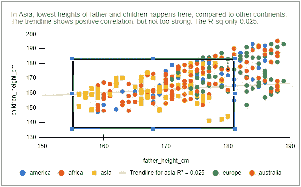

图 9。关注亚洲父亲和孩子身高的相关性。

从图 9 中，我们可以看到类别和我们制作的正方形周围的值之间的相关性。这意味着从我们用来可视化上面散点图的数据集来看，以厘米为单位的父子身高平均低于其他大洲。

在 Google Sheets 中，如果你注意到的话，我已经把亚洲数据的符号从点(圆)改成了正方形，因为我想让我的观众关注那个，这就是为什么我把它和其他的不同。你可以看看谷歌工作表编辑图表功能来创建你的！

# 折线图

这种类型的主要概念是:

1.  当 X 轴与时间相关，Y 轴是数值并且我们有要比较的类别时，我们使用这种类型。
2.  通常，它可以告诉我们在数据集中我们拥有的时间内每个类别之间的比较。
3.  我们可以尝试使用颜色来区分类别，或者使用清晰的图例来了解哪条线属于哪个类别。

让我们使用这个[数据集](https://docs.google.com/spreadsheets/d/1GoO5Dm9fD9-aCctz6No9r-zje1JpyAHa_tpOzbibMMw/edit#gid=1149960068)来练习使用散点图的技巧。

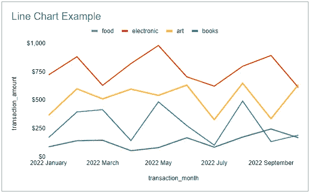

图 10。折线图示例

从图 10 中，我们可以比较每个类别每个月的`transaction_amount`。折线图更适合与时间进行比较，因为与使用其他类型的图表(如柱形图、条形图或散点图)相比，“线”更容易告诉我们“趋势”。

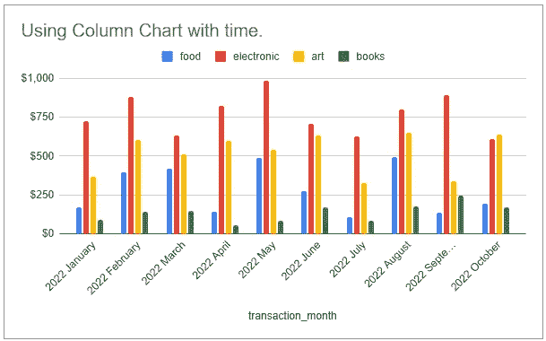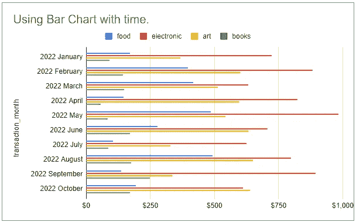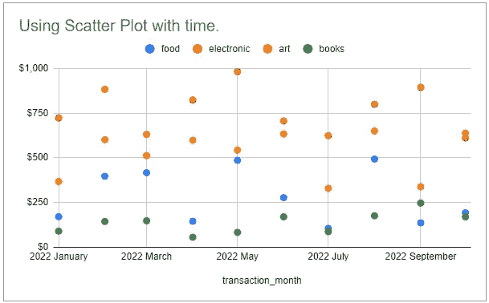

图 11。比较柱形图、条形图、散点图和折线图。

# 摘要

我们还有许多其他类型的数据可视化，通常用于比较类别，如面积图、饼图、气泡图等，但我们上面讨论的四种类型是基本类型。只要明白用哪一个要看情况，就可以随机应变选择更好的可视化来做数据讲故事。

我希望这篇文章从比较数据集中的类别的角度，让你对数据可视化的基础有所了解。祝各位数据分析愉快！:D