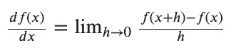
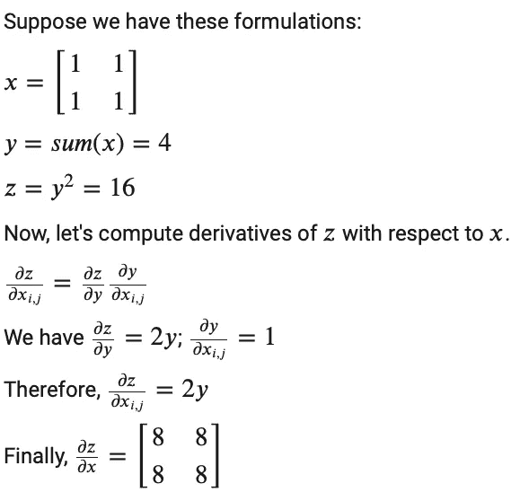
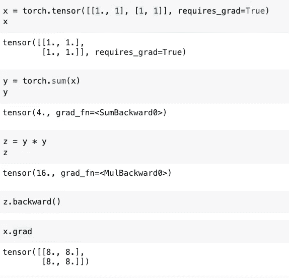
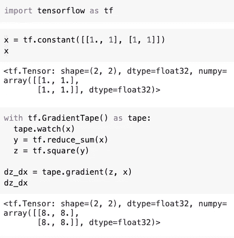

# 如何在 Tensorflow 和 Pytorch 中计算梯度

> 原文：<https://medium.com/codex/how-to-compute-gradients-in-tensorflow-and-pytorch-59a585752fb2?source=collection_archive---------4----------------------->

计算梯度是许多机器学习算法的核心部分之一。幸运的是，我们有深度学习框架为我们处理。这篇文章将通过一个例子解释 Tensorflow 和 Pytorch 如何帮助我们计算梯度。

照片由[巴卫·斯泰内克](https://unsplash.com/@dusk_cicada?utm_source=medium&utm_medium=referral)在 [Unsplash](https://unsplash.com?utm_source=medium&utm_medium=referral) 拍摄

我们许多人都熟悉使用 TensorFlow 和 PyTorch 来训练神经网络。我们已经知道如何计算梯度，并使用优化器通过几行代码更新权重参数。这篇文章将把这些库中计算渐变的部分分离出来，看看代码背后发生了什么。

# 1.导数和梯度

在一维中，函数的导数定义如下:

等式 1。导数的极限定义

通常，在多维中，梯度是沿着每个维度的偏导数的向量。因此，梯度和 x 有相同的形状，梯度的每个元素会告诉我们，如果我们在坐标方向上移动，函数 f 的斜率是多少。

这个梯度有很好的特性。它指向函数最大增长的方向。相应地，梯度的负值给出了函数最大下降的方向。

# 2.如何评估渐变

在计算机中评估梯度的一种简单方法是使用有限差分法，该方法使用梯度的极限定义(等式 1)。具体地说，我们对 x 的每个维度用该维度的小 h 值迭代地评估等式 1。当 x 的大小很大时，它会非常慢。

但谢天谢地，我们不必这样做。我们可以用微积分来计算解析梯度，也就是写下梯度应该是多少的表达式。

总之，有两种方法可以计算梯度。

*   **数字渐变**:近似，缓慢，易写。
*   **解析梯度**:精确、快速、易错。

在实践中，我们应该总是使用解析梯度，但是用数值梯度来检查实现。这被称为**梯度检查**。

# 3.举例说明

现在，让我们跳到一个例子(来自参考资料中的 Coursera 课程)。在这个例子中，我们将有一些计算，并使用链规则来计算梯度自己。然后我们看 PyTorch 和 Tensorflow 如何为我们计算梯度。

# 4.PyTorch 代码

在 PyTorch 中实现代码将给出我们对上面例子的预期。

是 PyTorch 的自动微分引擎，帮助我们计算梯度。

我们首先用`requires_grad=True`创建一个张量`x`。这向`autograd`发出信号，它上面的每一个操作都应该被跟踪。当我们在`z`上调用`.backward()`时，`autograd`计算这些梯度并将它们存储在张量的`.grad`属性中。因此，我们可以在`x.grad`中看到渐变。

# 5.张量流代码

在 TensorFlow 中，优化器是使用 TensorFlow 自动微分 API 调用**梯度带**实现的。这个 API 让我们计算和跟踪每个可微分张量流操作的梯度。

如果至少一个变量被监视，梯度带范围内的操作将被记录。如果我们观察变量`x`，录像带会观察你在下面看到的其余操作。当我们调用`tape.gradient`来计算`z`相对于`x`的梯度时，我们会得到与之前相同的结果。

# 结论

这篇文章提供了一个关于如何使用 PyTorch 的**自动签名**和 TensorFlow 的**渐变胶带**计算渐变的简单例子。我们实际上用它们来做更复杂的功能，用来训练深度神经网络。

微分机制的秘密(据我所知)来自图计算。然而，图形计算、反向传播或这些框架的显式实现超出了本文的范围。您可以在参考资料或它们的源代码中寻找更多的解释。

# 参考

1.  斯坦福 CS231n 第三讲损失函数与优化:[https://youtu.be/h7iBpEHGVNc](https://youtu.be/h7iBpEHGVNc)
2.  斯坦福 CS231n 第四讲神经网络简介:[https://youtu.be/d14TUNcbn1k](https://youtu.be/d14TUNcbn1k)
3.  PyTorch 亲笔签名教程:[https://py torch . org/tutorials/初学者/blitz/亲笔签名 _tutorial.html](https://pytorch.org/tutorials/beginner/blitz/autograd_tutorial.html)
4.  coursera Custom-Distributed Training with tensor flow:[https://www . coursera . org/learn/Custom-Distributed-Training-with-tensor flow？专业化=张量流-高级-技术](https://www.coursera.org/learn/custom-distributed-training-with-tensorflow?specialization=tensorflow-advanced-techniques)