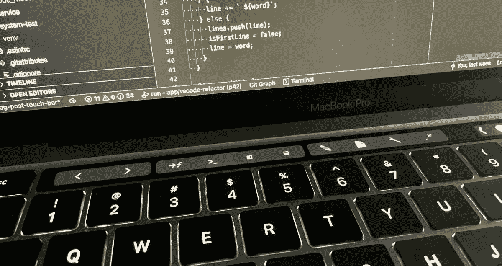

# 如何在 5 分钟内用 Visual Studio 代码配置触摸条

> 原文：<https://medium.com/codex/how-to-configure-the-touch-bar-in-visual-studio-code-in-under-5-minutes-9cdd0a9d3dc5?source=collection_archive---------8----------------------->



MacBook 上的 touch bar 有可能提供对 Visual Studio 代码中常用命令的**快速访问。**

在默认配置中,“前进”和“后退”按钮非常有用。但是，其他默认的 touch bar 动作价值较低，会占用空间。你可能还会发现，像“重命名”(`F2`)或“转到定义”(`F12`)这样的日常操作更难操作，因为你需要按住`Fn`。

这篇文章将向你展示如何**配置 Visual Studio 代码来充分利用 touch bar** 。

# Nasc Touchbar 扩展

[**Nasc Touchbar 扩展**](https://marketplace.visualstudio.com/items?itemName=felipe.nasc-touchbar&ssr=false) 使您能够轻松地向 Touchbar 添加许多附加动作，例如`Run command`、`Toggle side bar`和`Rename`。

您可以在 Visual Studio 代码设置中配置显示哪些按钮(`Preferences > Open Settings (UI)`，搜索`touch`)。

# JavaScript 助手扩展

我在 [JavaScript 助手扩展](https://marketplace.visualstudio.com/items?itemName=p42ai.refactor&ssr=false)中包含了对 JavaScript 和 TypeScript 用户有帮助的触摸栏按钮。该扩展向触摸栏添加了以下操作:

*   ✏️重命名:触发当前符号的重命名命令。
*   🪄快速修复:打开快速修复上下文菜单。
*   🔧重构:打开重构上下文菜单。
*   📄源操作:打开源操作上下文菜单。

这些操作仅在编辑 JavaScript 或 TypeScript 文件时可用。类似于 Nasc Touchbar 扩展，您可以配置在 Visual Studio 代码设置中显示哪些按钮(`Preferences > Open Settings (UI)`)。

# 禁用默认调试触摸栏操作

默认的触摸条按钮优先于 Nasc 触摸条和 JavaScript 助手扩展添加的控件。特别是，调试操作会占用大量空间并隐藏其他按钮。通过将以下内容添加到您的`settings.json`文件中，您可以禁用它们:

```
"keyboard.touchbar.ignored": [
  "workbench.action.debug.start",
  "workbench.action.debug.run",
  "workbench.action.debug.pause",
  "workbench.action.debug.stepOut",
  "workbench.action.debug.stepInto",
  "workbench.action.debug.stepOver",
  "workbench.action.debug.stop",
  "workbench.action.debug.restart"
]
```

# 示例配置


上述配置显示了以下按钮:

*   `Go back`和`Go forward`(默认)
*   `Go to definition`、`Run command`、`Toggle side bar`和`Toggle bottom panel` (Nasc Touchbar)
*   `Rename`、`Source Action`、`Refactor`和`Quick-Fix` (JavaScript 助手)

除了调试操作的禁用配置之外，还使用了以下设置:

```
"nasc-touchbar.addCursorBelow": false,
"nasc-touchbar.rename": false,
"nasc-touchbar.toggleSidebar": true
```