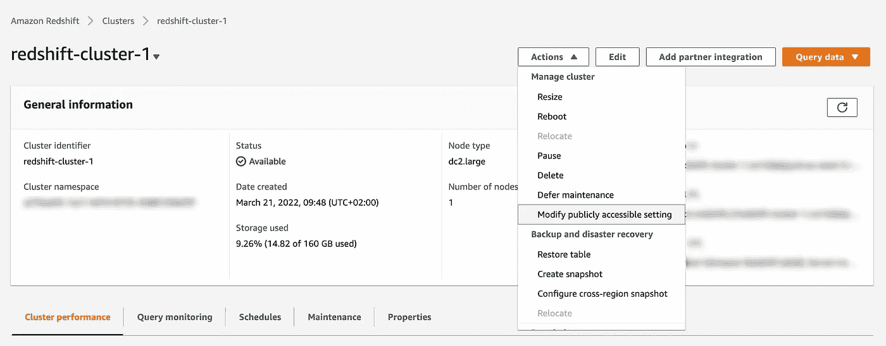
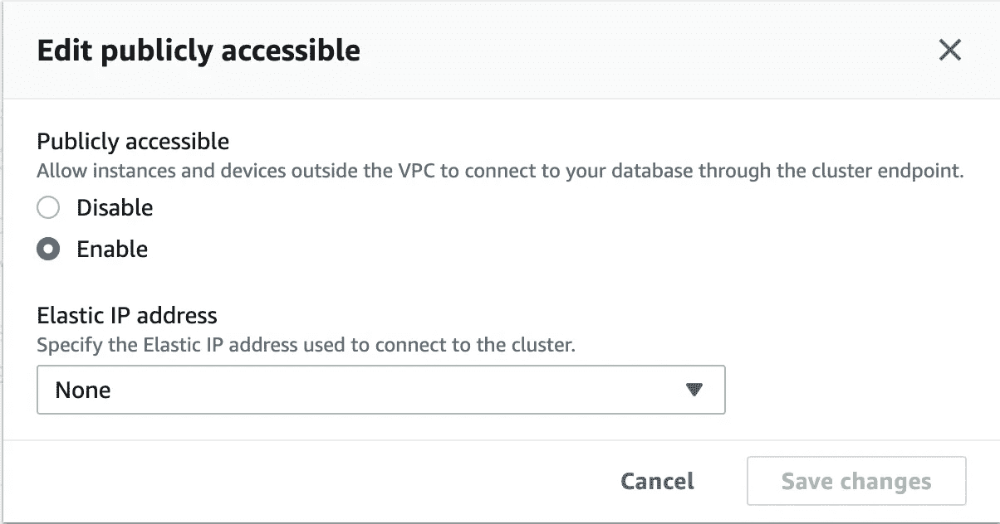
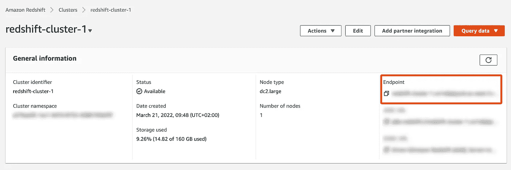
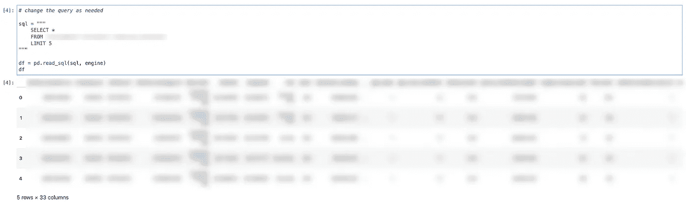

# 如何将 AWS 红移连接到 Python 笔记本

> 原文：<https://medium.com/codex/how-to-connect-aws-redshift-to-python-notebook-b9e6be15ee39?source=collection_archive---------2----------------------->

## 使用 Python 中的 SQLAlchemy 轻松处理作为 pandas 数据帧的红移查询。


照片由[陈茂三潭✪](https://unsplash.com/@tranmautritam?utm_source=medium&utm_medium=referral) 在 [Unsplash](https://unsplash.com?utm_source=medium&utm_medium=referral) 上拍摄

您或您的组织是否使用 AWS Redshift 来存储数据，但您更适合在 Python Notebook(例如 Jupyter Lab 或 Google Colab)中工作？有没有想过如何将它们连接在一起，这样你就可以在 Python 或其他任何地方流畅地工作并进行很酷的可视化？

这是我在做客户项目时想到的问题。作为第一步，我查看了 AWS 的[官方文档](https://docs.aws.amazon.com/redshift/latest/mgmt/python-connect-examples.html)。我的意思是，它的工作，但它并不像我预期的那样顺利。我还检查了是否可以将我在 Redshift 控制台中所做的查询保存为 csv 文件，但是[文档](https://docs.aws.amazon.com/redshift/latest/dg/r_UNLOAD_command_examples.html)有点难以理解。

在进行了更多的研究后，我发现 Redshift 只不过是托管在 AWS 服务器上的 PostgreSQL，并被赋予了一个新的名称(虽然我们正在研究它，但 SageMaker 实际上只是一个贴着 AWS 标签的 Jupyter 实验室)。当我发现是这种情况时，我知道我可以使用经典的 Python 库 SQLAlchemy 来帮助我摆脱困境。

首先，要使这个解决方案起作用，您必须通过在红移配置上启用它来使数据库可公开访问。在概览页面中，点击**操作→修改公共访问设置**。确保**已启用**，然后保存更改。



更改红移配置(图片由作者提供)



启用公共访问(图片由作者提供)

然后我们可以去 Jupyter 实验室，从 *sqlalchemy* 库中导入我们需要的库比如 *pandas* 、 *os* 和 *create_engine* 函数。我们还需要安装 *psycopg2* 库来处理 PostgreSQL 数据库。没有必要导入它，但只需检查它是否安装在我们的系统上就可以了。

```
import os
import pandas as pd
from sqlalchemy import create_engine
import psycopg2
```

如果你还没有安装上面的库，你可以先用 pip 来安装。

```
!pip install sqlalchemy
!pip install psycopg2
```

现在，我们需要从 AWS 获取凭证。我们需要的是:用户名、密码、端点、端口和数据库名称。用户名和密码用于登录 Redshift。端点和端口可以从端点部分下的概述页面中复制。请注意格式是*(端点):(端口)/(附加信息)*。端点看起来像一个**长 URL** ，端口看起来像一个 **4 位数**。我们只需要端点和端口。数据库名称是不言自明的；您或您的数据库管理员应该知道这个名称。



端点和端口(图片由作者提供)

一旦我们有了凭证，我们就可以把它放进我们的笔记本里。我喜欢在这一步使用 *os.environ* ，因为它提高了安全性，使工作流程更加顺畅。

```
os.environ['REDSHIFT_USER'] = ""
os.environ['REDSHIFT_PASS'] = ""
os.environ['REDSHIFT_ENDPOINT'] = ""
os.environ['REDSHIFT_PORT'] = ""
os.environ['REDSHIFT_DBNAME'] = ""print('Secret keys stored successfully. Remember not to share this information')
```

现在，我们需要用上面的凭证创建 SQLAlchemy 的引擎。

```
# create sql engine to connect to redshiftengine_string = "postgresql+psycopg2://{}:{}@{}:{}/{}".format(
    os.getenv('REDSHIFT_USER'), os.getenv('REDSHIFT_PASS'), os.getenv('REDSHIFT_ENDPOINT'), os.getenv('REDSHIFT_PORT'), os.getenv('REDSHIFT_DBNAME'))
engine = create_engine(engine_string)print('Engine created successfully')
```

完成了困难的部分，我们现在可以使用 *pd.read_sql()* 来执行 sql 查询，使用前面创建的引擎，并将其存储为 pandas 数据帧。

```
# change the query as neededsql = """
    SELECT *
    FROM <database_name>.private.<table_name>
    LIMIT 5
"""df = pd.read_sql(sql, engine)
df
```



示例查询(作者图片)

而且，就是这样！因为这是一个熊猫数据帧，你可以做任何你想做的操作，就像在任何其他数据帧上一样。您可以通过执行 *df.to_csv()* 将其保存为 csv 文件，或者通过执行 *df.plot()* 或其他任何操作来绘制。

我希望这篇教程能帮助你查询从红移到熊猫数据帧的数据，这是你熟悉并有信心使用的。你可以在 GitHub 页面找到完整的笔记本。祝您查询和分析数据好运！