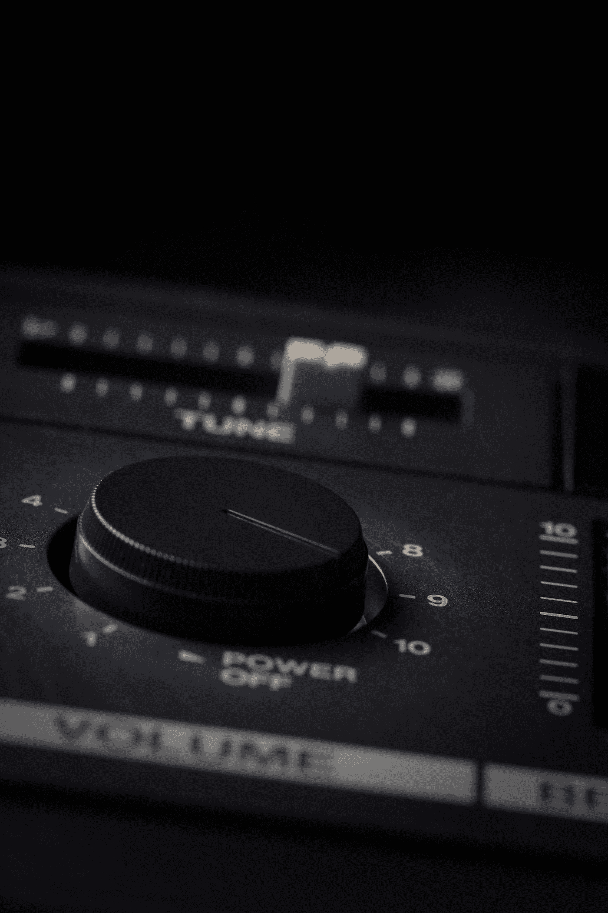

# 如何在 Google Meet 中控制音量

> 原文：<https://medium.com/codex/how-to-control-volume-on-google-meet-60d1a8c591d2?source=collection_archive---------8----------------------->

## TL；DR 使用缩放来控制 Google Meet 音量

安妮·尼加德在 [Unsplash](https://unsplash.com?utm_source=medium&utm_medium=referral) 上拍摄的照片

谷歌会议通话时不需要改变音量，这让我很沮丧。我的蓝牙耳机默认使用最大音量，这意味着我可以把耳机放在桌子上，仍然可以很好地听到一切。我的 Windows 10 音量控制对 Google Meet 的音量没有影响。