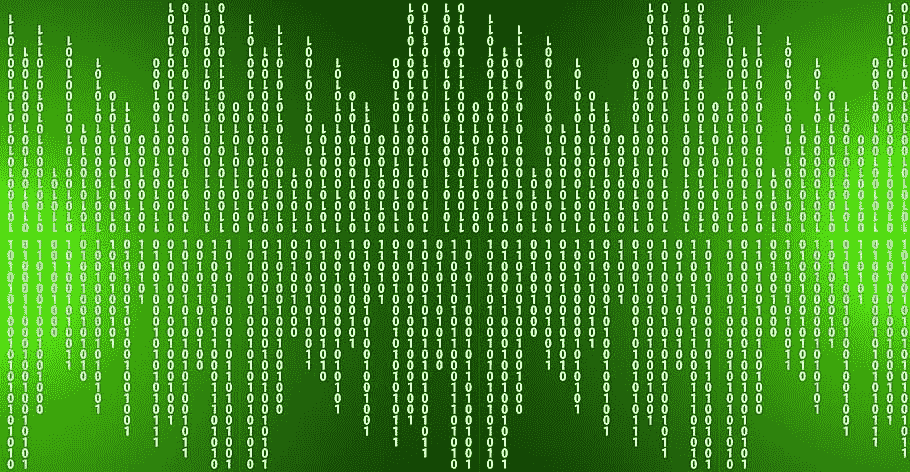

# 如何在 Python 中将二进制分数转换成十进制

> 原文：<https://medium.com/codex/how-to-convert-a-binary-fraction-to-decimal-in-python-a1e2a9a1147e?source=collection_archive---------4----------------------->

在我写的最后三篇帖子中，我讨论了如何将十进制整数转换为二进制整数，将十进制分数转换为二进制分数，以及将二进制整数转换为十进制整数。在这篇文章中，我将讨论如何将二进制分数转换成十进制分数。这篇文章是这个系列的第四篇，也将是关于这个话题的最后一篇文章，但是在某个时候我可能会发表一系列文章…