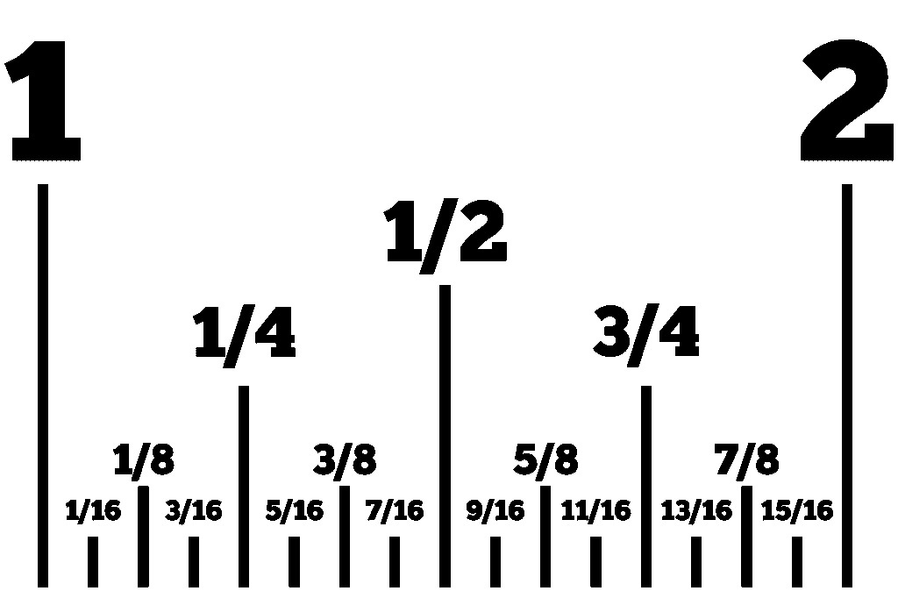

# 如何将十进制分数转换成二进制分数

> 原文：<https://medium.com/codex/how-to-convert-a-decimal-fraction-to-a-binary-fraction-1d11176547f3?source=collection_archive---------5----------------------->

在我最近的一篇文章中，我给出了将十进制整数转换成二进制的算法，这对于许多数字设备非常有用。即使一个人自己实际上并不处理二进制信息，理解它的科学原理也是有益的。我上一篇文章的链接可以在:- [如何将十进制数转换成二进制数](/codex/how-to-convert-decimal-numbers-to-the-binary-number-system-in-python-fabd40778add) …