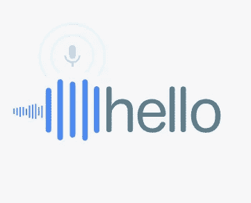

# 如何使用语音 API 将音频转换为文本

> 原文：<https://medium.com/codex/how-to-convert-audio-to-text-using-speech-api-8c6bebba768c?source=collection_archive---------8----------------------->

## [法典](http://medium.com/codex)

Google Cloud Speech API 支持将 Google 语音识别技术轻松集成到开发人员应用程序中。语音 API 允许你发送音频和接收来自服务的文本转录(见[什么是谷歌云语音 API？](https://cloud.google.com/speech/docs/)了解更多信息)。

# 创建 API 密钥