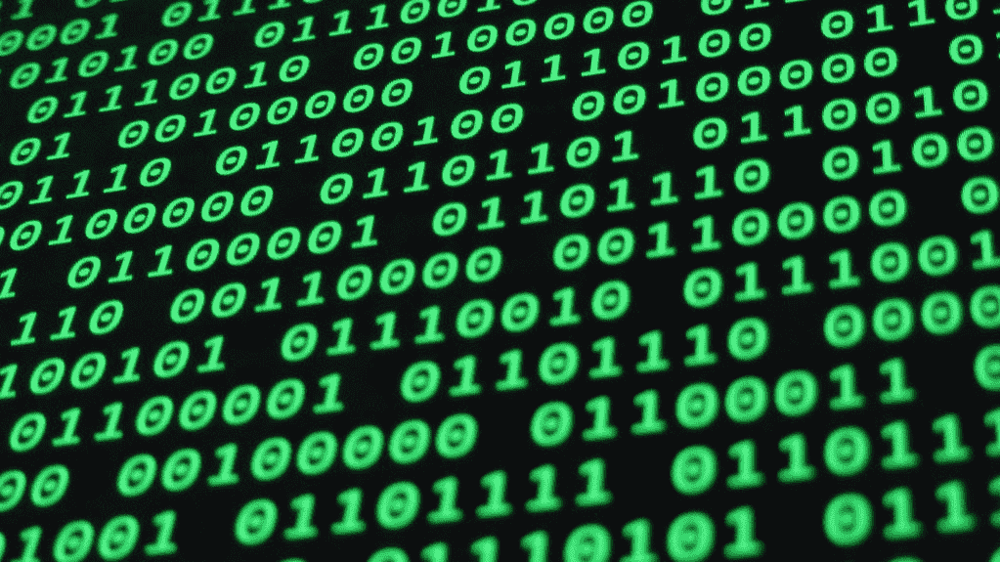

# 如何在 Python 中将十进制数字转换成二进制数字系统

> 原文：<https://medium.com/codex/how-to-convert-decimal-numbers-to-the-binary-number-system-in-python-fabd40778add?source=collection_archive---------5----------------------->

以二为基数的数字系统是二进制数字系统。这个数字系统使用两个符号，通常是 1 和 0。我们在日常生活中使用二进制数字系统，却没有意识到这一点。我们生活中任何涉及到这个或那个答案的领域都是二元逻辑的例子。如果有人问我们一个问题，而答案可以是“是”或“否”,那么我们就…