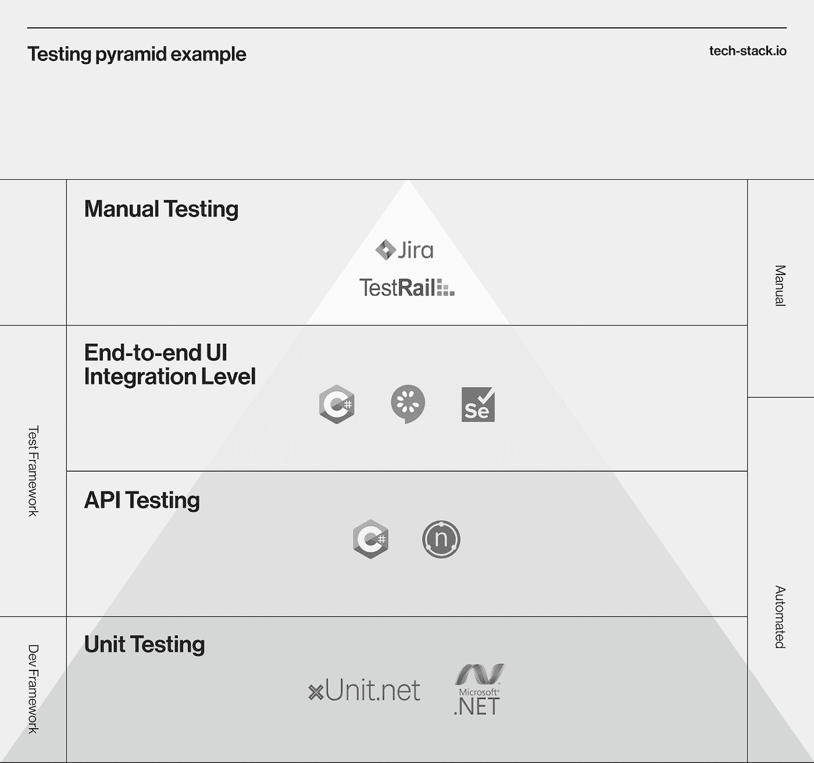
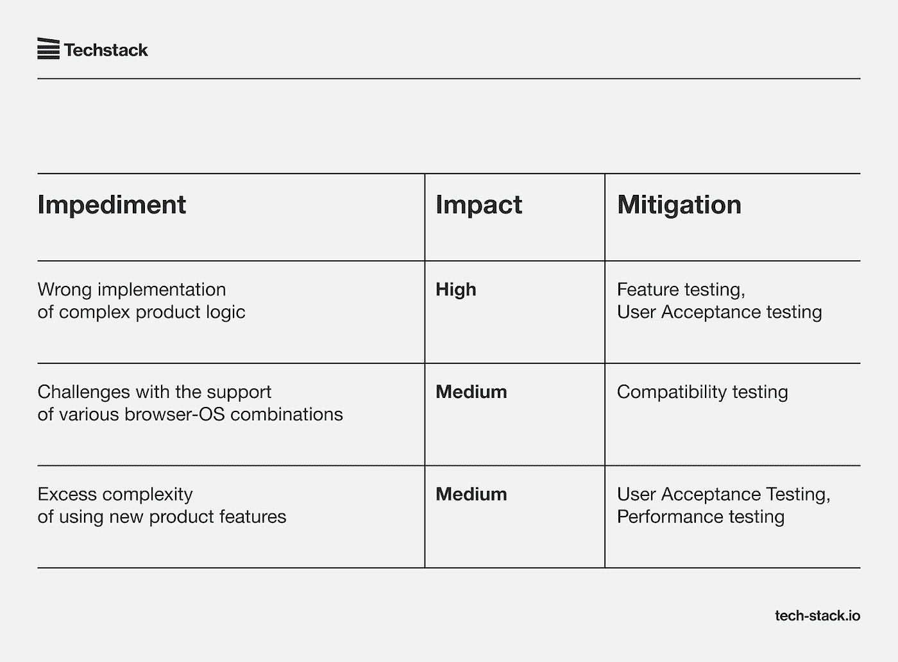
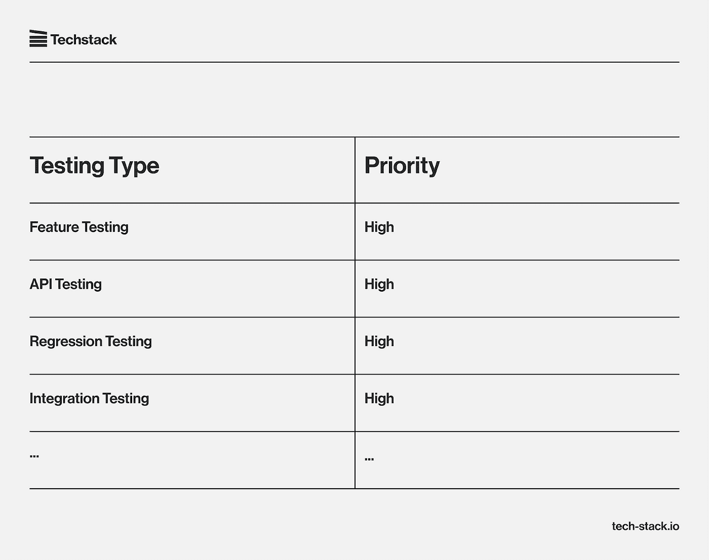
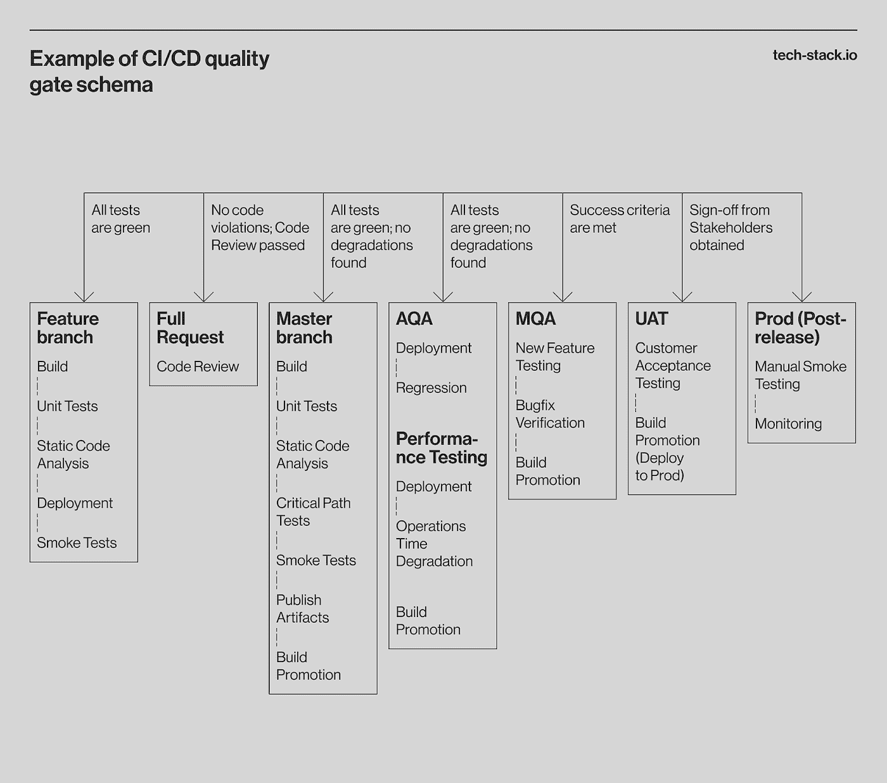

# 如何起草一份测试策略文档[里面有测试策略样本]

> 原文：<https://medium.com/codex/how-to-craft-a-test-strategy-document-sample-test-strategy-inside-cffbdd291491?source=collection_archive---------4----------------------->

没有测试文档，即使对于经验丰富的专业人员来说，测量 QA 质量仍然是一个挑战。当新的 QA 工程师加入并扩展您的产品时，对更多文档的需求更加明显。有了文档，质量保证的价值和目的仍然是清楚的。

当质量被正确测量时，您可以预测测试结果并影响测试过程。高层次的文档，比如测试策略和测试计划，允许你有效地度量 QA 的质量，从而也度量你的产品的总体质量。测试策略可以让您更好地控制测试过程和测试预算。

在这篇文章中，我们将定义一个[测试策略，而不是一个测试计划](https://tech-stack.io/blog/test-plan-and-test-strategy-best-practices/)，讨论它的组成部分，给出如何编写一个可靠的测试策略文档的技巧，并提供一个好的测试策略文档的例子。

# 什么是测试策略？

测试策略是高级测试文档，它确认将在产品上运行的测试的类型或级别，并描述软件开发生命周期中使用的测试方法。它定义了产品将如何被测试，指定了 QA 专家将用来实现他们目标的精确程序或方法。

# 测试策略与测试计划

有些人可能需要澄清[测试计划和测试策略。](https://tech-stack.io/blog/test-plan-and-test-strategy-best-practices/)一个测试计划解决了测试覆盖、应该和不应该检查的特性，以及评估、调度和资源管理。简而言之，测试计划是你面向目标的愿景，测试策略是你实现目标的策略。

测试计划是对测试过程中涉及的范围和各个步骤的书面描述。测试计划文档是动态的，可以在开发过程中更改。确定如何测试一个产品，测试什么，什么时候测试，谁来测试，谁来验证结果是这里的主要目标。

测试策略是一个高层次的文档，它涵盖了测试目标、方法、环境、自动化技术、工具以及带有应急计划的风险分析。一旦项目经理和开发团队编写并批准了测试策略，它通常不会改变。有以下类型的测试策略。

*   基于模型的策略
*   系统策略
*   符合标准或符合流程的策略
*   反应策略
*   咨询策略
*   回归厌恶策略

# 测试策略的组成部分

没有一个完美的测试策略文档可以作为标准并适用于所有类型的产品。因此，测试策略的组成部分可能因公司而异。我们建议查看 Techstack 测试策略文档的组件，这些组件是基于数十年来提供 [QA 即服务](https://tech-stack.io/services/qa-as-a-service)的经验而开发的。

# 测试方法

这一部分描述了产品测试中使用的测试类型、测试金字塔及其堆栈。此外，它还优先考虑兼容性测试、安装测试等类型的测试。为了方便起见，我们将把它分成几个小节。

## 测试级别

这是对测试级别的金字塔式描述。

## 测试类型

这包括团队计划进行的所有类型的测试的列表，它们的目标，每种类型的过程特征，以及接受标准。例如，对于冒烟测试，目标将是确保核心特性没有严重缺陷，并确定应用程序为后续测试阶段做好了准备。

过程的特点:冒烟测试应该不超过 30 分钟，在每个新构建之后运行，并且尽可能被自动测试覆盖。

## 兼容性测试优先级

本部分包含此类测试适用的组件或应用程序部分的列表。它还包括一个相同优先级的矩阵，对于不同的浏览器和操作系统可能是这样的。

如果测试过程与测试类型中列出的其他类型的测试有细微差别(需要额外的细节)，它们也应该在单独的小节中。

# 障碍缓解

这一部分描述了产品质量可能存在的潜在问题，以及旨在降低这些风险的测试类型及其优先级。

真实的表将比上面的例子中的大。基于这个表，我们可以将测试类型划分为优先级:

在 Techstack，我们根据运行相应测试的数量对优先级进行分类，以防时间不足或其他风险:

**高** —测试必须全面进行。

**中** —可以进行部分测试。

**低** —如果还有时间，将进行测试。

# 测试阶段

根据开发过程的不同，测试可以在不同的阶段进行。例如，当使用 Scrum 时，您可以将测试阶段划分为冲刺之前、冲刺期间、验收测试和产品发布之后的阶段。

为了使该过程具有可预测的质量，每个阶段都被形式化并描述为输入标准、阶段中的测试过程和输出标准。

## 发布验证

1.  发布后测试根据需要在测试主管的指导和监督下在生产中进行。
2.  仅进行冒烟测试，而不创建/更新或删除任何数据。
3.  团队报告测试结果，包括在产品发布测试期间发现的问题。

## 报告

团队向高层管理人员和利益相关者发送测试报告，通知他们测试过程的结果。

## 修补程序

如果测试过程中发现的问题被定义为对生产环境至关重要，则应根据其重要性和 SLA 来解决这些问题。(接下来，您可以列出使用修补程序、测试它并将其发布到生产环境的步骤)。

退出标准:

*   冒烟测试通过了。
*   发现的缺陷会列在 bug tracker 中。
*   修复过程中会修复关键缺陷。

# CI/CD 测试管道

持续集成和持续部署(CI/CD)方法并非在所有地方都适用，但是在某些情况下， [QA 作为 CI/CD 管道的一部分](https://tech-stack.io/blog/qaops-quality-assurance-in-continuous-delivery-systems/)可能是有用的。此图描述了质量关，并作为配置 CI 管道的起点。

# 如何准备一份好的测试策略文档

不要盲目地遵循模板，要考虑什么最适合你的产品。每个产品都有不同的规格，所以你需要坚持你知道最适合你的。不要盲从任何标准或组织。确保它总是有益于你和你的程序。当你准备一个测试策略文档时，这里有一些提示可能会对你有所帮助。

1.  当起草测试策略文档时，回答问题“为什么涉众希望构建这个产品？”这将使快速理解和排列问题变得更加容易。
2.  列出您计划测试的所有关键组件。如果您认为某个特性没有包含在这个版本中，请将其列在“不需要测试的特性”类别下。
3.  为你的产品写下一个测试方法。用清晰的术语指明预期的测试类型。示例包括功能测试、用户界面测试、集成测试、负载/压力测试、安全测试等。
4.  例如，描述你执行功能测试的策略。手工测试还是自动化？您打算在您的测试中运行每个测试用例吗？
5.  为你的测试设定清晰的进入和退出标准。当退出标准不明确时，团队成员会对它们做出不同的解释，这将导致重大问题的发布。因此，产品发布将会推迟。
6.  选择您将如何监控您的测试结果，以及您将使用什么度量来监控测试完成。
7.  决定任务分配，指定每个团队成员的责任和职能。
8.  在测试期间和之后，您将生成什么记录？
9.  确保整个团队对测试过程有统一的理解，即使管理层离开一段时间，也能有效地工作。
10.  测试策略应该让 PMs 全面了解 QA 工程师在测试什么，如何测试，期望的质量，以及测试团队在产品开发的每个阶段需要完成多少工作，而不需要深入了解测试。
11.  一个好的测试策略有助于预测产品质量，如果合作伙伴组织要求一组度量的文档，团队采取这些度量来评估产品的预测质量。
12.  满足数据安全性和安全性要求，通过进入新市场所需的任何审核和认证。
13.  建立一个 CI/CD 流程，作为测试策略文档的一个专门部分，以便与开发团队同步，并在将每个特性部署到生产环境之前对其完成的质量阶段进行管理。
14.  考虑显示您需要测试策略的 [QA 度量，例如缺陷滞留、重新打开率、估计准确性、下降率和平均缺陷时间。](https://tech-stack.io/blog/red-flags-that-show-your-project-needs-a-test-plan-and-a-test-strategy/)

# 一个好的测试策略文档的例子

正如我们前面提到的，对于一个好的测试策略文档应该是什么样子，并没有单一的标准。虽然每个产品可能都有不同的规格，应该显示在您的测试策略文档中，我们建议您考虑到多年的软件测试经验，查看 [Techstack 开发的测试策略文档](https://docs.google.com/document/d/1zELQq1Kfrfr8xjWhYWZ9qJKhyQTPknja/edit)。

Techstack 测试策略文档包括了我们上面提到的测试策略的所有组成部分。它由四个主要部分组成:

01.测试方法

02.障碍和缓解措施

03.测试阶段

04.CI/CD 测试管道

# 测试方法

测试方法部分包括四个表(测试级别、测试类型、浏览器和操作系统的兼容性测试要求以及兼容性测试的屏幕分辨率)和一个性能测试小节。

在测试级别表中，我们有两列，分别写下测试级别和描述。测试类型表有四列:测试类型、测试目标、过程细节和验收标准。

在用于兼容性测试的浏览器和操作系统表中，列数可能会根据用于兼容性测试的操作系统数量而有所不同。在兼容性测试的屏幕分辨率中，我们写下分辨率、屏幕尺寸、显示比例和优先级。

# 障碍和缓解措施

在这一部分中，有两个表。在第一个例子中，我们有三栏，分别写下产品障碍、影响和缓解。第二个表指定了不同测试类型的优先级。

# 测试阶段

在本节中，测试活动在以下阶段进行:

**3.1 冲刺阶段的测试活动**

进入标准

工艺细节

退出标准

**3.2 UAT 和 UAT 会议后的活动**

进入标准

工艺细节

退出标准

**3.3 制作和后期制作活动**

进入标准

工艺细节

退出标准

# CI/CD 测试管道

Techstack 测试策略文档的最后一部分是 CI/CD 测试管道方法的可选应用部分。

# 用可靠的测试策略控制你的产品质量

一个好的测试策略给你一个存储和共享 QA 团队知识的工具，允许你在不依赖特定团队成员的情况下成长你的团队和新成员。它给出了如何管理测试过程的简单理解。

有了一个写得很好的测试策略文档，你就可以确保你的 QA 团队理解什么是可交付成果，从而为产品提供价值。它可以让你更好地控制风险，预测产品质量。测试策略以及其他产品文档有助于顺利通过任何审核和认证，并通过进入新市场来扩展您的业务。

当 Techstack 在我们的产品开发团队中实施测试策略文档时，我们的团队合作变得更加明显和有效。这使得 Techstack 团队成员能够了解不同的责任领域以及向何处发送查询。

[联系我们](https://tech-stack.io/contact-us)想方设法确保您的产品质量。

*原载于 2022 年 12 月 14 日*[*https://tech-stack . io*](https://tech-stack.io/blog/test-strategy/)*。*