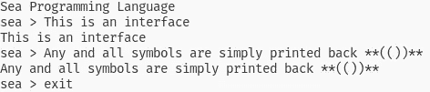

# 如何创建一个基本的算术编程语言—第 1 部分| Sea #1a

> 原文：<https://medium.com/codex/how-to-create-a-basic-arithmetic-programming-language-part-1-sea-1a-7ed8fbde7c6d?source=collection_archive---------5----------------------->

泰勒·弗兰塔在 [Unsplash](https://unsplash.com?utm_source=medium&utm_medium=referral) 上的照片

这是我的 [Sea 编程语言系列](https://davidjmacdonald.medium.com/list/how-to-create-a-programming-language-0ee2bcc7bccd)的第二篇帖子；参见[海洋 0 号](/codex/how-to-design-your-own-programming-language-sea-0-d68e240b6155)。在本文中，我将基于我们上次创建的语法开始编写 Sea。我将从在解释器和传输器中实现 Sea 的算术运算开始。这也将为一般的 Sea 打下基础。

我将用 Python 编写 Sea 的代码。一旦 Sea 可以使用，我将在 Sea 中重写代码。你可以创建自己的 Python 项目，或者从[我的起点](https://github.com/DavidMacDonald11/Sea-Programming-Language/tree/c8b59778f0eea9b0bb149bed1c8e50f47d2c664f)开始。

不幸的是，由于学校的原因，我没有时间继续这个项目。我预计战略环境评价的发展将会大大减缓。实际上，我在一个多月前的这个时候输入了上面的介绍。现在，首先，我将从我们之前开发的语法开始。最后，我将在实际项目中创建一个描述语法的文本文件。现在，我就用我写的文章。

开始创建语言的一个好方法是首先实现基本特性。我们将为我们的项目创建一个框架，并且我们将创建一些我们的语言所具有的算术特性。那么，我们开始吧。

## [基本终端接口](https://github.com/DavidMacDonald11/Sea-Programming-Language/tree/69980003e67109c974f49539c127c774a85f9db3)

首先，我们将让 Sea 在终端(类似于`python`命令)和文件中工作。我首先创建了一个简单的终端界面，它打印出用户输入的内容，如果用户输入`exit`、`^C`(键盘中断)或`^D`(文件结束)，界面就会结束:

这将产生如下行为的界面:

为此，我们需要继续发展我们的`main.py`:

我使用 Python 3 中推荐的方法来使用`if __name__ == "__main__"`，所以我的代码在一个主函数中。这里有很多只是为以后做计划。main 函数的前两行简单地解析了我们稍后将使用的一些命令行参数。`mode`会告诉我们是使用 transpiler，编译器，文件解释器，还是终端解释器。`debug`会告诉我们是否打印调试信息。传入的其余参数是描述我们最终将读取的文件的可选信息。

目前，我们只连接了简单的终端。为了运行这个，我们需要运行`python modules/main.py None False`。虽然我们还没有使用`debug`参数，但是程序至少需要两个参数。将来，我们将创建一个 bash 程序来简化语言的运行。请注意，在这些文章的每一部分中，我将链接我所指的提交。如果您想在任何给定的时间看到完整的项目结构，可以在那里找到。还要注意，在这些 GitHub 代码段中，我将在文件名后面加上提交文件的后缀。

## [基本通用界面](https://github.com/DavidMacDonald11/Sea-Programming-Language/tree/dfd7b317122819ce8a6f46e2ba16259ed2101fc3)

如前所述，我们既需要文件接口，也需要终端接口。因此，我们可以创建一个通用接口，让这两者都可以工作。首先，我们应该建立错误处理的基础。有许多方法可以处理词法分析器、解析器和访问者错误；然而，我选择使用 Python 异常来实现这一点。由于一个严重的错误会阻止我们的过程的完成，异常在这个上下文中抽象地有意义。

这个类唯一有趣的地方是，为了打印出错误消息，我有一个`get_message`方法。因此，在子类中，我将能够覆盖它来创建自定义消息。

这是我们目前为止的通用界面。你应该认得出之前的`debug`和`mode`。我还添加了这个`streams`参数。这是因为，当通过终端接口时，所有的输入和输出需要以一种方式完成，而通过文件接口时，所有的输入和输出必须以不同的方式完成。通过给这个函数传递一个通用的`streams`对象，我们将很快定义它，这两种类型的接口都可以在这里工作。另请注意，当启用调试时，无论是否有错误，都将打印调试信息。

## [流](https://github.com/DavidMacDonald11/Sea-Programming-Language/tree/3a8a8705fdd595aa43b4ea2da4a7dc2afde66a78)

我们将需要三种主要类型的流:输入、输出和错误。我们可以将调试信息直接打印到输出流中。下面是很多行非常简单的代码。我当然可以使它更简单，但我认为这样抽象更有意义。

乍一看，这似乎让人不知所措，但我向你保证这并不复杂。在`streams/general.py`中，我创建了三个流类型的抽象类。`InStream`是我们的抽象输入流类，它有一个每次读取一个字符的方法。`OutStream`是我们的抽象输出流，它简单地将数据写入流中。`ErrorStream`是我们的抽象错误流，它是一个修改过的输出流，可以写一个错误。然后我也创造了一个`NullStream`。这是一个可用于输入、输出或错误的流，它什么也不做。

接下来是`holder.py`，它创建了一个简单的数据类——数据类是 python 的一个非常有用的特性，你应该学习一下——它包含四个流。这个 holder 对象就是我们将在`interfaces/general.py`中作为`streams`传递给`interface`的对象。

最后，我们实际上为终端接口实现了这些流。我们将从填充在`interfaces/terminal.py`中的缓冲区中读取字符。输出和错误只需要打印到终端。

因此，虽然所有这些代码可能看起来很多，但实际上是一些非常基本的代码，主要用于创建流的抽象概念。

## [使用通用接口](https://github.com/DavidMacDonald11/Sea-Programming-Language/tree/e125531dd2f96b292d0af95830f6f4171c62a0ec)

要使用我们的通用接口，我们需要将它链接到我们的终端接口。

首先，我将`begin_interfacing`函数重命名为`interface`。一定要修改你的`main.py`来反映这一点。现在，我们通过创建我们的`streams`对象开始与终端接口(第 8 到 13 行)。使用我们以前构造的类，这个任务很简单。在第 17 行，我们的缓冲区现在也写入我们的输入对象。我们有一个本地`buffer`变量的原因是为了未来的计划。这也有助于我们简化代码。我还添加了一些输入检查。如果用户没有输入任何内容，循环会再次提示他们。此外，我还为用户创建了一种在程序以终端模式运行时打开或关闭调试模式的方法。一旦我们在`streams.in_stream`对象中构建了缓冲区，我们就准备好将对象传递给`general.interface`。

对于我们的`general.py`文件，我所做的只是修改了我们的`try`块来执行与之前相同的功能:将用户的输入输出给他们。如果您正在遵循项目结构，我还修改了我们的`Makefile`，这样我们可以简单地运行`make`而不是`python modules/main.py None False`。在我们写的时候测试我们的代码是至关重要的，以便在错误失去控制之前找到它们。

## [位置](https://github.com/DavidMacDonald11/Sea-Programming-Language/tree/31ebadda3db7145c6c97563808333c6ee6780838)

我们程序的一个有用的特性是告诉用户错误发生在哪里。这在文件中特别有用，但在终端中也非常有用。我的版本现在非常简单，但是你可以把你的变得像你想的那样复杂。

给定一些流，`SymbolPosition`类跟踪符号出现的行和列。然后，`Position`类跟踪流中的一段符号。这两个类都有一些有用的帮助器方法，我们稍后会用到。然后，我还更新了我们的`ErrorStream`类，这样打印的消息现在将是`f”{type(data).__name__} at {data.position}: {data.get_message()}\n”`。最后，我修改了`SeaError`类，使其也有一个`position`实例变量:

现在我们有了位置的存储机制，让我们看看如何在 lexer 中使用它们。

## [莱克斯骨骼](https://github.com/DavidMacDonald11/Sea-Programming-Language/tree/f92d814e986a532603b838e920e010707e58dfbc)

回想一下，我们的 lexer 将遍历输入流，一次一个符号，它将构造一个标记列表。为此，我们将要求:

除了实际的标记构造，我已经实现了我们需要的所有词法操作。我们的 lexer 在输入流中有一个当前位置，它跟踪这个位置，这样我们的标记就可以有一个准确的位置。然后，我们可以使用我们的`skip`、`advance`和`take`方法逐个符号地构造记号。一旦我们实现了`take_token`方法，我们的 lexer 就可以工作了。我还为我们创建了一个基础的`LexerError`,在此基础上构建错误。现在，我们需要代币来创建。

## [代币](https://github.com/DavidMacDonald11/Sea-Programming-Language/tree/504944ab8345b0e2792c284a6aad3b16072429bb)

回头看看我之前的文章，我们会有`*keyword*`、`*identifier*`、`*constant*`、*、*、`*string-literal*`、`*punctuator*`、*、*令牌。最终，我们将实现所有这些。然而，目前我们只是试图实现我们的算术功能。所以，我们只需要常量和标点符号。具体来说，我们将创建以下几个类:`Token`、`Constant`、`NumericalConstant`、 `Punctuator`和`Operator`。

我们的令牌将有一个位置和一些数据。每种类型的标记都有一个允许的符号列表，以及构造它们的方法。我们的数字常量要么是浮点数，要么是整数。最后，我们的标点符号是我们的标点符号和运算符。我用枚举来记录每一组符号，这样我们以后就可以和它们进行比较。希望我没有太快地看完这些。我建议多读几遍文件，看看发生了什么。有很多代码，但大部分是我们稍后将使用的框架函数。

在我写这篇文章的时候，我意识到这是一项艰巨的任务，所以我决定将这篇文章分成(至少)两部分。在下一篇文章中，我将继续开发我们的 lexer。我们将能够构造令牌并在调试信息中打印出令牌列表。我们将构建一个解析器来创建一个抽象语法树，以及我们的解释器。接近尾声时，我们将能够从文件中读取，将代码转换成 C，并且我们将创建一个 bash 程序来与我们的代码进行交互。Sea 的算术部分到此结束。除此之外，我们将继续这种语言的所有必要工作。如果你有问题，请提问。