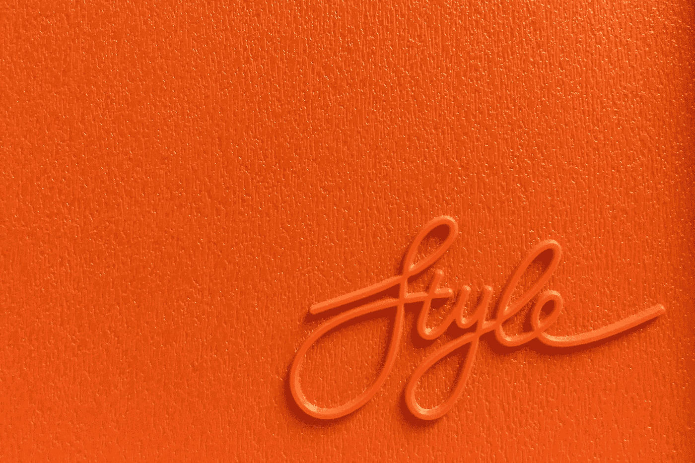

# 如何创建品牌风格指南

> 原文：<https://medium.com/codex/how-to-create-a-brand-style-guide-be3c9693c0e5?source=collection_archive---------19----------------------->

## 阅读本指南，了解如何创建品牌风格指南！

马库斯·加纳尔在 [Unsplash](https://unsplash.com?utm_source=medium&utm_medium=referral) 上的照片

品牌风格指南是概述特定品牌的具体风格指南的文件。这可以包括标志的使用，排版，调色板和其他设计元素。品牌风格指南是必不可少的，因为它确保所有的品牌元素是一致的，并准确地反映了…