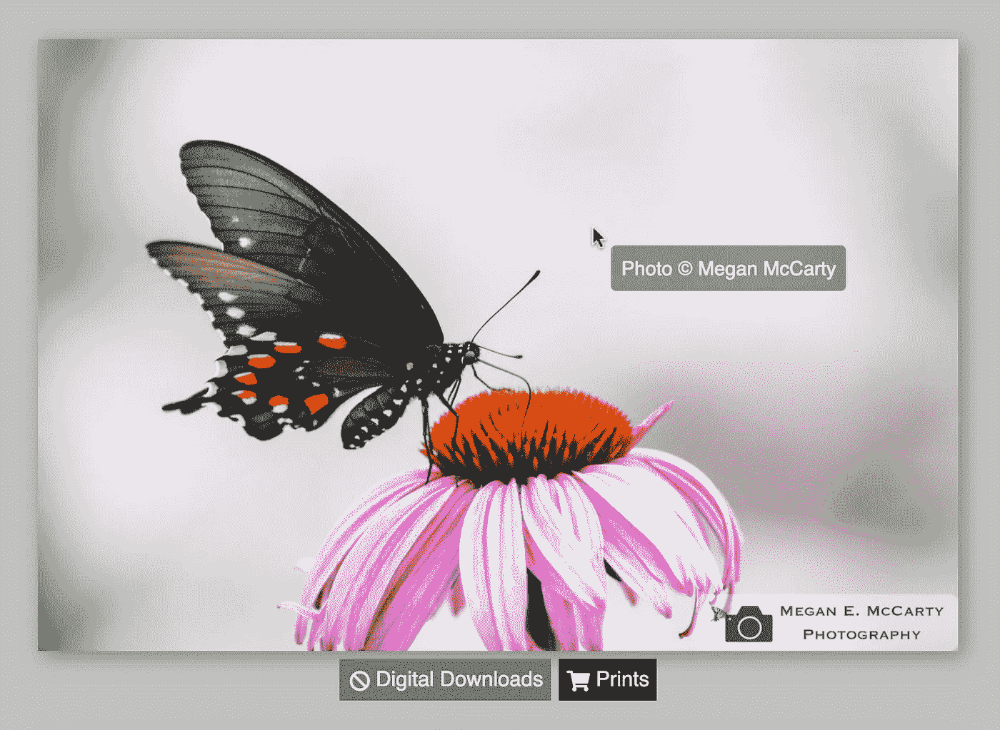

# 如何创建在 React 中淡出的自定义上下文菜单

> 原文：<https://medium.com/codex/how-to-create-a-custom-context-menu-that-fades-out-in-react-c5d40febc78?source=collection_archive---------19----------------------->



右键单击照片时会显示一条自定义消息，阻止复制或下载

不久前，我为自己的摄影作品建立了一个作品集网站。我以前在我的前端使用 React，尽管一切正常，但我并不真正明白我在做什么。这导致了一个网站是建立在一个非常“非反应”的方式。

我使用的东西之一是用 jQuery 构建的自定义上下文菜单(当你右键单击某个东西时看到的菜单)。这个 jQuery 代码允许我在右键单击一张照片时显示自定义的版权说明，而不是复制或下载照片的选项。我设法让它为我的网站工作，但现在我是一名熨斗软件工程的学生，我想重建我的网站“反应的方式”。这包括将 jQuery 代码重写为 React JS！(对于任何想使用 jQuery 定制上下文菜单的人，我强烈推荐您查看我使用的代码，由安德鲁·诺维科夫创建:[https://github.com/andymarch25/stopStealPhoto](https://github.com/andymarch25/stopStealPhoto))

> 注意:最初，我使用一个基于函数的组件和`useEffect()`钩子编写了下面的代码，但是如果一个图像被快速右键单击多次，这会导致一些奇怪的结果。我使用基于类的组件解决了这个问题，本教程将逐步介绍创建这种类型的组件的过程。最后，我将展示相同的代码，但作为一个(功能较少的)基于函数的组件。

首先，我创建了一个新组件`CopyrightText.js`，来保存上下文菜单的所有代码。在我写好初始组件后，我导出它并把它添加到我的`App.js`文件中:

```
// CopyrightText.jsimport React from ‘react’;class CopyrightText extends React.Component {
  render() {
    return (
      <span id=”context-menu”>
        Photo © Megan McCarty
      </span>
    )
  }
}export default CopyrightText;// App.jsimport React from ‘react’;
import CopyrightText from ‘./CopyrightText’;
…function App() {
  return (
    <div className=”parent-container”>
      <CopyrightText />
      …
    </div>
  )
}export default App;
```

接下来，我需要添加一些状态来跟踪一些事情:

1.  我需要跟踪光标的位置
2.  我需要跟踪是否显示上下文菜单
3.  我需要跟踪上下文菜单的不透明度(这样我可以让它慢慢淡出而不是消失)

```
class CopyrightText extends React.Component {
  state = {
    xPos: 0, // tracks the x coordinate of the cursor
    yPos: 0, // tracks the y coordinate of the cursor
    showContextMenu: false,
    opacity: 1
  }
  ...
}
```

然后，我为基于类的组件添加了两个内置函数:`componentDidMount()`和`componentWillUnmount()`。这些方法允许在组件呈现后将事件侦听器添加到页面中，如果组件被卸载，则删除事件侦听器:

```
componentDidMount() {
  document.body.addEventListener(‘contextmenu’, (event) =>
    this.handleClick(event)
  );
}componentWillUnmount() {
  document.body.removeEventListener(‘contextmenu’, (event) =>
    this.handleClick(event)
  );
}
```

目前为止很棒！在继续定义`handleClick()`函数之前，我写下了当右键单击一张照片时我想要发生的事情:

1.  将出现一个自定义上下文菜单
2.  该上下文菜单保持渲染 2 秒钟
3.  2 秒钟后，上下文菜单慢慢淡出并消失

为了完成第一个需求，我定义了`handleClick()`并编写了以下代码:

```
handleClick = (event) => {
  if (event.target.nodeName === ‘IMG’) {
    // prevents default context menu from loading
    event.preventDefault();

    this.setState({
      xPos: event.clientX + 14, // I offset the context menu’s x position from the cursor by 14
      yPos: event.clientY + 14, // I offset the context menu’s y position from the cursor by 14
      showContextMenu: true
    })
    console.log(“Context menu rendered”)
  }
}
```

完美！如果右键单击一个图像，为光标的坐标设置状态，并更新自定义上下文菜单的状态，以便显示它；如果右击图像以外的东西，状态不会改变，会显示默认的上下文菜单。

现在，为了让自定义上下文菜单消失，并满足上面的要求 2，我需要在`console.log()`之后有一个`setTimeout()`函数:

```
 … console.log(“Context menu rendered”)
    setTimeout(() => this.fadeOut(), 2000);
```

2 秒钟后，`fadeOut()`功能将被执行。该写了！

```
fadeOut = () => {
  console.log(“Function fadeOut() executed”)
  return this.setState({ showContextMenu: false });
}
```

所以 2 秒后上下文菜单就消失了，但并没有淡出。我需要一点复杂的逻辑来满足需求 3，因为与 jQuery 不同，JavaScript 或 React 没有本地的`.fadeOut()`方法。这是代码中最难写的部分，因为它不仅需要另一个`setTimeout()`函数，还需要一个`setInterval()`。更不用说我不得不写另一个自定义函数来处理减少不透明度！

```
fadeOut = () => {
  console.log(“Function fadeOut() executed”)
  let intervalID = setInterval(() => {
    return this.reduceOpacity()
  }, 50)

  setTimeout(() => {
    console.log(“Final setTimeout() function executed”)
    clearInterval(intervalID);
    return this.setState({ showContextMenu: false });
  }, 1000)
}reduceOpacity = () => {
  console.log(“Function reduceOpacity() executed”)
  this.setState(prevOpacity => {
    console.log(prevOpacity.opacity);
    return { opacity: prevOpacity.opacity — 0.05 }
  })
}
```

让我们走一遍。当`fadeOut()`被调用时，一个`setInterval()`函数被调用，它又调用`reduceOpacity()`。`reduceOpacity()` 设置不透明度的状态，每次调用时减少 0.05。`setInterval()`每 1/20 秒调用一次`reduceOpacity()`，所以调用函数 20 次后(或者 1 秒过去后)，不透明度达到 0；上下文菜单现在完全不可见。

还有第二个`setTimeout()`函数，它在最初调用`setInterval()`后立即被调用。这第二个`setTimeout()`有 1 秒的延迟。1 秒钟后(此时`reduceOpacity()`已经执行了 20 次)`setTimeout()`清除`setInterval()`功能；现在，`reduceOpacity()`已经停止执行，不会将不透明度降低到 0 以下。`setTimeout()`也将上下文菜单的状态重置为假。因此，不仅上下文菜单在视觉上消失了，跟踪其不透明度和是否呈现它的状态也相应地更新了。

回到`handleClick()`函数，我需要将不透明度重置为 1，这样下次右键单击图像时，上下文菜单实际上是可见的！

```
handleClick = (event) => {
  …

  setTimeout(() => this.fadeOut(), 2000);
  this.setState({ opacity: 1 });
  }
}
```

最后一件事:我需要在我的`CopyrightText`组件的 return 语句中添加一个三元组，以实际显示基于状态的上下文菜单:

```
render() {
  return (
    this.state.showContextMenu ?
      <span
        id=”context-menu”
        style={{
          ‘left’: this.state.xPos,
          ‘top’: this.state.yPos,
          ‘opacity’: this.state.opacity
        }}
      >
        Photo © Megan McCarty
      </span>
    : null
  )
}
```

搞定了。下面是最终的代码:

```
import React from ‘react’;class CopyrightText extends React.Component {
  state = {
    xPos: 0,
    yPos: 0,
    showContextMenu: false,
    opacity: 1
  } componentDidMount() {
    document.body.addEventListener(‘contextmenu’, (event) =>
      this.handleClick(event)
    );
  } componentWillUnmount() {
    document.body.removeEventListener(‘contextmenu’, (event) =>
      this.handleClick(event)
    );
  } handleClick = (event) => {
    if (event.target.nodeName === ‘IMG’) {
      event.preventDefault();

      this.setState({
        xPos: event.clientX + 14,
        yPos: event.clientY + 14,
        showContextMenu: true
      }) console.log(“Context menu rendered”)
      setTimeout(() => this.fadeOut(), 2000);
      this.setState({ opacity: 1 });
    }
  } fadeOut = () => {
    console.log(“Function fadeOut() executed”)
    let intervalID = setInterval(() => {
      return this.reduceOpacity()
    }, 50)

    setTimeout(() => {
      console.log(“Final setTimeout() function executed”)
      clearInterval(intervalID);
      return this.setState({ showContextMenu: false });
    }, 1000)
  } reduceOpacity = () => {
    console.log(“Function reduceOpacity() executed”)
    this.setState(prevOpacity => {
      console.log(prevOpacity.opacity);
      return { opacity: prevOpacity.opacity — 0.05 }
    })
  } render() {
    return (
      this.state.showContextMenu ?
        <span
          id=”context-menu”
          style={{
            ‘left’: this.state.xPos,
            ‘top’: this.state.yPos,
            ‘opacity’: this.state.opacity
          }}
        >
          Photo © Megan McCarty
        </span>
      : null
    )
  }
}export default CopyrightText;
```

对于感兴趣的人来说，这里有完全相同的代码，但是是作为基于函数的组件编写的(或者说是我的原始方式:注意，当快速连续单击鼠标右键时，它的工作效果不如基于类的组件！):

```
import React, {useState, useEffect} from ‘react’;function CopyrightText() {
  const [xPos, setXPos] = useState(0);
  const [yPos, setYPos] = useState(0);
  const [showContextMenu, setShowContextMenu] = useState(false);
  const [opacity, setOpacity] = useState(1);

  useEffect(() => {
    document.body.addEventListener(‘contextmenu’, handleClick);

    return function cleanup() {
      document.body.removeEventListener(‘contextmenu’, handleClick);
    }
  }, []); function handleClick(event) {
    if (!event.target.nodeName === ‘IMG’ ) {
      event.preventDefault();

      setXPos((xPos) => xPos = event.clientX + 14);
      setYPos((yPos) => yPos = event.clientY + 14);
      setShowContextMenu(true);

      console.log(“Context menu rendered”)
      setTimeout(() => fadeOut(), 2000);
      setOpacity((opacity) => opacity = 1);
    }
  } function fadeOut() {
    console.log(“Function fadeOut() executed”)
    let intervalID = setInterval(reduceOpacity, 50)

    setTimeout(() => {
      console.log(“Final setTimeout() function executed”)
      return setShowContextMenu(false);
    }, 1000)
  } function reduceOpacity() {
    console.log(“Function reduceOpacity() executed”)
    return setOpacity((opacity) => opacity — 0.05)
  } return (
    showContextMenu ?
      <span
        id=”context-menu”
        style={{
          ‘left’: xPos,
          ‘top’: yPos,
          ‘opacity’: opacity
        }}
      >
        Photo © Megan McCarty
      </span>
    : null
  )export default CopyrightText;
```

如果你愿意可以查看[直播网站](https://www.meganmccartyphotography.com/)，或者在 GitHub 上查看[源代码](https://github.com/Meganmccarty/photography)。