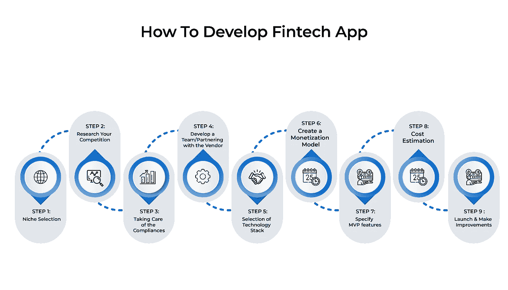

# 如何创建金融科技应用:高级管理人员详细指南

> 原文：<https://medium.com/codex/how-to-create-a-fintech-app-a-detailed-guide-for-senior-executives-9b6c753ea162?source=collection_archive---------12----------------------->

金融科技行业在疫情期间出现了激增，而所有其他行业都经历了增长的大幅停滞。由于 COVID 的物理移动性限制，推动了非接触式交易。

由于数字化、疫情引发的对数字服务的需求以及手机的可负担性，金融科技应用越来越受欢迎。P2P 贷款、实时支付、贷款发放、保险咨询以及以前由人力资本处理的一系列其他业务现在已经转移到完全依赖于互联网的金融科技环境中。

这种从众所周知的公司范式的巨大转变导致了许多独特的服务、服务模式和方法，以满足包括金融在内的一系列行业的客户需求。个人留在家里，从那里或在路上做生意的人数比历史上任何时候都多。因此，客户越来越了解移动银行、快速数字支付和汇款技术。

2020 年改变了许多行业(如果不是全部的话)的进程。封锁、严格的旅行限制、向远程工作的过渡以及对发展计划、预算和目标的彻底重新评估都对全球的企业产生了重大影响。然而，这种影响并不总是坏的。

在本帖中，我们将讨论开发一个成功的金融科技应用的一些关键参数。让我们开始吧:

# 为什么金融科技应用越来越受欢迎

随着新技术的出现和各种初创企业加入这一行业，金融科技应用在金融和银行业中产生了重大变革。以下原因促成了目前金融科技应用的推出:

# 1.增加的客户

客户对金融科技应用的好处越来越感兴趣。用户更喜欢这些应用程序，因为他们选择投资并使用人工智能应用程序完成交易，而不是为了每一个小活动或金融交易而去物理场所。由于这些程序提供了 24 小时银行服务，金融科技用户的数量每天都在不断扩大。

# 2.知识

由于金融科技应用的广泛使用和不断增长的需求，人们有兴趣了解金融科技应用。由于他们精通技术的气质和对金钱的兴趣，许多人选择了金融科技应用开发作为一份工作。寻找能够提供可扩展解决方案的熟练金融应用程序开发人员变得如此简单。

# 3.快速采用

金融科技应用现在需求很大，企业希望从中赚取丰厚的利润。几乎所有的智能手机现在都至少有一个有用的金融应用程序。金融组织广泛使用这些应用程序来寻找新客户和增强运营活动。因为客户更喜欢快捷方便的金融交易，而不是为了一次银行操作而等待数天，所以对移动银行应用和数字钱包的需求达到了历史最高水平。

# 4.企业需求

公司行业发现了对金融科技开发服务的巨大需求，因为这些金融科技应用有助于将更多潜在用户转化为忠诚的客户。进一步鼓励公司在了解竞争对手通过使用金融科技应用获得的优势后，开发能够为他们提供竞争优势的应用。

# 5.先进技术

开发移动应用程序的市场由不断改进的技术主导。由于机器人、人工智能、人工智能、大数据、区块链和物联网等技术的发展，金融应用的使用已经在全球范围内扩展。如果你想在这些技术的基础上设计一个可扩展的、响应迅速的金融应用，那么学习这些技术应该是你的第一步。

> **亦读-** [人工智能在金融行业的顶级用例](https://www.quytech.com/blog/artificial-intelligence-in-finance-industry/)

# Fintech 应用为什么受欢迎？

新冠肺炎疫情对银行和金融部门产生了巨大影响，并从根本上改变了金融机构的工作方式。因此，目前全球对金融科技应用有着巨大的需求。

# 金融科技应用的类型

对于企业的高管来说，在深入研究如何设计金融科技应用之前，了解各种金融科技应用至关重要。这可以帮助你决定创建什么形式的金融科技应用程序，以扩大你的业务。考察许多金融科技应用类别:

*   移动支付
*   监管的
*   投资
*   消费金融
*   保险
*   放款
*   众筹
*   国际支付

# 金融科技应用的主要功能

在阅读金融科技应用设计指南时，开发流程和功能始终是最重要的关注点。在这一部分，我们强调了吸引用户和提高金融科技应用程序的功能和响应能力的一些最重要的组成部分。让我们来看看这些特性:

# 1.安全性

人们可以使用金融科技应用程序执行各种私人银行和金融交易。因此，每个 fintech 应用程序的关键工作是确保用户数据的隐私和安全。为了防止数据受到不必要的访问，金融科技应用程序开发人员整合了双因素身份认证、区块链、生物识别、加密和许多其他安全措施等功能。

# 2.应用使用指南

必须有一个允许用户导航整个程序的功能。该功能应强调 fintech 应用的基本特性和功能，简化用户与应用的交互，并使其所有功能易于使用。为了让用户，甚至是那些不熟悉货币的用户，有一个良好的体验，这必须是快速的和信息丰富的。

# 3.数据可视化

大多数金融科技应用以简单的方式向用户提供收入、支出和日常活动的信息。然而，数据可视化可能会给你的金融科技应用带来竞争优势。这将直观地描述所有因素，包括股票图表、支付历史和支出。在设计金融科技应用程序时，这通常是必不可少的。

> **亦读-** [如何开发类似 Robinhood](https://www.quytech.com/blog/stock-trading-apps-like-robinhood-disrupting-the-financial-market/) 的炒股 app？

# 4.语音集成

语音助手目前是金融 app 的普遍趋势。最关键和最受欢迎的金融应用功能正在语音助手的帮助下出现。由于苹果 Siri、谷歌助手等语音助手，用户可以不用打开软件就能使用。

# 5.支付网关

大多数金融科技应用程序都包含支付网关功能，为此，这些程序会与 PayPal 等第三方支付网关提供商进行对接。因此，金融科技应用最重要的元素之一是其快速安全的支付网关。

你可以聘请一家领先的 [**金融应用开发公司**](https://www.quytech.com/solutions-enterprise/finance-industry.php) 比如“**Quytech”**来轻松地完成你的工作。

# 如何开发金融科技应用程序一步一步的指南

理解金融科技应用的开发过程是困难的，但为了让事情变得更容易，我们已经制作了一个简短且组织良好的列表，列出了必须完成的所有过程。请考虑以下情况:

# **第一步:利基选择**

在开始设计财务软件之前，你必须先选择一个专家。找到正确的利基可能需要一些时间和努力，但这是至关重要的，因为这将使你简化过程，并创建一个高度可扩展的金融科技应用程序。选择利基市场需要对金融科技应用的种类、建设策略和目标位置做出判断。你应该考虑这个应用程序是用于移动银行、资金管理、众筹还是其他用途。确定目标后，定位目标受众及其需求。所有这些研究将最终形成一个无缝且有效的开发过程。

# 第二步:调查你的竞争对手

在开发过程的竞争对手分析阶段，确保你选择的 fintech 移动应用程序开发业务能够生产出能够超越竞争对手的产品。在进行竞争研究之前，对现有应用进行广泛的市场调查以发现它们的优点和缺点是至关重要的。通过认识到竞争对手的金融应用程序设计中的弱点，你可以创建一个金融应用程序，纠正其所有的设计缺陷，并为消费者提供更深入、更无摩擦的体验。这将有助于一个人在竞争中获得优势，并扩大他们的消费者基础。

# 第三步:关注法规遵从性

就金融科技应用开发而言，与其他类型的应用开发相比，合规性要严格得多。在这种情况下，维护苹果应用商店和谷歌 Play 商店的发布规则是不够的。根据选定的目标市场，进行广泛的合规性研究以发现任何相关的监管规则、法规和法律障碍至关重要。必须确定所有这样的法律考虑，并且必须根据需要调整开发过程。了解适用法律法规下的授权非常重要。

因为当公司搬迁以反映合规和财务保护措施时，法规会发生变化，所以金融科技应用开发公司必须精通法律。了解您的客户(KYC)、数字签名认证和其他重要概念只是几个例子。为避免不合规，请确保完全完成此步骤。

# 步骤 4:发展团队/与供应商合作

金融科技应用的开发本质上由两部分组成:资金和技术。此外，获得可靠和可扩展的软件至关重要，与提供两者正确组合的移动应用程序开发企业合作是解决方案。如果你的公司缺乏能够开发 fintech 应用程序的内部开发团队，你必须雇佣一家 fintech 开发公司，该公司拥有能够开发响应性 fintech 应用程序的专家团队。因此，需要一个由以下人员组成的开发团队:

*   后端和前端开发人员
*   项目管理人
*   设计师
*   生产部经理
*   商业分析员
*   质量保证专家

你的团队规模还将取决于你的预算、项目需求以及发布金融科技应用的时间表。如果同时创建 iOS 和 Android 应用程序，则需要两个前端开发人员。第二种选择是将金融科技应用的开发外包给有能力的金融科技开发企业，尽管这可能会产生额外的费用。

# 步骤 5:选择技术堆栈

获得构建成功财务应用程序所需的技术。根据应用程序的类型和所提供的功能，前端和后端都需要大量的工具和技术。因为每个金融科技项目都是独特的，定制的技术栈是满足项目需求和目标所必需的。

如果你选择了正确的技术栈，你也可以将其作为一种策略，以最大限度地降低构建金融科技应用的总成本以及启动它们所需的时间。Fintech 应用程序使用多种技术构建，包括 Java、Swift、Ruby、C#、Python、C++和 Kotlin。对于 iOS，你可以使用 Swift 或者 Objective C，对于 Android，你可以使用 Kotlin 或者 Java。

# 第六步:创建一个盈利模式

在将功能融入金融应用之前，确定预期收入流至关重要。为了实现这一点，必须建立一个由少数最有价值的创收流组成的货币化模式，同时必须找到未来的新前景。

> **同时阅读-** Top [**Web3 货币化趋势**](https://www.quytech.com/blog/top-web3-monetization-trends/) 展望 2022 年及以后

# 步骤 7:指定 MVP 特性

在完成竞争研究和市场调查之后，下一个阶段是确定你的金融科技应用程序的真正目标以及该应用程序必须包含的功能。只有那些必需的、重要的、能够提高程序效率、可用性和速度的特性才应该被包含进来。没有必要提供太多的特征。

为了确保金融应用程序满足其目标，应该限制双因素身份验证、聊天机器人、跨平台兼容性、通过 OTP 登录等功能。完成产品领域的市场研究后，您必须选择哪些特性将包含在 MVP 中。

有几个工具可以帮助解决这个问题，比如优先级矩阵和得失图。在 MVP 版本发布后，收集消费者的反馈至关重要，以便评估目标市场的行为，并根据他们的想法调整金融科技应用。

# 步骤 8:成本估算

最终的预算限制使得应用程序开发过程不必要地拖延。建立一个金融科技应用的成本由多种标准决定，包括项目的规模、测试、维护、设计、平台选择、功能集成等等。在开始构建 fintech 应用程序之前，做一个评估是个好主意。这将使你在满足金融科技应用开发期限的同时，不超出预算。

金融科技应用开发费用通常由开发者的每小时开发费用决定。外包金融应用程序开发是获得合格开发人员、尖端技术和可扩展解决方案的最佳方法之一。

你可以向 Quytech 的专家预约一个免费的咨询时段，以获得正确的评估。

# 第 9 步:启动并做出改进

金融科技应用的开发并不意味着不需要额外的努力。相反，开发过程继续进行，因为维护和支持总是需要的。一旦 fintech 应用程序进入测试阶段，就会审查用户反馈，并根据想法和评论对功能和设计进行修改，以给潜在消费者提供更好的增强体验。应用程序的方法和功能必须随着技术和时间的发展而更新。应用程序必须尽快修复用户在使用时可能遇到的任何故障。

以下是支持和维护应用程序的关键措施:

*   确保程序总是更新到最新的操作系统版本
*   更新应用程序可以访问的第三方服务和库
*   执行所有安全审计并确认最新更新
*   让瑕疵和缺陷变得更好
*   重新组织当前代码而不改变其原始功能

# 包扎

近年来，金融科技的破坏给客户提供了传统银行解决方案的更好替代方案，从而在银行和金融行业制造了许多噪音。
各种各样的组织开始意识到这些新技术的巨大潜力和重要性。金融机构必须提供一种服务，允许客户以数字方式方便地处理他们的资金，以保持生存。

如果你正在寻找最好的 [**fintech 应用程序开发公司**](https://www.quytech.com/solutions-enterprise/finance-industry.php) ，并希望将你的想法转化为现实，那么就雇佣“ **Quytech** ”。

> **相关文章-** [**Fintech App 开发**](https://www.quytech.com/blog/fintech-app-development-guide-for-startups/) :创业基本指南