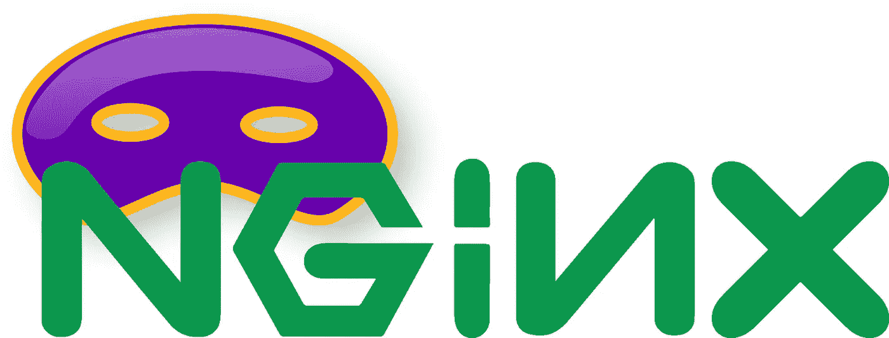

# 如何使用 DnsMAsq 和 Nginx 创建家庭网络和反向代理

> 原文：<https://medium.com/codex/how-to-create-a-home-network-and-reverse-proxy-with-dnsmasq-and-nginx-9adbbdf351d2?source=collection_archive---------1----------------------->

## 让您的家庭网络充满乐趣

如果你像我一样，你有很多东西在家里运行。一个媒体中心、一个文件服务器，也许还有几个家庭自动化系统……记住所有这些 IP 和端口可能是一件痛苦的事情。在这里，我将向您展示如何使用 DnsMAsq 和…为您的家庭构建 DNS 服务器和远程代理