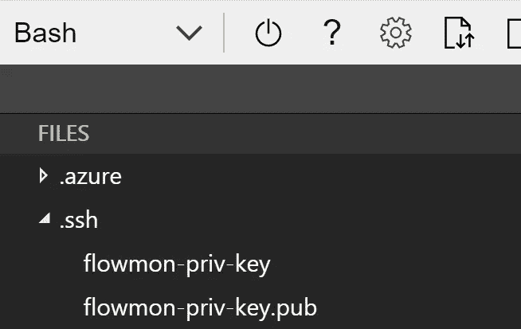
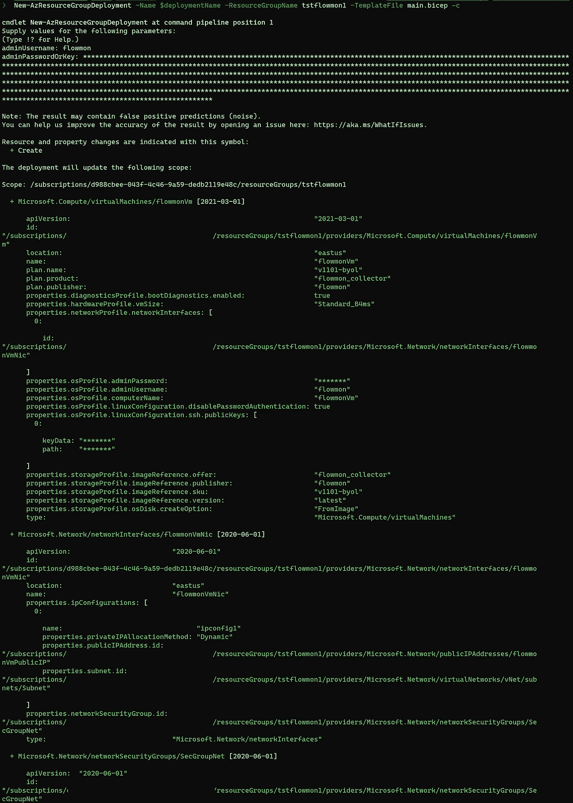
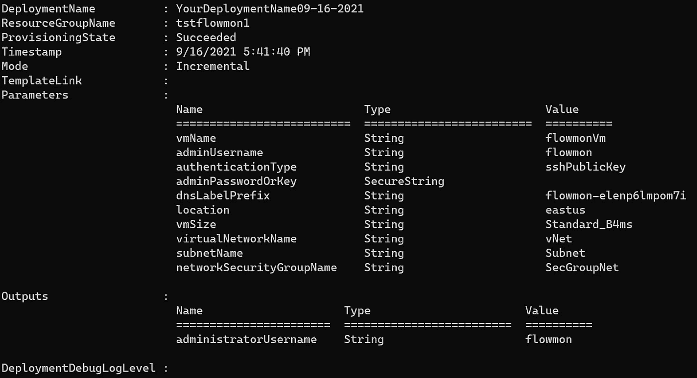
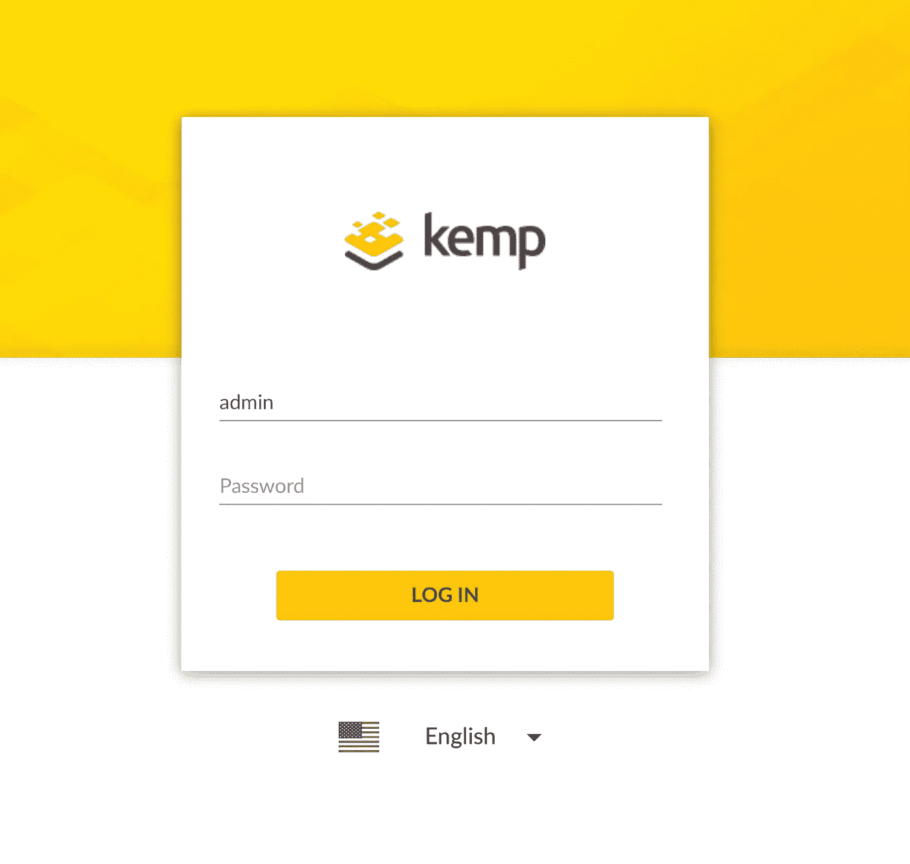

# 💪使用 Azure Bicep 创建 Linux 虚拟机—模板

> 原文：<https://medium.com/codex/how-to-create-a-linux-virtual-machine-with-azure-bicep-template-e22f50f2baea?source=collection_archive---------1----------------------->

今天，我们将创建一个 Azure Bicep 模板来配置基于 Linux 的虚拟机。

本文的主要目的是让您了解如何使用 Azure Bicep 来部署基于 Linux 的虚拟机。在这种情况下，我们将编写一个 Bicep 模板来在 Azure 中部署 Kemp Flowmon。

# 概观

在 Azure 上部署这个基于 Linux 的虚拟机之后，我们可以期待什么？我们将部署 Kemp Flowmon 收集器设备，这是一个很好的例子，因为它是基于 Linux 的机器，将为您提供预测网络性能监控和网络检测及响应功能。

本文将关注如何利用 Azure Bicep 模板来简化这个基于 Linux 的虚拟机在 Azure 上的部署。

# 先决条件。

*   有效的 Azure 订阅。
*   拥有所有者/贡献者角色的用户
*   资源组

我们开始吧！

在 Azure 中创建基于 Linux 的虚拟机包括几个步骤:

*   创建资源组
*   创建虚拟机及其相关组件(虚拟网络、子网、网络接口、DNS、安全规则。)

注意，这个特定的机器— Kemp Flowmon —只允许 SSH 验证。因此，我们将在 Bicep 模板中包含使用 SSH 进行身份验证的能力，而不是使用密码。

# 1.创建 SSH 密钥对

第一步是创建一个 SSH 密钥对；您可以查看以下关于如何在 Azure 中为 Linux 虚拟机创建 SSH 密钥对的文章—[https://docs . Microsoft . com/en-us/Azure/virtual-machines/Linux/MAC-create-SSH-keys](https://docs.microsoft.com/en-us/azure/virtual-machines/linux/mac-create-ssh-keys)

在本例中，我们将使用 Azure Bash 控制台创建一个 SSH 密钥对。在 Azure 门户中，请求一个新的控制台，如下图所示:


Azure 门户—控制台

然后，我们将使用下面的命令生成一个 SSH 密钥:

```
ssh-keygen \
    -m PEM \
    -t rsa \
    -b 4096 \
    -C "flowmon" \
    -f ~/.ssh/flowmon-priv-key \
    -N yourpasshphrase
```

这将在文件共享中的 SSH 目录下生成密钥:



SSH 密钥

如果您不熟悉 SSH 公钥的格式，可以使用下面的 cat 命令显示您的公钥，替换' *~/。ssh/id_rsa.pub* ，如果需要的话，带有您自己的公钥文件的路径和文件名:

```
cat ~/.ssh/flowmon-priv-key.pub
```

上面的命令将在控制台中显示 SSH 公钥。我们将在部署期间需要它，所以请将它放在手边。

酷！现在我们有了 SSH 密钥对。

您必须接受 Kemp Flowmon 收集器的许可条款。由于这是从市场部署的虚拟机，我们必须在部署该设备之前接受条款。

我们可以使用 PowerShell 通过下面的 cmdlet 接受条款和条件:

```
Get-AzMarketplaceTerms `
-Publisher 'flowmon' `
-Product 'flowmon_collector' `
-Name 'v1101-byol' |
Set-AzMarketplaceTerms -Accept
```

既然我们已经接受了市场条款，现在让我们开始制作我们的二头肌模板。

# 2.Azure 二头肌模板-参数

我们将通过定义虚拟机的参数来定义 start。

下面的代码显示了此部署要使用的参数:

```
// The name of your Virtual Machine.
param vmName string = 'flowmonVm'// Username for the Virtual Machine.
param adminUsername string// Type of authentication to use on the Virtual Machine. SSH key is recommended.
param authenticationType string = 'sshPublicKey'// SSH Key or password for the Virtual Machine. SSH key is recommended.
[@secure](http://twitter.com/secure)()
param adminPasswordOrKey string// Unique DNS Name for the Public IP used to access the Virtual Machine.
param dnsLabelPrefix string = toLower('flowmon-${uniqueString(resourceGroup().id)}')// Location for all resources.
param location string = resourceGroup().location// The size of the VM.
param vmSize string = 'Standard_B4ms'// Name of the VNET.
param virtualNetworkName string = 'vNet'// Name of the subnet in the virtual network.
param subnetName string = 'Subnet'// Name of the Network Security Group.
param networkSecurityGroupName string = 'SecGroupNet'
```

注意，我们使用了一个 *"@secure()"* 装饰器来安全地传递 SSH 密钥。我建议您看看这篇关于如何利用 [*@secure()* 装饰器](/codex/azure-bicep-secure-secrets-in-parameters-secure-decorator-ce6317cc0c23)安全地传递参数中的秘密的文章。

# 3.Azure 二头肌模板-变量

接下来，我们将定义几个变量:

```
var publicIPAddressName = '${vmName}PublicIP'
var networkInterfaceName = '${vmName}Nic'
var subnetRef = '${vnet.id}/subnets/${subnetName}'
var osDiskType = 'Standard_LRS'
var subnetAddressPrefix = '10.5.0.0/24'
var addressPrefix = '10.5.0.0/16'
var linuxConfiguration = {
  disablePasswordAuthentication: true
  ssh: {
    publicKeys: [
      {
        path: '/home/${adminUsername}/.ssh/authorized_keys'
        keyData: adminPasswordOrKey
      }
    ]
  }
}
```

注意，在变量" *linuxConfiguration* 中，我们禁用了密码认证，传递了 SSH 密钥路径，并引用了密钥值。

# 4.Azure 二头肌模板—网络

下一步是定义网络接口。您可以根据需要创建更多接口。

```
resource nic 'Microsoft.Network/networkInterfaces@2020-06-01' = {
  name: networkInterfaceName
  location: location
  properties: {
    ipConfigurations: [
      {
        name: 'ipconfig1'
        properties: {
          subnet: {
            id: subnetRef
          }
          privateIPAllocationMethod: 'Dynamic'
          publicIPAddress: {
            id: publicIP.id
          }
        }
      }
    ]
    networkSecurityGroup: {
      id: nsg.id
    }
  }
}
```

然后，我们将定义允许或拒绝访问该虚拟机的安全规则。Kemp Flowmon 收集器需要一些规则来接收来自不同来源的流量:

```
resource nsg 'Microsoft.Network/networkSecurityGroups@2020-06-01' = {
  name: networkSecurityGroupName
  location: location
  properties: {
    securityRules: [
      {
           name: 'SSH'
           properties : {
               protocol : 'Tcp' 
               sourcePortRange :  '*'
               destinationPortRange :  '22'
               sourceAddressPrefix :  '*'
               destinationAddressPrefix: '*'
               access:  'Allow'
               priority : 1010
               direction : 'Inbound'
               sourcePortRanges : []
               destinationPortRanges : []
               sourceAddressPrefixes : []
               destinationAddressPrefixes : []
          }
      }
      {
           name : 'HTTPS'
           properties : {
               protocol :  'Tcp'
               sourcePortRange :  '*'
               destinationPortRange :  '443'
               sourceAddressPrefix :  '*'
               destinationAddressPrefix :  '*'
               access :  'Allow'
               priority : 1020
               direction :  'Inbound'
               sourcePortRanges : []
               destinationPortRanges : []
               sourceAddressPrefixes : []
               destinationAddressPrefixes : []
          }
      }
      {
           name :  'Collector'
           properties : {
               protocol :  'Udp'
               sourcePortRange :  '*'
               destinationPortRange :  '3000'
               sourceAddressPrefix :  '*'
               destinationAddressPrefix :  '*'
               access :  'Allow'
               priority : 103
               direction :  'Inbound'
               sourcePortRanges : []
               destinationPortRanges : []
               sourceAddressPrefixes : []
               destinationAddressPrefixes : []
          }
      }
    ]
  }
}
```

安全规则就绪后，我们将继续定义虚拟网络:

```
resource vnet 'Microsoft.Network/virtualNetworks@2020-06-01' = {
  name: virtualNetworkName
  location: location
  properties: {
    addressSpace: {
      addressPrefixes: [
        addressPrefix
      ]
    }
    subnets: [
      {
        name: subnetName
        properties: {
          addressPrefix: subnetAddressPrefix
          privateEndpointNetworkPolicies: 'Enabled'
          privateLinkServiceNetworkPolicies: 'Enabled'
        }
      }
    ]
  }
}
```

下一步是定义公共 IP 地址。根据您的环境，您可以仅启用私有 IP；对于本例，我们将定义一个公共 IP

```
resource publicIP 'Microsoft.Network/publicIPAddresses@2020-06-01' = {
  name: publicIPAddressName
  location: location
  properties: {
    publicIPAllocationMethod: 'Dynamic'
    publicIPAddressVersion: 'IPv4'
    dnsSettings: {
      domainNameLabel: dnsLabelPrefix
    }
    idleTimeoutInMinutes: 4
  }
  sku: {
    name: 'Basic'
  }
}
```

一旦我们定义了前面的资源，最后要定义的资源就是虚拟机。

# 5.Azure 二头肌模板—虚拟机

下面的代码显示了虚拟机的定义。

```
resource vm 'Microsoft.Compute/virtualMachines@2021-03-01' = {
  name: vmName
  location: location
  properties: {
    hardwareProfile: {
      vmSize: vmSize
    }
    storageProfile: {
      osDisk: {
        createOption: 'FromImage'
        managedDisk: {
          storageAccountType: osDiskType
        }
      }
      imageReference: {
        publisher: 'flowmon'
        offer: 'flowmon_collector'
        sku: 'v1101-byol'
        version: 'latest'
      }
    }
    networkProfile: {
      networkInterfaces: [
        {
          id: nic.id
        }
      ]
    }
    osProfile: {
      computerName: vmName
      adminUsername: adminUsername
      adminPassword: adminPasswordOrKey
      linuxConfiguration: any(authenticationType == 'password' ? null : linuxConfiguration)
    }
    diagnosticsProfile: {
      bootDiagnostics: {
        enabled: true
      }
    }
  }
  plan: {
    name: 'v1101-byol'
    publisher: 'flowmon'
    product: 'flowmon_collector'
  }
}
```

请注意，Kemp Flowmon 虚拟机必须包括计划的定义，并且包括:名称、发布者和产品。

最后，我们将包括管理员用户名的输出，如下所示:

```
output administratorUsername string = adminUsername
```

# 6.Azure 二头肌部署

作为最佳实践，我建议您使用标志-C 预览部署。我们将使用下面的命令来启用部署预览:

```
$date = Get-Date -Format "MM-dd-yyyy"
$deploymentName = "AzInsiderDeployment"+"$date"New-AzResourceGroupDeployment -Name $deploymentName -ResourceGroupName azinsider_demo -TemplateFile .\main.bicep -TemplateParameterFile .\azuredeploy.parameters.json -c
```

注意，我们在命令的末尾添加了标志-c；这将启用假设验证。这样，您可以在进行实际部署之前预览部署操作。

在部署时，会要求您输入 adminUsername。该值必须是“ *flowmon* ”。这是 Kemp Flowmon 设备的特定配置。

然后我们将提供 SSH 公钥。该值作为安全参数传递。

下图显示了部署的预览:



Azure Bicep —部署预览

一旦所有的配置都正确，我们将继续进行部署。下图显示了部署的输出:



Azure Bicep — Kemp Flowmon 部署

现在可以通过 [https://Your-IP-Address 访问虚拟机。](https://Your-IP-Address.)



肯普·弗洛蒙·天蓝色

部署之后，我建议您通过 SSH 访问该设备，并修改 GUI 用户密码以访问 Web 用户界面。

完整的二头肌模板如下所示:

```
// The name of your Virtual Machine.
param vmName string = 'flowmonVm'// Username for the Virtual Machine.
param adminUsername string// Type of authentication to use on the Virtual Machine. SSH key is recommended.
param authenticationType string = 'sshPublicKey'// SSH Key or password for the Virtual Machine. SSH key is recommended.
[@secure](http://twitter.com/secure)()
param adminPasswordOrKey string// Unique DNS Name for the Public IP used to access the Virtual Machine.
param dnsLabelPrefix string = toLower('flowmon-${uniqueString(resourceGroup().id)}')// Location for all resources.
param location string = resourceGroup().location// The size of the VM.
param vmSize string = 'Standard_B4ms'// Name of the VNET.
param virtualNetworkName string = 'vNet'// Name of the subnet in the virtual network.
param subnetName string = 'Subnet'// Name of the Network Security Group.
param networkSecurityGroupName string = 'SecGroupNet'var publicIPAddressName = '${vmName}PublicIP'
var networkInterfaceName = '${vmName}Nic'
var subnetRef = '${vnet.id}/subnets/${subnetName}'
var osDiskType = 'Standard_LRS'
var subnetAddressPrefix = '10.5.0.0/24'
var addressPrefix = '10.5.0.0/16'
var linuxConfiguration = {
  disablePasswordAuthentication: true
  ssh: {
    publicKeys: [
      {
        path: '/home/${adminUsername}/.ssh/authorized_keys'
        keyData: adminPasswordOrKey
      }
    ]
  }
}resource nic 'Microsoft.Network/networkInterfaces@2020-06-01' = {
  name: networkInterfaceName
  location: location
  properties: {
    ipConfigurations: [
      {
        name: 'ipconfig1'
        properties: {
          subnet: {
            id: subnetRef
          }
          privateIPAllocationMethod: 'Dynamic'
          publicIPAddress: {
            id: publicIP.id
          }
        }
      }
    ]
    networkSecurityGroup: {
      id: nsg.id
    }
  }
}resource nsg 'Microsoft.Network/networkSecurityGroups@2020-06-01' = {
  name: networkSecurityGroupName
  location: location
  properties: {
    securityRules: [
      {
           name: 'SSH'
           properties : {
               protocol : 'Tcp' 
               sourcePortRange :  '*'
               destinationPortRange :  '22'
               sourceAddressPrefix :  '*'
               destinationAddressPrefix: '*'
               access:  'Allow'
               priority : 1010
               direction : 'Inbound'
               sourcePortRanges : []
               destinationPortRanges : []
               sourceAddressPrefixes : []
               destinationAddressPrefixes : []
          }
      }
      {
           name : 'HTTPS'
           properties : {
               protocol :  'Tcp'
               sourcePortRange :  '*'
               destinationPortRange :  '443'
               sourceAddressPrefix :  '*'
               destinationAddressPrefix :  '*'
               access :  'Allow'
               priority : 1020
               direction :  'Inbound'
               sourcePortRanges : []
               destinationPortRanges : []
               sourceAddressPrefixes : []
               destinationAddressPrefixes : []
          }
      }
      {
           name :  'Collector'
           properties : {
               protocol :  'Udp'
               sourcePortRange :  '*'
               destinationPortRange :  '3000'
               sourceAddressPrefix :  '*'
               destinationAddressPrefix :  '*'
               access :  'Allow'
               priority : 103
               direction :  'Inbound'
               sourcePortRanges : []
               destinationPortRanges : []
               sourceAddressPrefixes : []
               destinationAddressPrefixes : []
          }
      }
   ]
  }
}resource vnet 'Microsoft.Network/virtualNetworks@2020-06-01' = {
  name: virtualNetworkName
  location: location
  properties: {
    addressSpace: {
      addressPrefixes: [
        addressPrefix
      ]
    }
    subnets: [
      {
        name: subnetName
        properties: {
          addressPrefix: subnetAddressPrefix
          privateEndpointNetworkPolicies: 'Enabled'
          privateLinkServiceNetworkPolicies: 'Enabled'
        }
      }
    ]
  }
}resource publicIP 'Microsoft.Network/publicIPAddresses@2020-06-01' = {
  name: publicIPAddressName
  location: location
  properties: {
    publicIPAllocationMethod: 'Dynamic'
    publicIPAddressVersion: 'IPv4'
    dnsSettings: {
      domainNameLabel: dnsLabelPrefix
    }
    idleTimeoutInMinutes: 4
  }
  sku: {
    name: 'Basic'
  }
}resource vm 'Microsoft.Compute/virtualMachines@2021-03-01' = {
  name: vmName
  location: location
  properties: {
    hardwareProfile: {
      vmSize: vmSize
    }
    storageProfile: {
      osDisk: {
        createOption: 'FromImage'
        managedDisk: {
          storageAccountType: osDiskType
        }
      }
      imageReference: {
        publisher: 'flowmon'
        offer: 'flowmon_collector'
        sku: 'v1101-byol'
        version: 'latest'
      }
    }
    networkProfile: {
      networkInterfaces: [
        {
          id: nic.id
        }
      ]
    }
    osProfile: {
      computerName: vmName
      adminUsername: adminUsername
      adminPassword: adminPasswordOrKey
      linuxConfiguration: any(authenticationType == 'password' ? null : linuxConfiguration)
    }
    diagnosticsProfile: {
      bootDiagnostics: {
        enabled: true
      }
    }
  }
  plan: {
    name: 'v1101-byol'
    publisher: 'flowmon'
    product: 'flowmon_collector'
  }
}output administratorUsername string = adminUsername
```

我希望这篇文章能帮助你踏上 Bicep 之旅，以及如何利用 Bicep 在 Azure 中部署基于 Linux 的虚拟机。

[*在此加入****azin sider****邮箱列表。*](http://eepurl.com/gKmLdf)

*-戴夫·r·*