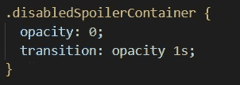

# 如何只用 React 和 CSS 在 hover 上创建一个简单的剧透效果？

> 原文：<https://medium.com/codex/how-to-create-a-simple-spoiler-effect-on-hover-using-react-and-css-only-5d2fb18c81d8?source=collection_archive---------6----------------------->

我已经有一段时间没写文章了。我一直忙于学校和自由职业。然而，稍后在另一篇文章中会有更多的介绍。今天，我们将制作一个非常简单的在悬停时触发的剧透效果，我们只使用 React 和 CSS。首先，使用您喜欢的工具启动一个项目。对于这篇文章，我将使用 Vite，但你可以自由使用你喜欢的任何东西(如果你使用 CRA，我强烈建议不要使用 CRA，有许多文章详细解释了为什么它不好。)由于这不是一篇关于使用 Vite 的文章，我将跳到编码部分。然而，如果你被卡住了，我强烈建议你检查 Vite 自己的文档，这是惊人的。他们的文件可以在这里[找到。继续，让我们把结构移开。首先，让我们导航到项目中的`app.jsx`文件。我删除了一大块，因为我们的项目不需要它。我当前的文件如下所示:](https://vitejs.dev/guide/)

简单吧？接下来，我用我的终端通过输入`npm run dev`，aaaand 和…来启动我的应用程序

这是一个好消息，因为这意味着我们的 React 应用程序仍然存在并且运行良好。让我们开始工作，我们的应用程序，这将只是一个简单的图像剧透应用程序。首先，我想要一个包装我们的剧透和图像的容器。我可以将 div 容器与文件中已经存在的“App”类一起使用。接下来，我想为我们的扰流板包装。我希望文本出现在我们的剧透组件中，这样我们希望用户做什么就很清楚了。我可以简单地创建另一个 div 元素来创建这个容器，如下所示；

好的，我们有 2 个 div 元素，我们正在慢慢进入 div 地狱的深处。让我们将第一个 div 更改为 main 元素，因为它是页面的主要内容。

完美。现在，让我解释一下为什么我们有两个集装箱。第一个容器“appContainer”是我们的主容器，它将保存我们的图像和剧透。第二个容器“剧透容器”将保存我们的文本和剧透背景。在这一点上，让我们做一些 CSS。浏览你的`app.css`文件，删除所有你不再需要的东西。让我们从定义 appContainer 的高度和宽度开始，它将把我们的图像和剧透放在一起。我将使用一个 800x600 的图像，你通常不希望使用像素进行测量，但对于这个非常简单的例子来说，这样做没有坏处。如果你想了解更多，我强烈建议你去看看响应式网页设计，百分比，视口和 rem/em。继续，您的代码应该看起来像这样；

接下来，我们需要确保我们的剧透容器匹配 appContainer 的高度和宽度。不仅如此，我们还需要给它一个经典的黑色背景剧透。接下来让我们继续。

但是等等…为什么我们没有重新定义我们的高度和宽度？答案很简单。扰流板容器是 appContainer 的子元素，所以当我们告诉子元素使用其父元素的 100%的高度和宽度时，子元素将继承父元素的值。如果你现在查看你的网站，你应该已经看到了第一个画面。

它看起来并不令人印象深刻，只是一个黑盒，但我们会用它做一些反应和 CSS 魔法。接下来，让我们添加一些文本到我们枯燥的黑盒。我将使用一个 h2 元素和一个 p 元素，我将为每个元素分配类，以便更容易地设计它们的样式。显然，这些需要在我们的剧透容器中，因为我希望它们在剧透本身中。

好了，我们在剧透容器中添加了文本。其中一个是 h2 标题，另一个是带有一些“em”标签的段落元素，以强调我们希望用户悬停在图像上。如果我们再次检查我们的网站，我们应该能够看到这一点；

等等，这很奇怪，对吧？正文在哪里？嗯，文字是黑色的，所以在黑色背景下你看不到。让我们改变文本颜色，但是不要为每个段落元素一个一个地做，你可以在容器上设置它，这样子元素从它们的父元素继承。很好，对吧？

好吧，文字有点难看。让我们把它做在水平和垂直的正中间。让我们也减少标题和段落之间的距离。当我们这样做的时候，让我们也为我们的段落找一个新的颜色。为了做到这一点，我将在标题上使用行高和边距，并使用 flexbox 在中间对齐文本。为了做到这一点，我添加了 flex display 到我们的扰流板容器，设置方向为列，因为我们希望我们的标题和段落元素是垂直的，而不是水平的。接下来，我将我们的剧透文本的下边距和行高设置为 0，以减少标题和文本之间的间距。我还改变了段落标签的颜色。最终的 CSS 是这样的；

从技术上来说，我们可以通过调整字体大小、字体粗细甚至给自己弄一个好看的字体来让它看起来更漂亮，但我不想浪费太多时间。接下来，让我们添加我们的形象。为了生成占位符图像，我使用了一年前开发的占位符图像生成器。您可以找到自己的图片，或者使用[我的服务](https://image-placeholder-generator-rgcm1zlce-hujam.vercel.app/)或任何其他您喜欢的服务生成一个占位符。我将我的占位符图像导出为 WebP 文件，这被认为是最好的方法之一，因为其他文件的大小更大，会影响网站的加载时间。接下来，让我们在`src`文件夹中创建一个`images`文件夹，并将我们的占位符图像移动到那里。尽管这是一个非常简单的应用程序，但保持整洁有序始终是最佳实践。现在你的文件夹应该看起来像这样；

接下来，我们需要将我们的图像导入到我们的`app.jsx`文件中来使用它。因此，让我们导入它，并将我们的图像添加到我们的网站。

这将帮助我们导入存储在 images 文件夹中的文件“placeholder.webp ”,我们可以通过调用“image”来使用该特定文件。命名与它是一个图像的事实无关。我可以使用`import medium from ‘./images/placeholder.webp’;`，它仍然可以工作。接下来，让我们将我们的图像添加到我们的网站。

请注意，该图像不在剧透容器中，但仍在 appContainer 中。那是因为我不想让剧透容器挡住我的图像，因为我会用一些 React 和 CSS 魔法让它消失。确保总是为你的图片设置一个“alt”文本。现在，让我们再次检查我们的网站。

哦，很奇怪，对吧？图像和我们的剧透在彼此之上。不完全是。那是因为它们每一个都是*块*元素。有一种方法可以解决这个问题，那就是通过*绝对*定位。如果你绝对定位一个元素，其他元素会忽略它的位置。让我们绝对定位我们的剧透容器。为了使用绝对定位，您需要在父元素上使用相对定位。这基本上设定了你绝对定位的“边界”。谢天谢地，我们已经知道了我们的父元素，它是 *appContainer* 。让我们继续为 appContainer 添加相对定位，并为我们的剧透容器添加绝对定位，如下所示；

如果我们再次检查我们的网站，我们只会看到这样的剧透容器；

好吧，我们还没有遇到任何问题，但只是为了安全起见，我想改变我们的剧透容器的 z-index 为 1，只是为了确保它总是在顶部，无论像这样；

太好了，现在我们的设计好了。让我们在功能性上下功夫。为了做到这一点，让我们导航到我们的`app.jsx`文件。当我们悬停在元素上时，我们希望我们的剧透容器消失。这意味着我们希望 *onMouseEnter* 和 *onMouseLeave* 事件用于我们的*剧透容器*。听起来不错，对吧？我们开始吧。

好的，这基本上意味着我们的 hideContainer 函数将在我们的光标进入剧透 Container 时被调用，showContainer 函数将在我们的光标离开它时被调用。然而，如果你现在尝试这样做，你会遇到错误。那是因为我们没有定义我们的功能，更不用说创建功能了。让我们现在做那件事。

好，我们用箭头函数定义了函数。如果你不知道它们是什么，我强烈建议你看看我关于箭头函数的文章[这里](https://yigitatak.medium.com/arrow-functions-in-javascript-97c025b31fcc)。接下来，让我们来研究功能。我们需要引用一个 DOM 元素，最好的方法是使用 useRef 而不是 useState。你可以在这里阅读我写的另一篇文章[来了解两者的区别。让我们定义一个 ref，并将其分配给我们的扰流器容器。首先，我们需要从 React 导入 ref 功能，因此我们将它添加到顶部；](/codex/useref-and-usestate-which-one-should-you-use-and-why-b9853dff9e38?source=user_profile---------0----------------------------)

接下来，我们需要像这样在我们的“App”函数中定义我们的引用；

接下来，我们需要将我们的扰流板容器 DOM 元素分配给我们的扰流板引用，这很容易做到。

好了，现在我们已经把我们的剧透引用与我们的剧透容器 DOM 联系起来了，是时候在调用我们的函数时用它来操纵我们的 DOM 了。我将使用 JS 的 classList 功能来做到这一点。当我们的元素需要隐藏时，我将在 DOM 中添加一个类，当它需要显示时，我将移除它。我将把这个类称为“disabledSpoilerContainer”。

现在，一旦用户将鼠标悬停在*扰流板容器* DOM 元素上， *hideContainer* 函数被调用，它将*disabled 扰流板容器*类添加到存储在我们的*扰流板*引用中的 DOM 元素中。然而，一旦鼠标离开 DOM 元素， *showContainer* 函数被调用，它从存储在我们的 *spoiler* 引用中的 DOM 元素中移除*disabled spoiler container*类。如果你现在查看我们的网站，你会发现一切都没有改变！这是为什么呢？这是因为我们没有为“disabledSpoilerContainer”设置 CSS 规则。我将继续为我们的扰流板容器和禁用的扰流板容器添加“不透明”规则。扰流板容器的不透明度将设置为 1，禁用扰流板容器的不透明度将设置为 0。因此，当用户悬停在我们的剧透容器上时，我们将简单地将不透明度设置为不可见。简单但有效。

如果你再次检查你的网站，你应该能够悬停在你的扰流板容器上，并看到图像。但是，变化太快了，很伤眼睛。让我们让过渡更顺利一点，好吗？

啊，现在你知道了！

和往常一样，如果您对这段代码有任何改进或者有任何问题，请在下面留下您的评论。如果你想看更多我日常学习中的文章，也可以考虑关注我。从现在开始，我会试着每周至少发表两篇文章。感谢您到目前为止的阅读，我将在我的下一篇文章中与大家见面！