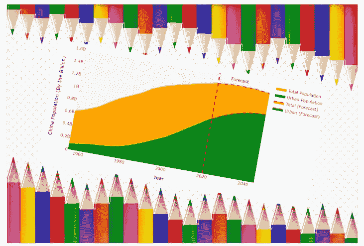

# 如何使用 Plotly 图形对象创建堆积面积图

> 原文：<https://medium.com/codex/how-to-create-a-stacked-area-chart-using-plotly-graph-objects-d06f053d8c05?source=collection_archive---------3----------------------->

## 了解关于 Plotly Go 的关键概念、提示和技巧

图片由 [Pixabay](https://pixabay.com/illustrations/crayon-frame-pencil-frame-4273182/) 提供(作者修改)

面积图可以被认为是折线图和条形图的组合。堆积面积图不仅允许您跟踪一段时间内指标的总值(非常类似于折线图)，还可以帮助您了解该指标的细分情况…