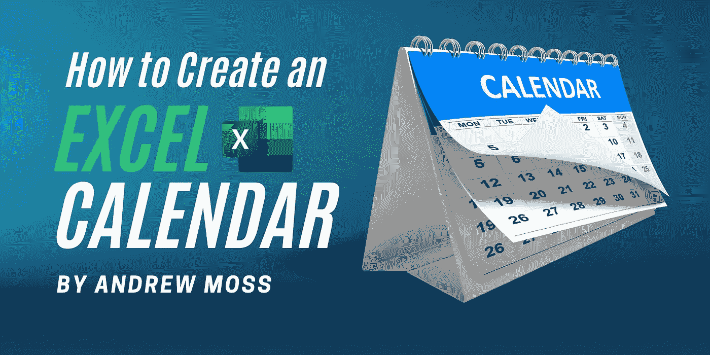

# 如何创建 Excel 日历

> 原文：<https://medium.com/codex/how-to-create-an-excel-calendar-eb29eafd6ec8?source=collection_archive---------1----------------------->

## 解释了三个工作表示例。📅

日历对于安排事件、构建待办事项列表和管理项目非常有用。手机和桌面有许多应用程序，如 Outlook、iCloud Calendar 和 Google Calendar。虽然这些功能齐全，非常适合日常使用，但在真正的定制方面，没有什么比 Excel 日历更好的了。