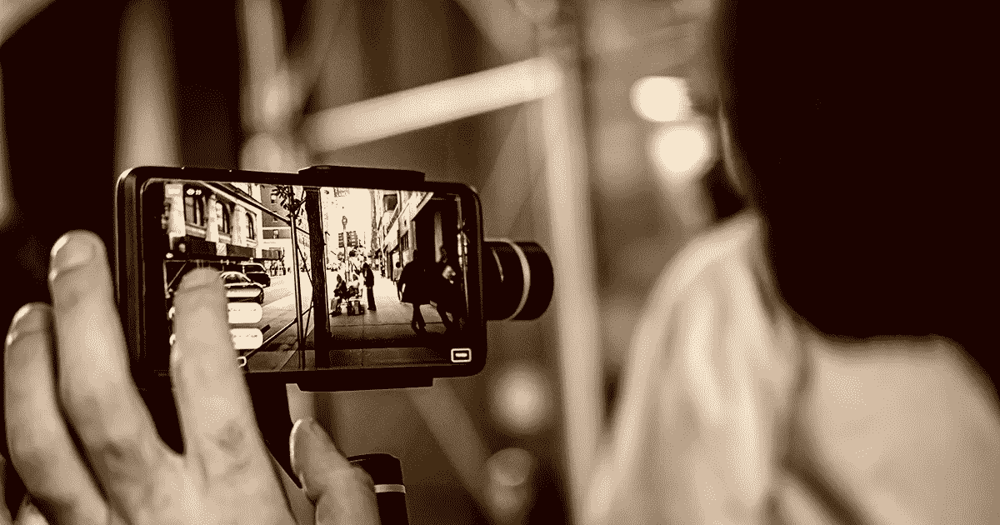

# 如何创建一个在 iPhone 屏幕似乎关闭时拍摄秘密照片的 iOS 应用程序

> 原文：<https://medium.com/codex/how-to-create-an-ios-app-that-takes-secret-photos-while-the-iphone-screen-seems-to-be-turned-off-7081d110309e?source=collection_archive---------5----------------------->



**问题**

假设你想重复拍摄某人的秘密照片，而不被抓到。最好的 iPhone 应用程序是什么？内置相机应用程序就足够了吗？

有许多事情要考虑。首先，如果有人越过你的肩膀，注意到你的屏幕正在显示摄像机画面，你可能会被抓住。所以，你需要确保拍摄时没有人在你身后。此外，拍照所需的轻击手势与其他常见手势(滚动、发短信)有所不同。一个人只要看你的手和肢体语言就能猜到你在拍照。

另一个需要考虑的是绿色的相机使用指示器。当 iOS 应用程序要拍摄照片时，它必须首先显示类似于以下内容的提示:


一旦用户确认，应用程序可以在任何给定的时刻拍照，而不必提供任何正在拍照的可见指示。由于偷偷给用户拍照在道德上是错误的(我们不希望 Gmail 或 Instagram 偷拍我们的照片)，所以从 iOS 14 开始增加了一个绿色的相机使用中指示器:


一旦相机被激活，绿色指示灯就会变成绿色，即使照片没有被保存或传输到任何地方。因此，即使我们有一个程序，它只是拍摄一张照片，而不在屏幕上显示任何特定的内容，绿色指示器也会显示相机处于活动状态的事实。

最后，iOS 有一个特殊的声音效果，让每个人都知道拍了一张照片:

要想拍出没有这种声音的照片，唯一的方法就是在拍摄时将音量完全静音。

**解决方案**

我一直在研究这个问题，并最终创建了一个小程序来解决上述所有问题，并使用户能够更自信地拍摄秘密照片。

1.  程序显示黑屏(没有摄像头进给)。
2.  该程序以一秒钟的时间间隔重复拍摄照片(不需要用户手势)。
3.  由于程序控制屏幕的亮度并将其降低到最小可能的值，使用中的相机指示灯几乎**不可见**，即使它是绿色的，并且整体上，屏幕似乎是关闭的。
4.  无需将设备静音:即使当设备设置为高音量时，相机拍摄声音也会被编程静音。
5.  为了快速逃离，触摸屏幕会立即导致程序退出回到 iPhone 的主屏幕。


需要注意的是，我不鼓励任何人实际使用这个程序。毕竟是**恶**。这个项目的目的只是为了展示创建这样一个程序是多么容易。此外，代码只使用众所周知的系统 API，而不访问任何私有系统方法，因此理论上，它可以通过 AppStore 审查(如果作为秘密模块嵌入到具有其他一些有价值内容的更大的应用程序中)。

该程序的代码可在 GitHub 上公开获得，地址如下:

https://github.com/arixegal/BlackEye/tree/MediumTutorial

然而，在本文中，我将一步一步地演示如何创建这个程序。需要具备 Swift 编程语言的基础知识。

**通用设置**

我们需要创建一个 xCode 项目和一个空白的单页应用程序。

1.  打开一个现代版的 Xcode。
2.  选取“创建新的 Xcode 项目”。
3.  在“可用模板”窗口中，选择“iOS -> App”模板


4.输入项目名称、团队和组织标识符。语言应该是 **Swift** 界面应该是**故事板**。


这将创建一个显示空白屏幕的应用程序。离游戏结束又近了一步。为了测试它，键入 Command+R 或选择 Product->Run。

**如何显示黑屏**

由于我们的应用程序的界面是基于故事板的，并且我们已经有了管理主屏幕显示的视图控制器，为了显示黑屏，我们所要做的就是将这个屏幕的背景改为黑色。这可以直接从界面构建器中完成。

1.  在项目导航器中，选择文件 Main.storyboard
2.  在故事板的文档轮廓中，选择**视图**元素(在“视图控制器场景”- >“视图控制器”下)
3.  在视图的属性检查器中，将背景更改为黑色。


这将创建一个显示黑屏的应用程序。为了测试它，键入 Command+R 或选择 Product->Run。选择颜色**黑色**很重要，这与其他看起来是黑色的颜色相反，例如*标签颜色*。选择*标签颜色*而不是*黑色*作为背景颜色，将导致黑色或白色屏幕，这取决于 iPhone 的黑暗模式设置。选择**黑色**总是会导致黑屏，不管 iPhone 的暗模式还是亮模式。

**如何隐藏状态栏**

如果我们现在运行应用程序，我们可能会看到一个完全黑屏。然而，如果我们运行应用程序的模拟器或设备设置为黑暗模式，屏幕不会完全黑下来。黑暗模式是通过选择设置->显示和亮度->外观下的“黑暗”来实现的。


当我们现在运行我们的应用程序时，虽然设备处于黑暗模式，但顶部状态栏会显示各种元素，如时间、电量和 WiFi 指示器。在亮模式下，状态栏元素都是黑色的，所以我们看不到它们，但是现在因为我们在暗模式下，它们是亮的，可见的。


我们希望屏幕看起来好像是关闭的。这意味着我们必须隐藏状态栏。这可以通过向目标属性添加两个新的键值对来实现。

1.  在项目导航器中，选择最顶层的元素，即项目本身。
2.  选中项目后，在**目标**下，选择主目标并导航到**信息**选项卡。
3.  点击鼠标悬停在列表项上时可见的**加**按钮，并添加以下键:**UIViewControllerBasedStatusBarAppearance**
4.  将新添加键的值设置为**否**
5.  添加另一个键: **UIStatusBarHidden**
6.  将上述新增键的值设置为**是**

你会注意到一旦添加并显示了按键，名称 **UIStatusBarHidden** 显示为*“状态栏初始隐藏”*，名称**UIViewControllerBasedStatusBarAppearance**显示为*“查看基于控制器的状态栏外观”*。这是可以的。


现在运行 app 的时候，你会看到屏幕完全黑了，状态栏元素全部不见了，不管 iPhone 是暗模式还是亮模式。这正是我们想要的。

**如何响应点击事件**

当点击屏幕时，我们希望应用程序完全退出。为此，我们需要听录音。有许多方法可以做到这一点。在这个项目中，我们将添加一个黑色按钮。

1.  在项目导航器中，选择 **ViewConroller.swift**
2.  在类声明下添加以下代码:

```
**private** **lazy** **var** curtainView: UIView = {
    **let** size = UIScreen.main.bounds.size
    **let** btn = UIButton(
        frame: CGRect(
            x: 0,
            y: 0,
            width: **size**.width,
            height: size.height
         )
    ) btn.backgroundColor = UIColor.black 
    btn.addTarget(**self**, action: **#selector**(quit), for: .touchDown)     

    **return** btn
}()
```

3.添加**退出**的方法

```
/// Will quit the application with animation**@objc private** **func** quit() {
    UIApplication.shared.perform(**#selector**(NSXPCConnection.suspend))
    /// Sleep for a while to let the app goes in background
    sleep(2)
    exit(0)
}
```

4.将按钮添加到视图中

```
**override** **func** viewDidLoad() {
    **super**.viewDidLoad()
    view.addSubview(curtainView)
}
```

上面的**退出**方法，是从下面讨论中的一个答案复制过来的:

[](https://stackoverflow.com/questions/355168/proper-way-to-exit-iphone-application) [## 退出 iPhone 应用程序的正确方法？

### 我们不能使用 exit(0)，abort()函数退出应用程序，因为 Apple 强烈反对使用这些函数。虽然…

stackoverflow.com](https://stackoverflow.com/questions/355168/proper-way-to-exit-iphone-application) 

尝试运行该应用程序，并测试点击屏幕时的行为。如果一切正常，轻点屏幕会导致应用程序退出。

**如何拍照**

有很多在线教程和例子可以教你如何编程操作 iPhone 相机。对于我们的目的来说，它们中的大多数都有太多的代码，因为操作摄像机的传统方式涉及到在屏幕上显示摄像机馈送，这在我们的例子中是不需要的。

1.  在 ViewController.swift 中，在文件**的顶部添加一行 **import AVFoundation** 。**
2.  在类声明下添加以下两个实例:

```
**private** **let** photoOutput = AVCapturePhotoOutput()**private** **let** session = AVCaptureSession()
```

3.添加以下两种方法:

```
**private** **func** setupCaptureSession() -> AVCaptureSession? {
    session.sessionPreset = .photo **guard** **let** cameraDevice = AVCaptureDevice.default(for: .video) **else** {           
        print("Unable to fetch default camera")
        **return** **nil** } **guard** **let** videoInput = **try**? AVCaptureDeviceInput(device: cameraDevice) **else** {
        print("Unable to establish video input")
        **return** **nil** } session.beginConfiguration()
        session.sessionPreset = AVCaptureSession.Preset.photo 
        **guard** session.canAddInput(videoInput) **else** {
            print("Unable to add videoInput to captureSession")
            **return** **nil** }

        session.addInput(videoInput)

        **guard** session.canAddOutput(photoOutput) **else** {
            print("Unable to add videoOutput to captureSession")
            **return** **nil** }

        session.addOutput(photoOutput)
        photoOutput.isHighResolutionCaptureEnabled = **true** session.commitConfiguration() DispatchQueue.global(qos: .background).async { [**weak** **self**] **in
         self**?.session.startRunning()
     }
     **return** session
}**private** **func** takePhoto() {
    photoOutput.capturePhoto(with: AVCapturePhotoSettings(), delegate: **self**) DispatchQueue.main.asyncAfter(deadline: DispatchTime.now() + .seconds(1)) {[**weak** **self**] **in
        self**?.takePhoto()
    }
}
```

添加方法后，您会注意到项目无法编译。问题是我们将 *self* 作为委托传递给了 *capturePhoto* 方法，但是 *self* ，在本例中是 *UIViewController* 实例，不支持*avcapturephocapturedelegate*协议。为了保存照片和静音，我们以后需要这种支持。记住这一点，为了解决编译错误，我们将添加以下存根:

```
**extension** ViewController: AVCapturePhotoCaptureDelegate {
    **func** photoOutput(_ output: AVCapturePhotoOutput, didFinishProcessingPhoto photo: AVCapturePhoto, error: Error?) {} **func** photoOutput(_ output: AVCapturePhotoOutput, willCapturePhotoFor resolvedSettings: AVCaptureResolvedPhotoSettings) {}
}
```

那么我们目前有什么发现？两种方法，一种用于配置相机会话，另一种用于拍照(以一秒钟的间隔重复进行)。但是我们仍然需要连接它们，所以最后一步是添加第一个调用:

```
**override** **func** viewDidAppear(_ animated: Bool) {
    **super**.viewDidAppear(animated) 
    **if** UIImagePickerController.isSourceTypeAvailable(.camera) { 
        **if** **let** _ = setupCaptureSession() {
            takePhoto()
        } **else** {
            print("Failed to establish capture session")
        }
    } **else** {
        print("Camera not available") // Would be true in Simulator
    }
}
```

现在运行项目时，构建应该会成功。然而，在添加第一个调用后，我们有一个运行时崩溃。此应用程序已崩溃，因为它试图在没有使用说明的情况下访问隐私敏感数据。 为了解决这个问题，我们需要向目标添加更多的键值对。在这里，我们将添加一个访问相机的用法描述和另一个将照片保存到相册的用法描述(稍后将实现)。

1.  在项目导航器中，选择最顶层的元素，即项目本身。
2.  选中项目后，在**目标**下，选择主目标并导航到**信息**选项卡。
3.  点击**加**按钮，当鼠标悬停在列表项上时，该按钮变为可见，并添加以下(字符串)键:**NSCameraUsageDescription**
4.  将新添加的键的值设置为“*，以便拍摄秘密照片*”。
5.  添加另一个(字符串)键:**NSPhotoLibraryAddUsageDescription**
6.  将上述新添加的键的值设置为“*以存储秘密照片***”**

现在运行应用程序时，您应该可以看到摄像头访问权限对话框。一旦授权，您将能够听到相机拍摄音效，并看到绿色的相机在使用中的指示被激活。


**如何储存照片**

在这个程序中，我们将把每张照片存储到最近的相册中。如果我们愿意，我们也可以将它们存储在远程服务器上，但这需要配置后端，超出了本演示的目的。

存储照片是通过调用系统方法*UIImageWriteToSavedPhotosAlbum 实现的。*

1.  找到之前添加的空委托方法*did finished processing photo**，*，插入下面的主体:

```
**func** photoOutput(_ output: AVCapturePhotoOutput, didFinishProcessingPhoto photo: AVCapturePhoto, error: Error?) {
    **guard** **let** data = photo.fileDataRepresentation() **else** {
        print("Processing did finish with no data")
        **return** } **guard** **let** image = UIImage(data: data) **else** {
        print("Processing did finish with invalid image data")
        **return** } UIImageWriteToSavedPhotosAlbum(
        image, 
        **self**,  
        **#selector**(image(_:didFinishSavingWithError:contextInfo:)),           
  **      nil**)

    print("Photo taken") 
}
```

2.添加以下方法来获取成功/失败状态:

```
**@objc** **func** image(_ image: UIImage, didFinishSavingWithError error: NSError?, contextInfo: UnsafeRawPointer) {
    **if** **let** error = error {
        print("Save error: \(error.localizedDescription)")
    } **else** {
        print("Saved!")
    }
}
```

现在运行应用程序时，您应该能够看到图库访问权限对话框。获得授权后，您将能够在“照片”应用程序中看到新照片。尝试运行应用程序几秒钟，看看照片是否已添加。

**如何隐藏相机使用中指示器**

iOS 应用可以控制屏幕亮度。当应用程序运行时，将屏幕亮度设置为最小可能值会导致正在使用的相机指示灯几乎不可见。

我们将添加一个专用于控制屏幕亮度的单独类:

```
**final** **class** DimUnDim {
    **static** **let** shared = DimUnDim()
    **private** **var** originalBrightness = UIScreen.main.brightness **func** dim() {
        print("dim")
        UIScreen.main.wantsSoftwareDimming = **true** UIScreen.main.brightness = 0.0
    } **func** unDim() {
        print("unDim")
        UIScreen.main.brightness = originalBrightness
    }
}
```

我们将在应用程序激活时调用 Dim，在应用程序不激活时调用 UnDim。编辑文件 SceneDelegate.swift 并添加以下内容:

```
**func** sceneDidBecomeActive(_ scene: UIScene) {
    DimUnDim.shared.dim()
}**func** sceneWillResignActive(_ scene: UIScene) {     
    DimUnDim.shared.unDim()
}
```

这是好的，只要应用程序正在运行。如果它处于活动状态，屏幕会变暗，但如果用户切换到主屏幕或另一个应用程序，屏幕亮度会保留原始值。

但是，如果用户通过触摸屏幕手动终止应用程序，屏幕将保持黑暗，因为没有调用 *sceneWillResignActive* 。这是 inpolite。我们将通过在退出前添加另一个对 UnDim 的调用来解决这个问题。

找到之前添加的*退出*方法，添加调用:

```
/// Will quit the application with animation**@objc private** **func** quit() {
 **DimUnDim.shared.unDim() // Restore normal screen brightness**    UIApplication.shared.perform(**#selector**(NSXPCConnection.suspend))
    /// Sleep for a while to let the app go in background
    sleep(2)
    exit(0)
}
```

现在运行该项目时，屏幕亮度应该完全按照我们需要的方式运行。

**如何禁用射手音**

1.  找到之前添加的空委托方法 *willCapturePhotoFor* ，并插入以下主体:

```
**func** photoOutput(_ output: AVCapturePhotoOutput, willCapturePhotoFor resolvedSettings: AVCaptureResolvedPhotoSettings) {
    // dispose system shutter sound
    AudioServicesDisposeSystemSoundID(1108)
}
```

上面的方法是从下面讨论中的一个答案复制过来的:

[](https://stackoverflow.com/questions/4401232/avfoundation-how-to-turn-off-the-shutter-sound-when-capturestillimageasynchrono) [## AVFoundation，如何在捕捉 stillimageasynchronouslyfromconnection 时关闭快门声音？

### 我正试图通过 AVFoundation 从相机中捕捉一个实时预览图像…

stackoverflow.com](https://stackoverflow.com/questions/4401232/avfoundation-how-to-turn-off-the-shutter-sound-when-capturestillimageasynchrono) 

这就是了。

**最后注释**

这个项目中展示的拍摄秘密照片的能力违背了当前保护用户隐私的趋势。如前所述，通过控制屏幕亮度，可以将绿色摄像机使用中指示器控制为不可见。苹果可以在未来的 iOS 版本中阻止这一点。当相机处于活动状态时，崩溃一个试图降低屏幕亮度的应用程序应该没有任何问题(就像我们看到当我们无法产生相机使用描述时，应用程序崩溃一样)。

有没有可能创建一个类似的程序来录制视频而不是拍摄静态照片？我不知道，但值得一试。

邀请您阅读我的其他帖子:

Xcode 和 CocoaPods:在不同 pod 的分支之间干净无误的切换

[一个简单快捷的后台定时器](/codex/a-simple-swift-background-timer-bebd36589203)