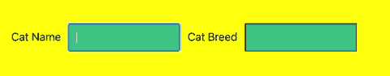
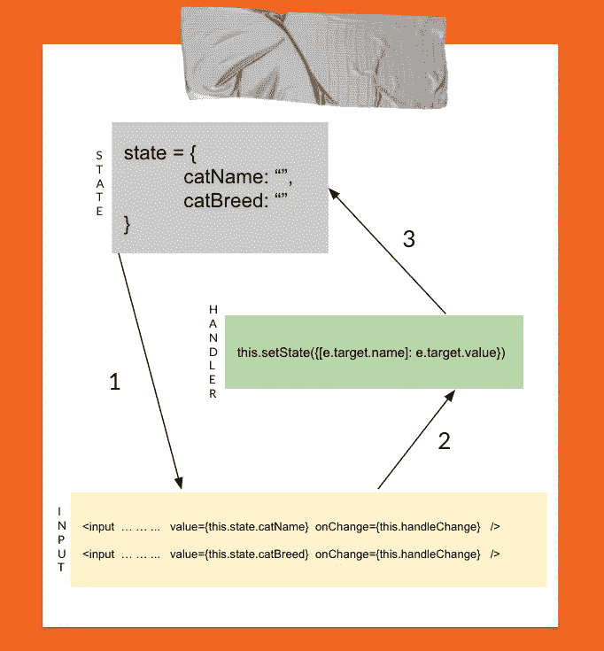
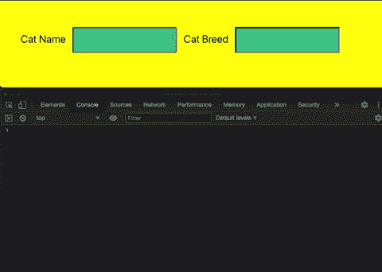

# 如何在 React 中创建受控表单

> 原文：<https://medium.com/codex/how-to-create-controlled-forms-in-react-a8c8982ace00?source=collection_archive---------11----------------------->

如果您是使用 React 组件创建应用程序的开发人员，您很可能希望通过表单收集用户数据。本帖将重点介绍在 React 中构建受控表单的最常见实践。但在此之前，理解什么是受控形式是很重要的。

受控形式和非受控形式有什么区别？

简单来说，React 中的非受控表单相当于基本的 HTML 表单。用户输入数据静态存储在 DOM 节点中，稍后使用 ref 属性进行引用。这些类型的表单保持它们自己的内部状态。

受控形态则相反，它们并不维持自己的内部状态，它们是由道具控制的。它们从 React 状态对象接收输入值。这种状态被视为“真实的单一来源”，并使用回调事件处理程序进行动态更新。React 的官方文档建议尽可能使用受控组件。在下一节中，将说明构建受控表单的过程。

考虑用户输入他们的猫的名字和品种的情况。下面是用户与呈现的 cat 表单交互的示例:

图 1:简单的 Cat 表单示例

表单(上图)相当简单，用户与它交互的方式与不受控制的表单一样。为了了解这种形式与不受控制的形式的区别，有必要查看代码内部。

图 2:受控 Cat 表单的源代码

使这种形式具有动态性的是使用 props 的输入值在状态之间的流动。最初呈现表单时，从状态中提取相应的输入值，在本例中，该值被设置为空字符串。onChange 合成事件然后监听输入字段中的变化。一旦用户记录了另一次击键，合成事件就会注意到，并立即调用处理程序来处理该事件。在我们的处理函数中，状态随后用新的值更新为 catName 或 catBreed with setState()。这个循环一直持续到用户提交表单。图 3(下图)展示了这一流程。

图 3:表示受控表单与状态交互的流程图

为了直观显示每次击键所修改的状态，提供了下面的 GIF:

图 4:控制台记录状态以验证表单控件

已创建了一个受控表单！这个例子使用了类组件和状态。一旦掌握了这个基本流程，尝试使用[功能组件和 React 钩子](/swlh/building-controlled-forms-using-functional-components-in-react-965d033a89bd)来试验受控表单。这种方法甚至比这里概述的方法消耗的资源更少，但是如果您是新手的话，就有点棘手了！感谢您的阅读！

**资源:**

1.  [https://reactjs.org/docs/forms.html](https://reactjs.org/docs/forms.html)
2.  【https://www.youtube.com/watch?v=7Vo_VCcWupQ】T2&ab _ channel =共同进化