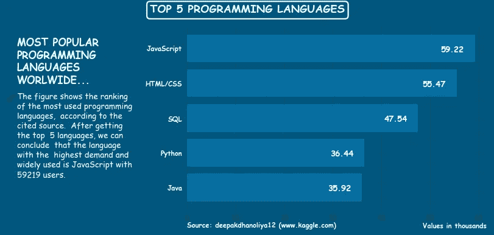

# 如何在 Python 中创造强大的剧情，壮大你的受众…

> 原文：<https://medium.com/codex/how-to-create-powerful-plots-in-python-and-grow-your-audience-6185b151e24?source=collection_archive---------1----------------------->

## 您想了解更多关于 Python 数据可视化的知识吗？我留下了使用 Matplotlib 改进条形图的完整指南、提示和技巧。

用数据讲述故事是一项简单而又复杂的任务。用数据讲故事是一种…