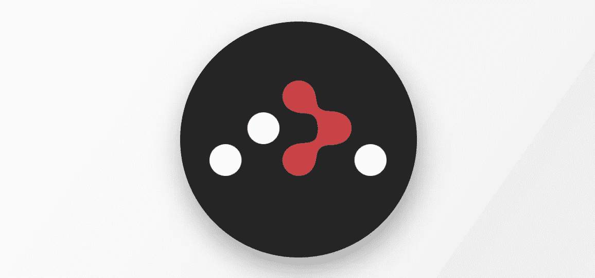

# 如何在 React 中创建路线

> 原文：<https://medium.com/codex/how-to-create-routes-in-react-50b8907d441e?source=collection_archive---------4----------------------->

通过使用几个 URL 路由，您可以使您的应用程序的用户体验更加有效。除了有一个更好的站点结构之外，路由还使得将用户指向你的网站的某个子页面变得简单。但是 React 应用程序如何处理路由呢？这就是我们将在本文中讨论的内容。


你可能已经知道，不同的网站有不同的子页面，有一个独特的网址，像

```
🔗 **EXAMPLE SUBPAGE WITH CUSTOM URL** [https://www.awesome.com/about](https://www.anydomain.com/about)
```

哦，等等。因此

```
💡 *URL = Uniform Resource Locator. We use them to identify resources like web pages, texts, and images on the internet.*
```

最有可能的是，这个网址将浏览者指向 awesome.com 的“关于”页面。创建一个`<a>`标签并将`href`属性设置为任何一个 HTML 文件名是实现这一点的传统 HTML 方法。

但是我们不能这样做。

相反，我们可以利用一个很棒的 React 库:React 路由器



## 装置

```
**👆 THIS ARTICLE IS ABOUT REACT ROUTER V5**
Only the React Router version 5 components will be discussed.
```

要在你的项目中安装 React 路由器，只需使用`npm`或`yarn`包管理器

```
👍 npm install react-router-dom@5.2.0
```

或者

```
🤞 yarn add react-router-dom@5.2.0
```

## 使用

想象一下，能够准确地告诉您的应用程序在哪个路径上呈现哪个组件。在这种情况下，您必须为各个页面的内容创建组件，并为它们设置一个路由。例如，您可以为`<About />`页面组件设置应用程序的`/about`路径。

使用 React Router，您可以使用其包装器组件为您的页面组件定义不同的路由。首先，我们需要一个包装器来定义我们想要在浏览器中使用 React Router。

```
🚏 **WE ARE GOING TO USE THE <BrowserRouter> COMPONENT** import {BrowserRouter} from "react-router-dom"
const App = () => {
  return (
    **<BrowserRouter>**
    ...
    **</BrowserRouter>**
  )
}
```

接下来，我们需要一个组件来包含我们打算实现的所有不同的路由

```
🎛 **WITH SWITCH WE CAN WRAP OUR ROUTES**
import {BrowserRouter, Switch} from "react-router-dom"
const App = () => {
  return (
    <BrowserRouter>
      **<Switch>**
      ...
      **</Switch>**
    </BrowserRouter>
  )
}
```

接近终点线了！只剩下一件事要做，那就是指定每个页面组件的不同路径

```
🚩 **THE BOTTOM LINE**
import {BrowserRouter, Switch, Route} from "react-router-dom"
const App = () => {
  return (
    <BrowserRouter>
      <Switch>
        **<Route exact path='/main'>** <Main /> **</Route>
        <Route exact path='/about'>** <About /> **</Route>**
      </Switch>
    </BrowserRouter>
  )
}
```

现在我们有了一个具有不同路径的全功能应用程序。现在就为一些额外的内容做好准备:

## 添加一些链接使导航更简单

在应用程序的这种状态下，我们只能通过在浏览器的地址栏中手动键入 URL 来访问这两个路径——但这不是我们想要做的。我们希望通过按钮和文本来识别不同的路线，这就是`<Link>`组件的用途

```
🔗 **YOU CAN WRAP ANY COMPONENT INTO A <Link>**
import { Link } from "react-router-dom"
...
**<Link to='/about'>**
  <p>Read more about us!</p>
**</Link>**
...
```

您现在可以点击“阅读更多关于我们的信息！”并导航至`/about`。

## 添加导航栏

你一定注意到了，为了在这个网站上使用导航界面，你还必须在`<Main />`和`<About />`组件中包含你的`<Navbar />`组件，然而，这是非常多余和不专业的。

您可以在`<Switch>`包装器之外包含您的`<Navbar />`组件，而不是重复您自己

```
🔥 **YOU CAN HAVE A FIXED NAVBAR OUTSIDE THE SWITCH**
import {BrowserRouter, Switch, Route} from "react-router-dom"
const App = () => {
  return (
    <BrowserRouter>
      **<Navbar />**
      <Switch>
        <Route exact path='/main'>
          <Main />
        </Route>
        <Route exact path='/about'>
          <About />
        </Route>
      </Switch>
    </BrowserRouter>
  )
}
```

通过这种设计，你可以将带有 CSS 设置`position: fixed`的导航条放在页面的顶部，并在上面放置不同的子页面。

👋我希望这在你寻找新的学习材料时对你有用。感谢您花时间阅读这篇文章！

如果你从我的文章中更好地理解了一些东西，你可以请我喝咖啡来支持我:[https://www.buymeacoffee.com/daanworks](https://www.buymeacoffee.com/daanworks)

📯订阅我的电子邮件列表，如果你想在未来读到更多这样的故事，请在这里或在 [Twitter](https://twitter.com/daanwords) 上关注我！