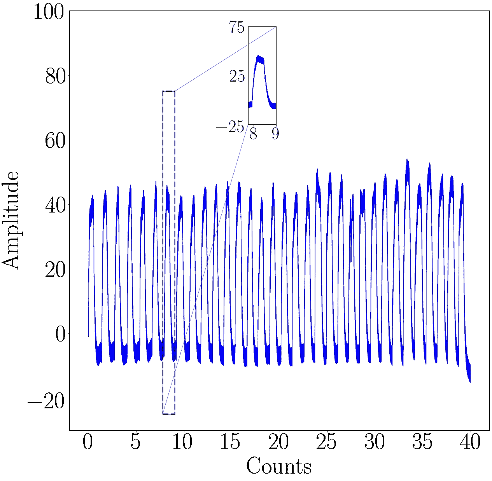

# 如何使用 Matplotlib、Python 和 LaTeX 创建科学绘图

> 原文：<https://medium.com/codex/how-to-create-scientific-plots-using-matplotlib-python-and-latex-23a471c8bb69?source=collection_archive---------2----------------------->

这个博客将向您展示如何使用 Matplotlib、Python 和 LaTeX 为科学期刊和会议创建可发布的绘图。

照片由[汉斯·雷尼尔斯](https://unsplash.com/@hansreniers?utm_source=medium&utm_medium=referral)在 [Unsplash](https://unsplash.com?utm_source=medium&utm_medium=referral) 拍摄

Python 是科学绘图的优秀工具。Python 的开源特性和其他绘图软件的硬盘使用是主要驱动力。我希望这一课有助于突出关键选项和约束，以便您可以定制任何数据集来满足您的偏好。我用谷歌合作实验室来绘图；但是，您可以使用任何想要的 IDE 或文本编辑器。Python 的 Matplotlib 工具包提供了一个完整的工具来构建静态、动画和交互式可视化。Matplotlib 让困难的事情成为可能，让简单的事情变得容易。

# 包装

我们首先需要将 LaTeX 导入我们的编码环境。

如果您在导入 LaTeX 时遇到任何错误，您可以尝试执行以下命令。

Matplotlib 包包含了所需函数的最重要部分。我们还导入了用于快速计算的 Numpy 和用于添加缩放数字的附加 Pylab 包。

# 加载数据

因为我的数据在一个. csv 文件中，所以我使用了`read_excel`函数。我们可以将列中的数据存储在单独的变量中进行绘制。的名称。xlsx 文件将成为`read_excel`函数的输入。

然后我们需要创造一个形象。

照片由 [charlesdeluvio](https://unsplash.com/@charlesdeluvio?utm_source=medium&utm_medium=referral) 在 [Unsplash](https://unsplash.com?utm_source=medium&utm_medium=referral) 上拍摄

# 绘制数据

为了创建我们的轴，我们使用了`add_axes`函数。在这个例子中，我们还实现了一个插图。

> 可以改变`inset_axes`函数中的系数来找到图形的最佳位置。

为了给我们的图添加标签，我们使用下面的代码。

我们还可以根据我们的数据给我们的图添加限制。

我们可以改变我们的图的滴答频率。

为了使字体更加突出，我们可以使用 for 循环来迭代不同的绘图组件，在这里我们可以改变字体大小。

我们可以使用下面的代码来操作插图框架并创建缩放效果。

在最后一步中，我们可以将图形保存到环境中，并在控制台上显示它。

这是我们在整个教程中开发的整个代码。

# 结论

终于！使用 Python，我们能够创建一个适合发布的情节。感谢您的阅读，我会继续添加新的说明和示例。关于其他文章和更新，请通过 [LinkedIn](http://linkedin.com/in/bkullukcu) 与我联系。你也可以在 [Github](https://github.com/bkullukcu) 上关注我。