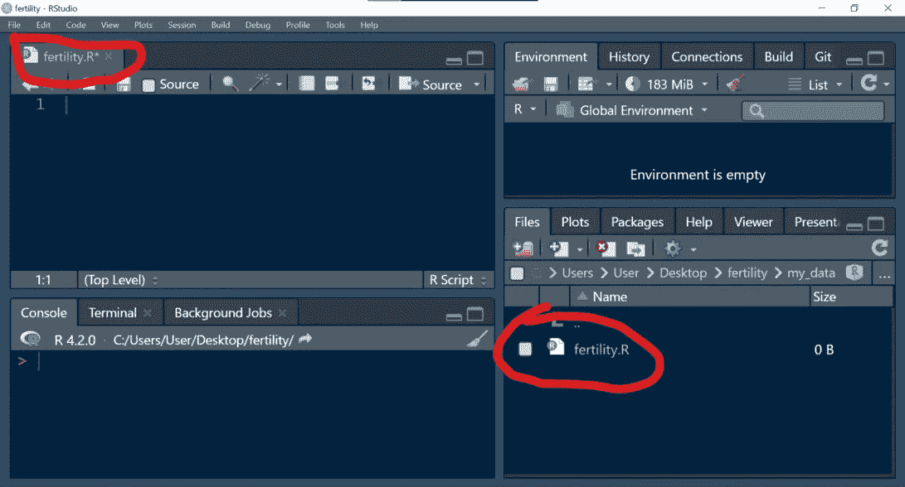

# 如何用 R 编程创建你的第一个包

> 原文：<https://medium.com/codex/how-to-create-your-first-package-in-r-programming-d59398f76c28?source=collection_archive---------6----------------------->


你是一个 R 讲师吗，你总是发现自己与你的学生共享大量的数据文件？

这对学生和你来说都是很大的压力。

通过将数据集捆绑到包中，任何想要使用该特定数据集的人都可以轻松地使用它。

此程序要求您拥有一个易于设置的 [GitHub](https://github.com/) 账户。

# 创建 GitHub 存储库

创建一个 GitHub 存储库，并为它命名您将使用的数据集，我将命名为 mine fertility，因为我将使用生育率数据集。


单击“创建新的存储库并复制存储库”链接，我们稍后会用到它。


# 建立一个 R 项目

转到文件选项卡，点击**新项目- >版本控制- > Git**


将存储库链接粘贴到为存储库 URL 提供的空间中，这将把 GitHub 存储库链接到本地存储库，从而允许我们对项目进行 push 和 pull 请求。


点击**创建项目**，我们已经有了一个 R 项目设置。

# 包装

确保您安装了以下软件包。

```
#install.packages(c("usethis","devtools","roxygen2") library(devtools) library(roxygen2) library(usethis)
```

在您的控制台中，运行下面的命令来创建包项目

```
create_package(getwd())
```

系统会询问您是否要覆盖现有文件，请回答“否”

将打开第二个 R session 选项卡，我们将从现在开始使用它。

现在您可以关闭另一个 R Studio 选项卡。


# 添加数据

确保你准备好了简历数据。

创建一个名为 *my data* 的新文件夹，我们将在其中存储我们的数据文件。


在这个文件夹中， *my_data* 创建一个名为 *the_name_of_your_data 的 R 文件。R* 我自己的情况是*生育。R*



在这个文件中，你的数据将被读取，所有的数据清理和整理将被完成。

下面的脚本读取我的数据。

```
fertility <- read.csv("C:/Users/User/Desktop/Fertility Rate.csv")
```

加载数据后，在项目目录中创建一个名为 data 的新文件夹。


在数据脚本的最后一行使用下面的代码，将数据导出为*。rda* 文件到数据文件夹。


要验证数据集是否包含在包中，请在控制台上运行下面的命令，然后调用您的数据集。


# 检查

要检查他们的问题是否在您的软件包中，请在您的控制台上运行命令。

```
devtools::check(document = FALSE)
```


如果收到警告和注释，您可以忽略它们。

# 记录数据集

您需要记录您的数据集，以便任何使用它的人都能理解它的内容。

在控制台中，运行下面的命令，数据集的名称用引号括起来。我的情况是*生育*

```
usethis::use_r("fertility")
```

一个新的 R 脚本将会打开，它位于 R 文件夹中。


您将在这个文件中编写数据文档。

您可以使用下面的模板作为指南，将其复制并粘贴到文档文件中。

这些是特殊格式的注释，它们被称为 *Roxygen* 注释。

```
#' Data of fertility rate in Nigeria from the year 1960 - 2020
#'
#' @format A tibble with 61rows and 12 variables:
   #' \describe{
   #' \item{Year}{dbl Year fertility rate was recorded}
   #' \item{Fertililty.Rate}{dbl Fertility rate for that particular year} 
#' }
#' @source \url{}"fertility"
```

> *@格式描述了数据集变量。*
> 
> *@source 描述了数据的来源，如果你没有可以跳过。*
> 
> *最后一行是引用数据的名称，用你的数据集名称替换。*

为了将该文件登记到数据集包中，

运行下面的代码:

```
devtools::document()
```


尝试运行并调出文档。呼叫`?fertility`


# 记录包

现在打开`DESCRIPTION`文件，填入作者信息和关于这个包的其他描述信息。


在许可证字段中输入`MIT + file LICENSE`，然后在根项目目录中创建一个名为`LICENSE`的新文本文件，并在适当的地方进行编辑。

```
Package: fertility
Title: Data Package of Fertility Rate recorded in Nigeria from the year 1960 - 2020
Version: 0.0.0.9000
Authors@R: 
 person(given = "Ridwan",
 family = "Adejumo Suleiman",
 role = c("aut", "cre"),
 email = "[adejumo999@gmail.com](mailto:adejumo999@gmail.com)",
 comment = c(ORCID = "[https://orcid.org/0000-0002-2923-2046](https://orcid.org/0000-0002-2923-2046)"))
Description: This package contains a time series data recording the fertility rate in Nigeria from the year 1960 - 2020
License: MIT + file LICENSE
Encoding: UTF-8
Roxygen: list(markdown = TRUE)
RoxygenNote: 7.2.1
Depends: 
 R (>= 2.10)
LazyData: true
```


现在我们已经记录了数据集和包，您可以对包进行最终检查了。

```
devtools::check(document=FALSE)
```


要使整个包的文档具体化，运行`usethis::use_package_doc()`

这将创建并打开位于 R/文件夹中的 R 脚本。

现在运行`devtools::document()`

# 构建和安装

您现在可以使用`devtools::install()`构建并安装软件包


您将被要求更新到一些软件包的最新版本，键入`1`，然后全部更新。

# 安装您的软件包

现在人们可以通过使用下面的代码来安装你的包了

```
# install.packages("remotes") remotes::install_github(adejumoridwan/fertility") library(fertility)
```

要向包中添加更多数据集，只需重复上述步骤。

*原载于 2022 年 10 月 5 日 http://rblogopedia.wordpress.com*[](https://rblogopedia.wordpress.com/2022/10/05/how-to-create-your-first-package-in-r-programming/)**。**