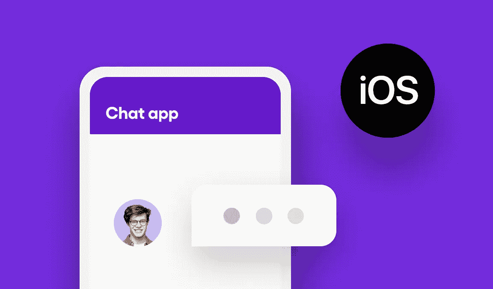
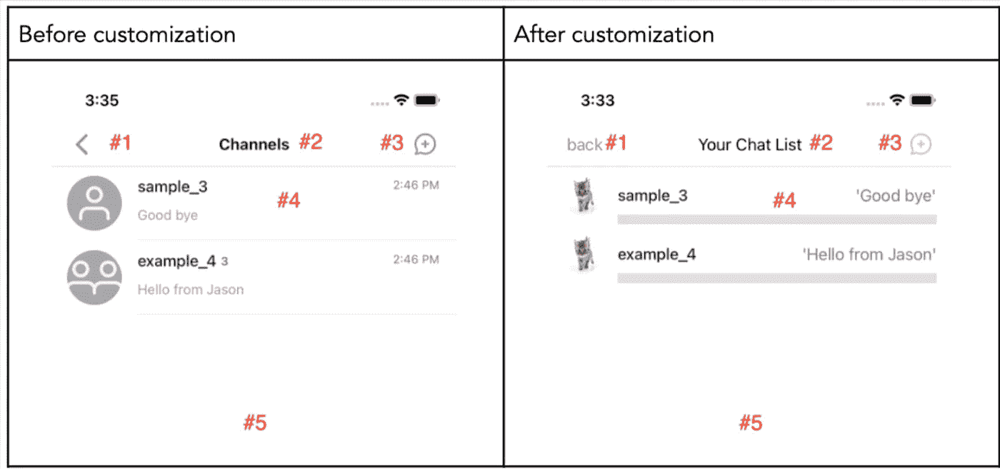
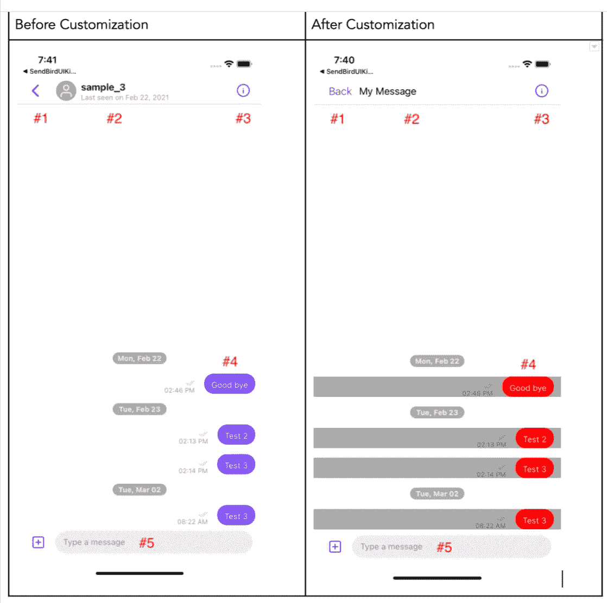

# 如何使用 Sendbird UIKit 在 iOS 上定制应用内聊天

> 原文：<https://medium.com/codex/how-to-customize-in-app-chat-on-ios-with-the-sendbird-uikit-33e2188e3897?source=collection_archive---------17----------------------->

仙鸟 2022

## 自定义 Sendbird iOS 聊天 UIKit 的频道列表视图和消息视图。

杰森·奥尔肖恩
解决方案工程师| [仙鸟](https://www.sendbird.com/)

*你可能会发现查看 iOS 聊天 UIKit* [*样本*](https://github.com/sendbird/sendbird-uikit-ios) *很有用。有关本教程中材料的其他指导，请参见* [*文档*](https://sendbird.com/docs/uikit/v2/ios/quickstart/send-first-message) *。要查看仙鸟聊天的运行情况，请查看这个* [*演示*](https://sendbird.com/demos/in-app-chat) *。您也可以访问我们的* [*网站*](https://sendbird.com/features/chat-messaging/uikit) *了解更多关于 UIKit 的信息。*

# 介绍

本教程将向您展示如何定制 iOS Sendbird 聊天工具包。我们将定制两个组件:

*   频道列表视图
*   邮件列表视图

在我们开始之前，您需要安装 Sendbird UIKit。为此，请遵循 Sendbird [**文档**](https://sendbird.com/docs/uikit/v1/ios/quickstart/send-first-message) 中的说明。

既然你已经准备好了，让我们开始吧。

# 如何自定义聊天频道列表

要更改频道列表的外观，我们需要更新 SBUChannelListViewController。以下要点包含要定制的代码:

首先，让我们:

*   初始化 UIKit 频道列表视图控制器
*   并覆盖其功能和属性

这是为 iOS 定制 Sendbird Chat UIKit 的任何组件的相同过程。

下面是初始化自定义 UIKit 频道列表视图类的基本模式。IBAction openChat 是视图控制器中的一个按钮，用于显示 UIKit 频道列表。

现在，让我们改变的外观:

1.  左边的按钮
2.  标题视图
3.  右侧按钮
4.  通道细胞
5.  自定义频道列表查询

图一。聊天频道列表定制前后

## 自定义左边的按钮

要自定义 leftBarButton，请使用以下代码:

## 自定义标题视图

要自定义标题视图，请使用以下代码:

## 自定义 channelListVC.rightBarButton

要自定义[**channelistvc . rightbarbutton**](https://gist.github.com/supertopoz/c3b266f8da04cb5a8aab60a9d587460c#file-channellistviewcontroller-swift-L21)使用以下代码:

## 自定义 channelistvc . register(channel cell:customchannelistcell())

要自定义 channelistvc . register(channel cell:customchannelistcell())，请使用以下代码:

对于**customchannelistcell**类，代码侧重于单元格视图的编程呈现。下面是一个工作示例代码:

## 定制频道列表查询

*   创建频道列表视图时，在初始化时包含您的自定义查询，并将其传递到**超级**。 **init** ()方法。
*   自定义频道列表查询利用了 Sendbird core SDK 的频道列表 [**查询**](https://sendbird.com/docs/chat/v3/ios/guides/group-channel-advanced#2-search-channels-by-name-url-or-other-filters) 。Sendbird 核心 SDK 是 Sendbird UIKit 库的一部分。

# 如何定制频道消息列表

这个 viewController 显示特定通道中的所有消息。在本例中，我们将更改:

1.  左边的按钮
2.  标题视图
3.  右侧按钮
4.  register(channel cell:CustomUserMessageCell())
5.  自定义消息发送

图二。频道消息列表定制前后

您需要用通道 URL 或通道对象初始化 channelViewController，以自定义单个通道。下面的代码演示了如何重写 SBUChannelListViewController 的 didSelectRowAt 委托。覆盖允许您收听在 channelListViewController 中选择的频道，然后显示 channelViewController。

ViewController.swift

## 自定义左边的按钮

要自定义 leftBarButton，请使用以下代码:

## 自定义标题视图

要自定义标题视图，请使用以下代码:

## 自定义右边的按钮

要自定义 rightBarButton，请使用以下代码:

## 自定义寄存器(channel cell:CustomUserMessageCell())

要自定义寄存器(channel cell:CustomUserMessageCell())，请使用以下代码:

## 自定义消息发送

要自定义消息发送，请使用以下代码:

# 颜色设置

默认情况下，Sendbird 提供了一个漂亮的用户界面，带有浅色或深色的主题。要进一步定制和指定用于浅色和深色主题的确切颜色，您可以使用我们的 UIKit [**颜色设置指南**](https://sendbird.com/wp-content/uploads/SB_UIKit_colorSet_guide.pdf) 。这个文档将帮助你在背景和聊天界面组件之间设置和谐的颜色和对比度。

# 结论

本教程向您介绍了定制 iOS Sendbird 聊天 UIKit 的两个组件的步骤。对于额外的 UI 修改，请查看文档以获得可定制的 [**主题**](https://sendbird.com/docs/uikit/v1/ios/guides/themes#1-themes) 以及如何更改 [**公共资源**](https://sendbird.com/docs/uikit/v1/ios/guides/common-resources#1-common-resources) 如字符串、图标和其他样式的完整列表。

您正在创建一个美丽而个性化的聊天体验！保持下去，快乐聊天建设！🙂