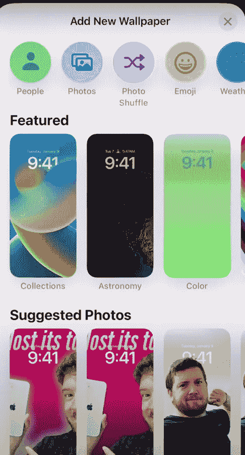

# 如何自定义你的 iOS-16 锁屏与部件，动态壁纸和…

> 原文：<https://medium.com/codex/how-to-customize-your-ios-16-lock-screen-with-widgets-dynamic-wallpapers-and-779e1287bec4?source=collection_archive---------16----------------------->

# 锁屏定制

首先，按住你的锁屏，这应该会将锁屏向后移动一点，在那里你应该会看到一堆锁屏面，如果你只有一个，想添加更多，你可以点击右下角的蓝色圆圈。

苹果内幕