# 如何做数据工程师？(第三部分)

> 原文：<https://medium.com/codex/how-to-data-engineer-part-3-98ed68a77f1f?source=collection_archive---------4----------------------->


克里斯多夫·伯恩斯在 [Unsplash](https://unsplash.com?utm_source=medium&utm_medium=referral) 上拍摄的照片

在这一部分(**第三部分** ) 我会试着描述一个数据工程师应该知道的技术。请注意，这不是一个能让你找到工作或获得数据工程师头衔的权威指南。如果我必须从零开始学习一切，这是我根据目前的经验选择的道路。我们开始吧！

# 编程语言

## 结构化查询语言

在我看来，如果你对“所有查询语言之母” **SQL** 一点都不了解，那么在某些方面会变得很有挑战性。尽管我有一些好消息，作为一名数据工程师，你肯定会遇到它，并且会以某种方式学习它。几乎所有的分析引擎和数据库都支持某种 SQL 来快速查询数据。作为一名数据工程师，你会比你想象的更频繁地遇到它——无论你是需要快速浏览潜伏在某个关系数据库中的数据，还是过滤云中的数据。

如果您一直在处理数据，那么很可能您已经看到了所有关于 SQL 与雇员或订单表以及它们如何相互关联的教程。我只能说，这是开始学习如何操作数据的一个好方法。

```
***-- As simple as these:***
SELECT TOP(10) * FROM employee_table;
SELECT MAX(salary) FROM employee_table;***-- Or a bit more complex:***
SELECT
 EMPLY.id EmployeeId,
 EMPLY.dept_id EmployeeDeptId,
 EMPLY.name EmployeeName,
 DEPT.nama EmpployeeDeptName
FROM 
 employee_table EMPLY
LEFT JOIN 
 emmployee_department_table DEPT 
ON 
 EMPLY.dept_id = DEPT.dept_id;
```

SQL 提供了对如何处理数据的坚实理解，然后可以将这些数据投射到其他技术或框架上来操作数据。

## Scala 还是 Python

或者最好两者都有——我会说。我学到一些知识的第一门语言是 Scala，对于初学者来说，它有一个陡峭的学习曲线。我挣扎了很久，才或多或少地适应了它。对我变得更好最有益的事情是阅读别人写的代码。Scala 经常受到很多人的讨厌，因为它给了开发者很多自由，而且有些“艺术家”可以写出难以置信的难以阅读的代码。

**Python** —数据社区最受喜爱的语言。它只是做你想让它做的事情。它是一种很棒的脚本语言，拥有大量的数据处理和分析库，这使它成为数据科学家的首选。

根据我的经验，经过审核的数据工程师最喜欢的选择是 Scala。之所以这样，是因为数据处理最常用的大数据分析引擎是 **Spark** ，Spark 是用 Scala 写的。在 Spark 变得更受欢迎之前，它对 Python 的优化很差，所以 Scala 是显而易见的选择。现在使用 Python 和 Spark ( *PySpark* )的人越来越多，因为更多的人知道 Python 而不是 Scala。当然，这意味着对于项目来说，维护基于 Python 的代码比 Scala 更容易，因为更容易找到 Python 开发人员。

> 如果你需要创建一个数据处理框架，使用 Scala。如果您需要创建简单的批处理作业，请使用 Python。

我认为这两种语言在数据工程中都有它们的位置。但是我确实偏爱 Scala，因为我认为 Python 是最好的第二语言。

# 数据库设计和架构

## 什么是数据库？

简单而模糊——一个你可以存储**数据**的地方。很难有一个更具体的定义，因为数据可以是任何东西——纸上的一些笔记、电话簿或关于在线商店订单的信息。作为一名数据工程师，你必须分析数据，了解什么是最好的解决方案。当然，要开发最佳解决方案，您必须了解数据库是如何设计的。以我的经验来看，我从未遇到过一个适合所有不同用例的数据库。但是我明白——一旦明确了数据的用途，就有可供选择的东西了。

## **数据库类型**

关系(SQL)数据库是最传统的数据库，也是历史最悠久的数据库。位于关系数据库中以供有效使用的数据是**结构化的，并且具有模式**。数据由*表*、*记录*和*列*组织。几乎所有这些表都有明确的相互关系。

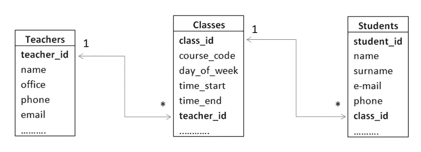

具有一对多关系的示例关系数据库结构

关系可以是*一对一*、*一对多*、*多对一*或*多对多*。最广为人知的关系数据库是 *MySQL* 、 *PostgreSQL* 、 *Oracle* ，或者 *SQL Server* 。每当您的数据是结构化的，并且您希望基于数据的关系从数据中获得洞察力时，这是一个很好的起点。

NoSQL 数据库与关系数据库相反，没有模式和关系。很容易想象为什么需要没有模式和关系的数据库— **非结构化** / **大数据**。有四种类型的 NoSQL 数据库:

*   ***键-值*** 是最简单的数据库类型，它以索引键和值对的形式存储数据。键值数据库的例子有 *Redis* 或 *MemcacheDB* 和 *Riak* 。

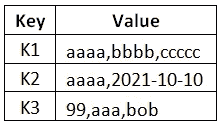

示例键值数据库

*   ***列存储*** 数据库是一种以面向列的方式而不是传统的基于行的方式存储数据的数据库。这样做的目的是通过更高效地读写存储来提高查询性能。

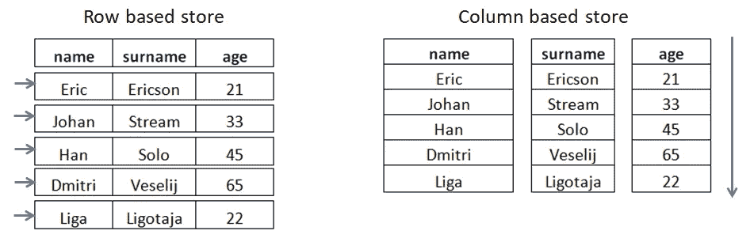

行存储数据库与列存储数据库

*   例如，在列存储中，所有列*年龄*值在物理上是在一起的，这适用于其余的列。数据按记录顺序存储，因此列*名*的第 1000 个条目是列*姓*的第 1000 个条目。这允许极大的改进，例如，在计算人的平均年龄时——因此年龄值不是逐行获取，而是作为*年龄*列的组来访问，以便更快地处理。列存储数据库的例子有 *Cassandra* 、 *HBase* 和 *ClickHouse* 。
*   **面向文档的数据库**简单来说就是键值集合的集合。存储在键下的数据称为文档，它可以存储完全非结构化的数据，但它擅长存储半结构化的数据，如 XML 或 JSON。文档存储数据库的伟大之处在于，您不仅可以通过键进行索引，还可以在键的桶内进行索引，这在某些解决方案中极大地提高了数据搜索的性能。这类数据库的例子有 *MongoDB* 、 *CouchDB* 、 *RavenDB* 。

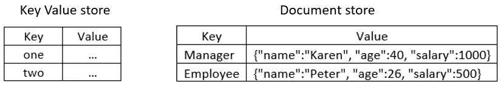

键值数据库和文档存储数据库之间的区别

*   当需要比传统关系数据库更复杂的关系时，通常使用图形数据库。在图形数据库中，关系被视为独立的对象，因此您建模的不是数据而是关系。最常见的用途是高度关联的数据，例如社交网络数据。数据由*节点*、*边*和*属性*组成。**节点**是人、书、汽车或其他需要跟踪的事物的实例——非常像 SQL 数据库中的记录。**边**或通常也称为关系是连接节点的那些。它们可以是有向的，也可以是无向的(双向的)，并且像节点一样，它们可以有属性。**属性**是与节点相关的信息。例如，如果人 Peter 在节点上，它可以具有以字母 P 开始的属性"*"*。最流行的图形数据库是*亚马逊 Neptune* 或 *Neo4j* 。

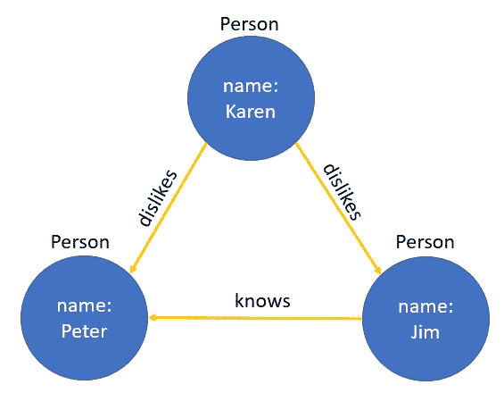

图形数据库的示例结构

作为一名数据工程师，无论您是需要将数据转移到另一个数据库还是改造现有的数据库，了解不同类型的数据库都是至关重要的。在这个位置上，你也是一个架构师，你的解决方案应该适合数据的用途。

# 大数据框架

大数据框架是处理大数据的地方。我认为这是大数据工程师工作的“面包和黄油”。有多种选择——一些更受欢迎，一些不太受欢迎，目前我认为没有领导者，因为这取决于你计划实现什么。

## Hadoop

它是一个开源框架，用于以分布式方式存储数据并并行处理数据。Hadoop 框架是尝试解决大数据问题的先驱之一。所有数据都以块的形式(默认大小为 128MB)存储在 Hadoop 分布式文件系统( **HDFS** )上。Hadoop 的架构允许在商用硬件上容错存储和处理数据。

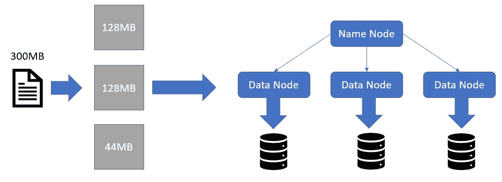

数据在 HDFS 是如何存储的

**名称节点**管理和维护数据节点。它记录所有元数据(权限、文件大小、层次结构等。)关于存储数据块的位置和内容。总有一个辅助名称节点在主节点出现故障时拍摄快照，以便它可以取代主节点。**数据节点**是实际的工作者，负责读取和写入。它们向名称节点报告并处理客户端请求(名称节点已将请求委托给它们)。文件的所有数据块都被复制以实现容错，并且可以在任何节点出现故障的情况下恢复。

现在，我们知道 HDFS 中的数据存储在多个设备上，并且很容易横向扩展，但是当发出请求时，如何处理这些数据呢？这就是 MapReduce 的用武之地，它是为在一个机器集群上使用并行处理算法处理大数据集而开发的。

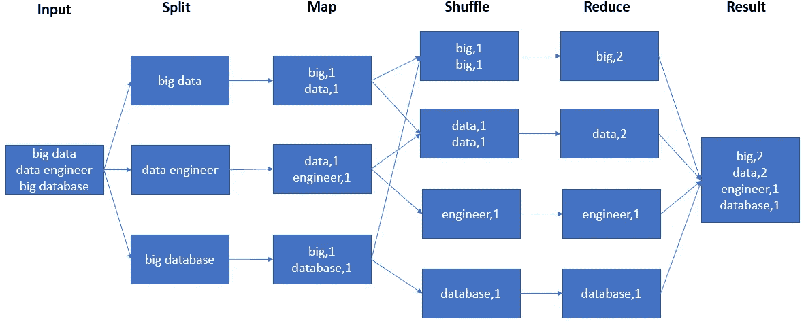

MapReduce 字数统计示例

例如，您有一篇文章，并且想要计算一些单词在该文本中出现的频率。首先，文件在 HDFS 上被分割成块，然后所有数据节点对文件中属于它们的部分进行映射计算，每个节点输出一个键值对结果。在*归约*操作之前，这些键值对通常被排序，从而发生*洗牌*操作。归约操作将所有条目加起来，得到一个结果。

MapReduce 引擎由 JobTracker 和 TaskTracker 组成。 **JobTracker** 接受来自客户端应用程序的 MapReduce 作业，然后将它们转发到集群上可用的 **TaskTracker** 节点。JobTracker 跟踪数据的物理位置，并尝试管理数据所在的作业，以减少网络流量。

## 储备

它是一个开源项目，是一个数据仓库类型的基础设施，可以“放”在 HDFS (Hadoop 分布式文件系统)或任何其他受支持的分布式文件系统之上。它通过将类似 SQL 的(*Hive QL*—Hive query language)请求转化为 Map Reduce 任务链，提供了对位于文件系统上的数据集的查询。

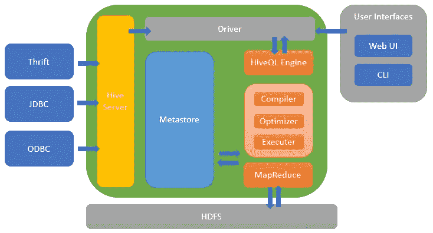

蜂巢建筑

这是一个非常强大的工具，大大降低了编写低级 MapReduce 代码的复杂性。Hive 将其数据库和表元数据存储在 *Metastore* 中。Metastore 是一个数据库或文件备份存储，支持数据的抽象和发现。Hive 还提供了命令行工具和 JDBC 驱动程序，因此用户可以轻松地连接到 Hive。

## 火花

另一个开源大数据框架，作为 Hadoop 的更高级的解决方案。根据我的经验，这是最常用的一种。我也见过专门需要 *Spark 开发人员*的工作角色。那么它有什么好的呢？正如 Spark 主页对自己的描述——**速度**，**易用**，**通用性**，**无处不在**。

Spark 实现了高处理速度**因为不像 Hadoop 在执行 MapReduce 任务时将数据保存在硬盘上，它使用随机存取存储器(RAM)处理所有操作。因此，Spark 的运行速度比 Hadoop 的 MapReduce 快 100 倍。速度不仅来自处理 RAM 上的数据，还因为它的智能 DAG 调度程序和查询优化器。**

几乎任何人都可以编写 Spark 应用程序，这就是易用性的来源。可以用 Java、Scala、Python、R 和 SQL 编写代码。

```
****Scala**
val studentsDF = spark.sql("SELECT * FROM students")
studentsDF.show()****Java**
Dataset<Row> studentsDF = spark.sql("SELECT * FROM students");
studentsDF.show();****Python**
studentsDF = spark.sql("SELECT * FROM students")
studentsDF.show()****R**
studentsDF <- sql("SELECT * FROM students")**Results in the same:**
*# +--+--------+*
*# |id|    name|*
*# +--+--------+*
*# | 1|   Janis|*
*# | 2|Vladimir|*
*# | 3|    Emma|*
*# +--+--------+*
```

Spark 的流行和广泛的应用来自于它的易用 API，可以帮助开发人员处理大量的数据。Spark 有三个提供数据抽象的 API——*RDD*、*数据框架*和*数据集*。

**RDD** (弹性分布式数据集)是首批面向用户的 API 之一，它是跨集群节点划分的元素(数据)集合。有两种方式与之交互— *转换*和*动作*。转换是**惰性的**(意味着不立即计算)并返回一个新的 RDD 作为结果。然而，动作会计算出结果，并保存到文件系统或返回。转换的一个例子是*映射*、*平面映射*、*不同的*或*过滤器*，对于动作——*收集*、*计数*、*取*、*减少*。当您希望通过低级转换和操作来控制数据集或者数据是非结构化的时，RDD 非常有用。但是请注意，与使用*数据帧*或*数据集*不同，您可能会损失一些优化和性能优势。

像 RDD 这样的数据框架是一个不可变的分布式数据集合，但是有一个模式——数据被组织在具有数据类型的列中。它基本上类似于关系数据库中的一个表。这使得几乎所有只懂 SQL 的人都有机会使用 Spark 来并行处理大型数据集。您可以从 CSV、JSON、AVRO、HDFS、HIVE 和其他来源和格式读取和写入数据帧。

**数据集**是数据帧的扩展，提供 RDD API 的面向对象编程接口和类型安全的功能。数据集以行的 JVM 对象或行对象集合的形式表示数据。类型安全意味着编译器将在编译时验证数据集中的数据类型，如果数据类型中有任何不匹配，将引发错误。

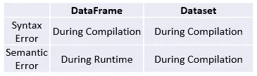

数据帧和数据集的类型安全

Spark 由五个组件组成——核心和四个库，扩展了它与大数据交互的可能性。


火花烟囱

*   **Spark 核心**包含 Spark 的基本功能——任务调度、内存管理、故障恢复、与文件存储系统的交互。是 RDD API 的总部所在地。
*   **Spark SQL** 包包含处理结构化数据的工具。它为 Spark 提供了 SQL 接口，并允许使用 SQL 和编程数据操作与前面提到的受支持的编程语言混合进行数据处理。
*   **Spark Streaming** 是支持数据流处理的组件。数据流可以是日志文件、物联网设备数据或消息队列。它提供了与 RDD API 类似的处理数据的 API，因此很容易从批处理切换到流处理。虽然在引擎盖下 Spark 实际上并不做实际的实时处理，而是更像微秒级的批处理。
*   **MLlib** 包含了常见的机器学习功能，因此得名。它提供了多种机器学习算法，包括分类、回归、聚类等。这样做的好处是，所有这些都可以以分布式方式在集群中运行。
*   GraphX 是一个处理图形数据的库。如前所述，对于像社交网络那样互联的数据。Spark 允许创建一个有向图，每个顶点和边都有属性。

使用 Spark 的最后一个好处是它可以在任何地方运行。Spark 可以运行在 Hadoop 之上，可以独立运行，也可以运行在云上。它有大量的连接器，因此可以访问不同的数据源。

## 其他大数据框架

根据我的经验，Spark 是解决任何大数据相关问题的“首选”技术。但我知道，对于不同的情况，有许多其他伟大的甚至可能更好的大数据处理框架。以下是我渴望学习并建议研究的框架列表:

*   **Storm** 是一个开源的分布式实时计算系统。它解决了 Hadoop 的批处理限制，是一个真正的大数据集实时处理框架。Storm 的主要特点是可扩展性和停机后的快速恢复能力。
*   **Flink** 是一个流和批处理框架，提供复杂的状态管理和事件时处理语义。这对于事件驱动的应用程序来说是非常好的，因为它不是远程访问数据，而是在本地访问数据以获得更好的性能。事件驱动应用程序的用例是欺诈检测、异常检测或业务流程监控。
*   Heron 是一个实时、分布式、容错的流处理引擎。由 Twitter 开发，作为 Storm 的替代品(这意味着它向后兼容 Storm，便于迁移)。虽然它仍处于开发阶段，但它已经显示出很大的前景，因为它比阿帕奇风暴有更好的性能。
*   **Kudu** 是一个开源的分布式数据存储引擎。它非常适合处理频繁更新的不同数据流。一些用例像欺诈检测，或者，例如，中国手机制造商小米用它来收集错误报告。
*   **Presto** 是 Hive 的替代品——一个开源的分布式 SQL 查询引擎。它可以通过运行单个查询来组合来自多个来源的数据。一些较大的公司每天都在使用这项技术，如脸书、Airbnb 和 Dropbox。

## 工作流程管理

我还想在大数据框架下包含一个关于如何实际管理所有数据处理工作的部分。我想说目前有两个主要的工具用于此——**气流**和**路易吉**。但是我还会补充一点关于我已经遗忘很久但肯定还在使用的 **Oozie** 。

Oozie 是一个工作流引擎。工作流可以支持 Hadoop MapReduce、Pig、Hive 和 Spark 等作业。Oozie *工作流*由构成有向无环图(DAG)的*动作*组成。还有另一个称为*协调器*的组件，用于调度重复出现的工作流。

让我们看一个在 Oozie 的帮助下运行 Hive 脚本的小例子。下面是我们的示例 Hive 脚本，名为 **create_database.q** :

```
CREATE DATABASE company;
```

现在是 Oozie 工作流( **workflow.xml** ):

```
<workflow-app  name="hive-example">
    <start to="hive-node"/>
    <action name="hive-node">
        <hive >
           <job-tracker>localhost:50001</job-tracker>
            <name-node>hdfs://localhost:50000</name-node>
            <configuration>
                <property>
                    <name>mapred.job.queue.name</name>
                    <value>default</value>
                </property>
                <property>
                    <name>oozie.hive.defaults</name>
                    <value>/user/test/oozie/hive-site.xml</value>
                </property>
            </configuration>
            <script>create_database.q</script>
        </hive>
        <ok to="end"/>
        <error to="fail"/>
    </action>
    <kill name="fail">
        <message>Table Creation Failed</message>
    </kill>
    <end name="end"/>
</workflow-app>
```

该工作流的可视化如下所示:

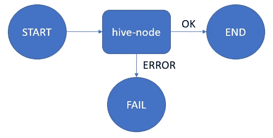

Oozie 工作流可视化

协调者( **coordinator.xml** )每天执行工作流:

```
<coordinator-app xmlns = "uri:oozie:coordinator:0.2" name =
   "coord_create_database" frequency = "0 8 * * *" start =
   "2021-01-01T01:00Z" end = "2025-12-31T00:00Z"" timezone = "America/Los_Angeles">

   <controls>
      <timeout>1</timeout>
      <concurrency>1</concurrency>
      <execution>FIFO</execution>
      <throttle>1</throttle>
   </controls>

   <action>
      <workflow>
         <app-path>workflow.xml</app-path>
      </workflow>
   </action>

</coordinator-app>
```

正如你所看到的，这需要相当多的代码，并且有很大的出错空间。但是我并没有抱怨，因为这是为 Hadoop 设计的，它完成了它的工作。

**气流**由 *AirBnb* 开发，是目前最流行的工作流管理系统之一。它的伟大之处在于工作流是用 Python 编写的，因此很容易与第三方数据库或数据文件系统集成。让我们在 Airflow 中看到与 Oozie 创建公司数据库相同的例子。Airflow 有一个直接 HiveOperator，可以运行配置单元查询，而不需要创建单独的配置单元脚本，所以让我们利用这一点:

```
from datetime import timedelta
from airflow import DAG
from airflow.operators.hive_operator import HiveOperator

default_args = {
    'owner': 'airflow',
    'depends_on_past': False,
    'email': ['airflow@example.com'],
    'email_on_failure': False,
    'email_on_retry': False,
    'retries': 1,
    'retry_delay': timedelta(minutes=5),
}

dag = DAG(
    dag_id='hive_database',
    max_active_runs=1,
    default_args=default_args,
    schedule_interval='@once')

query = """
    CREATE DATABASE company;
"""

run_hive_query = HiveOperator(
    task_id="create_database",
    hql=query,
    dag=dag
)
```

正如你所看到的，与 Oozie 不同，它的调试更加简洁和用户友好。Airflow 的另一个好处是它有一个 WebUI，您可以在其中看到作业及其 Dag 的状态和可视化。

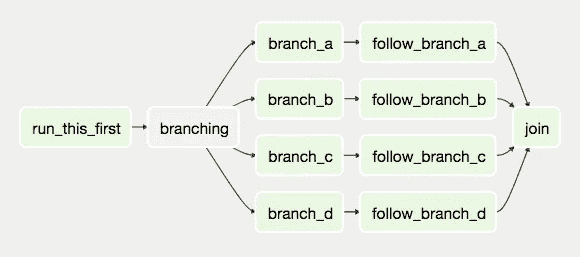

气流中 DAG 的可视化示例

由 *Spotify* 创建的 Luigi 是一个可用于创建数据管道的执行框架。类似于在 Airflow 中，使用 Python 编写管道。它也有一个非常好的 WebUI。让我们看看如何使用 Luigi 创建公司数据库:

```
import luigi
import luigi.contrib.hive

class CreateTable(luigi.contrib.hive.HiveQueryTask):
    def query(self):
        return 'CREATE DATABASE company;' if __name__ == "__main__":
    luigi.run()
```

如你所见，它甚至比气流更简洁。老实说，对我来说，很难说一个人是好是坏。但我可以肯定的是，在 Oozie 让我的生活变得更加轻松之后，我会使用 Luigi 或 Airflow。

还有许多其他类似的工作流管理和调度工具，但在我看来，这三个工具可以帮助你应对任何挑战。此外，不要忘记，如果你在云上工作，那么很可能你会使用某种云供应商提供的调度程序。

# **数据仓库、数据湖、数据集市、数据网格**

当我开始学习数据工程时，我发现了术语*数据仓库*，它的目的很清楚。但是当我开始从事我的第一个项目时，我开始听到一些术语*数据湖*、*数据集市*以及最近的*数据网*。所有这些意味着什么，为什么理解它们很重要？

## 数据仓库

数据仓库的目的是为您的数据提供一个中央存储库。一个数据仓库可以有多个包含多个表的数据库。它积累来自不同来源的数据，如事务系统或关系数据库。数据仓库通常有多个数据级别。底层是存储本身，它可以是数据库，也可以是某种文件系统。中间层包括底层的处理和分析。顶层位于中间层之上，由前端用户访问，前端用户分析、报告并获得对准备好的数据的见解。实施数据仓库的好处:

*   整合所有组织数据。
*   分析历史数据的可能性。
*   商业决策的改进。
*   提高数据质量和一致性。

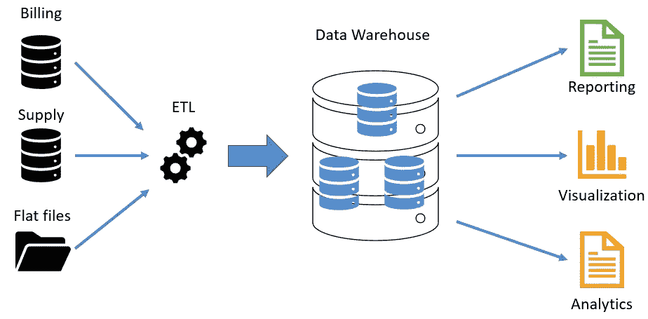

数据仓库体系结构

## 数据湖

数据湖不同于数据仓库，因为它不仅存储结构化数据，还存储非结构化数据。在数据湖中捕获数据时，不需要指定数据的结构或模式。在尚不清楚如何使用时，这是一种积累数据的灵活方法。但这也有一些危险，因为有时数据湖会因此变成“数据沼泽”，从中提取任何价值会变得非常困难或不可能。数据湖也有不同的数据就绪层，在大多数情况下有三层——原始层、着陆层和用例层。原始层保存原始数据——没有转换、丰富或任何其他内容——就像它在数据源上一样。接下来是登录层，在这里数据被分配一些基本的模式或结构。最后是使用案例层，在该层中，可以基于登录层对特定数据集进行清理、重复数据消除、转换、连接或用其他登录层数据丰富。用例层通常充当面向前端的用户连接到的数据端点，并进行一些探索性的数据分析或报告。数据湖最适合于:

*   探索性数据分析。
*   研发。
*   非结构化数据的存储。
*   整合不同数据源的经济高效的解决方案。

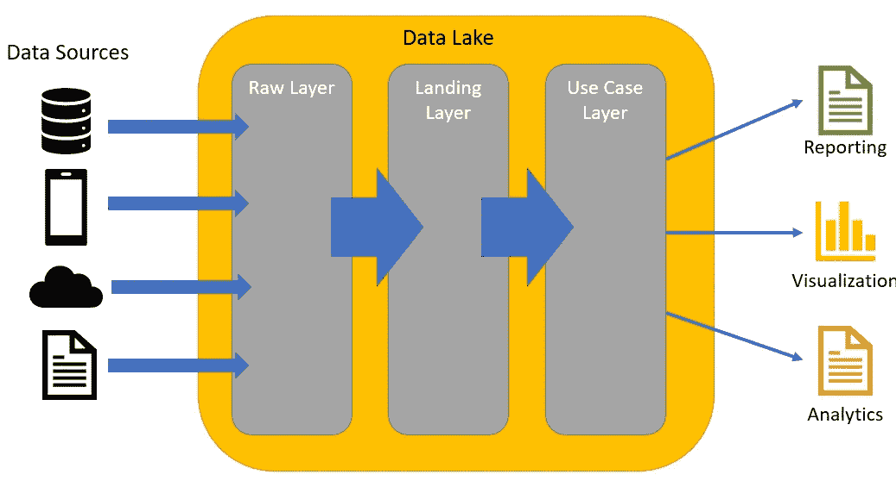

数据湖示例架构

## 数据集市

数据集市是一种专门的数据仓库，通常只保存特定领域的数据，例如财务、销售或营销。它也不保存领域的所有数据，而是一个汇总版本。数据集市可以独立存在，也可以是数据仓库的一部分。

## 数据网格

数据网格是如何处理数据的一个相对较新的概念。许多大公司倾向于花费大量资源构建大数据湖来整合所有数据，希望从中创造价值。不幸的是，这并不总是成功的。数据网格是一种新的数据范式，它试图远离集中式数据仓库或数据湖概念。主要思想是保持数据的分布式，而不是将其整合到巨大的数据湖中，这将数据生产者与数据消费者分离开来。Data mesh 试图解决数据所有权和数据质量的问题，因为数据湖基础设施团队大多不知道数据是否正确。当然，如果数据域快速增长，数据湖可能会成为扩展的瓶颈。每个数据领域(如财务、营销或其他)都被视为一等公民，处理自己的数据和管道。


[*数据网*](https://martinfowler.com/articles/data-monolith-to-mesh.html) *架构*

我希望通过解释这些数据范例，它能在将来为您简化如何构建数据的繁琐决策。

# **内部部署和云**

在我作为数据工程师的职业生涯中，我可以说我是幸运的，因为我的项目有完全本地的解决方案、完全在云上的解决方案，也有本地和云集成在一起的混合解决方案。

## 内部部署与云

这是一个有时很难做出的选择。当然，如果我们看看云供应商的报告，我们会发现云市场正在逐年大幅增长。但它总是最佳解决方案吗？有一些要点可以帮助理解在哪里托管数据。

**可扩展性**可能是使用云的最佳论据。它非常适合那些不想投资数千美元建立自己的硬件，但最终却以失败告终的创业公司。另一个很好的使用案例是针对每天、每周甚至季节性工作负载变化的公司，这很简单，只需扩大或缩小您的数据解决方案。

**的安全**是另一件需要考虑的事情。虽然还没有任何关于云提供商大规模违规的报告，但许多公司都担心会发生这种情况。这是他们在考虑云解决方案时最关心的问题。云供应商当然会提供物理硬件和数据安全性，但对于某些行业来说，这仍然存在太大的风险，他们希望对自己的数据有更大的控制权。

**对于 GDPR 这样的公司来说，合规现在比以往任何时候都重要，不合规可能会造成巨大的经济损失。但是云已经通过开箱即用的解决方案为您的数据提供了行业领先的保护和合规性，从而解决了这一问题。**

**如果您的数据系统运行金融等关键工作负载，可靠性和灾难恢复**非常重要。云供应商确实提供了大约 99.9%的资源可用性，但这一小部分对于一些行业来说仍然是灾难性的，这就是为什么他们仍然选择完全控制他们的数据基础架构。在我看来，对于云供应商来说，灾难恢复听起来更有前途，因为开发自己的解决方案可能会非常昂贵。

在我看来，最具成本效益的解决方案取决于您是否已经拥有一些基础设施。如果您需要从头开始构建一切，那么云解决方案可能最适合您。但是，如果您已经有了一些基础架构，就有可能使用**混合云**来扩展您的解决方案。它既可以用于廉价存储(归档数据)，也可以在您的内部基础架构停机时用于备用恢复。

## 云数据工程

我第一次体验云计算是在 *Databricks* 上。我可以说，在我不得不使用 *Oozie* 安排我的 Spark 工作的现场项目工作之后，这非常令人耳目一新。我还与*亚马逊网络服务*和*微软 Azure* 合作过。在与这些云供应商合作后，我看到了使用云的价值——它简化了数据工程师工作的各个方面。它就像一个你所知道的所有技术的沙箱。最棒的是，您可以轻松设置它们并无缝连接它们。我不会详细介绍每个云供应商提供什么工具，因为内容太多了。但是我对云的最后一个想法是，不要害怕自己去探索和尝试。所有提到的云供应商都有试用订阅，并有足够好的文档可供学习。我建议也调查一下*雪花*和*谷歌云平台*。

# 结论

这是**第三部分**和该系列的结束。我已经尝试过把数据工程师工作中更重要的事情挤进去，我希望你能找到一些有用的见解。

感谢您花时间探索**如何进行数据工程**！