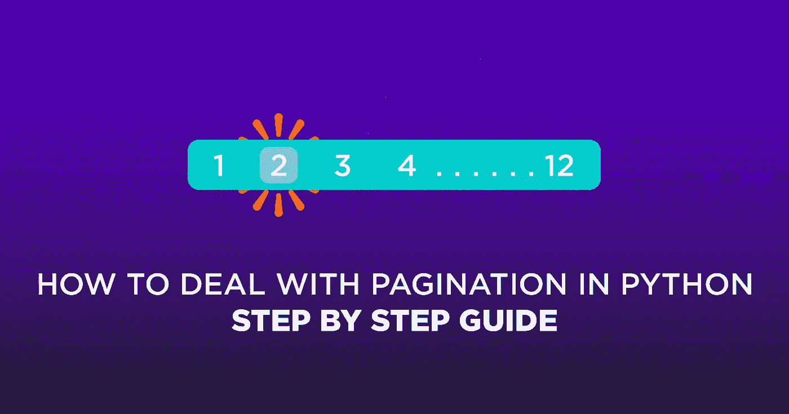
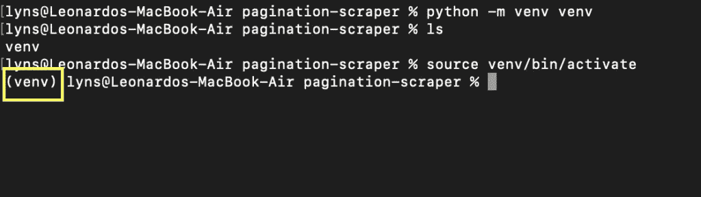
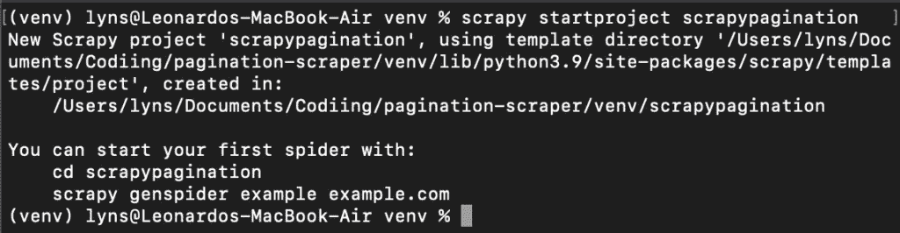
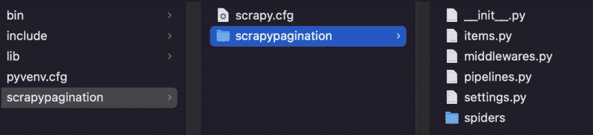
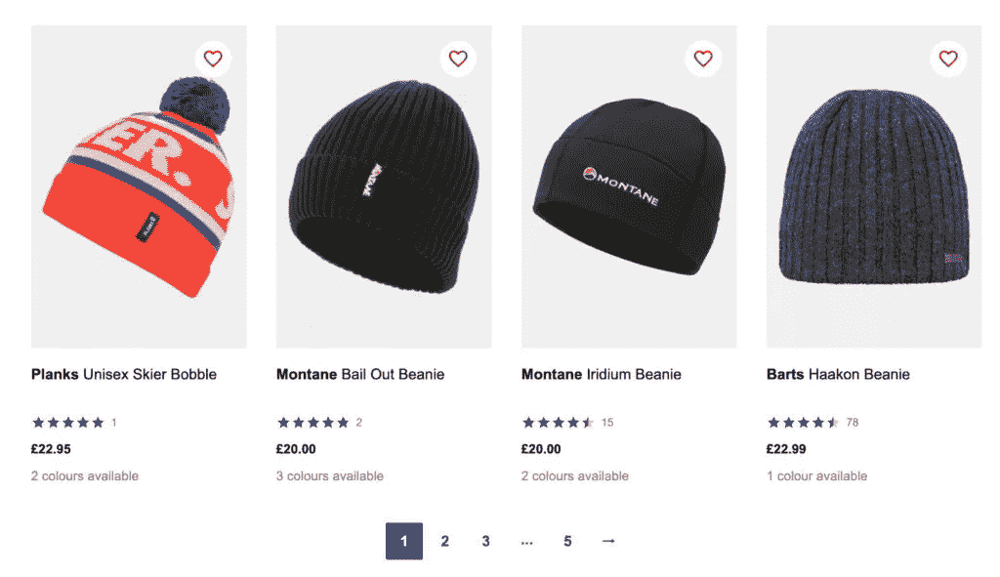
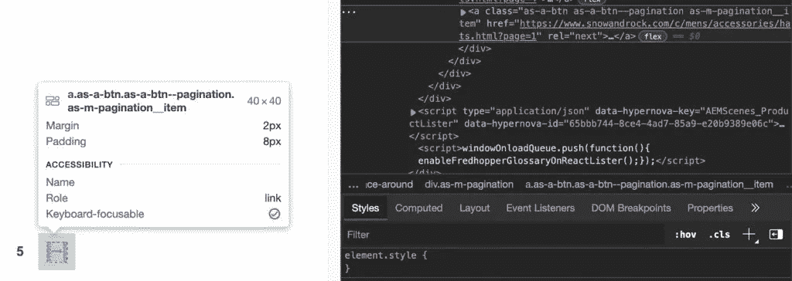
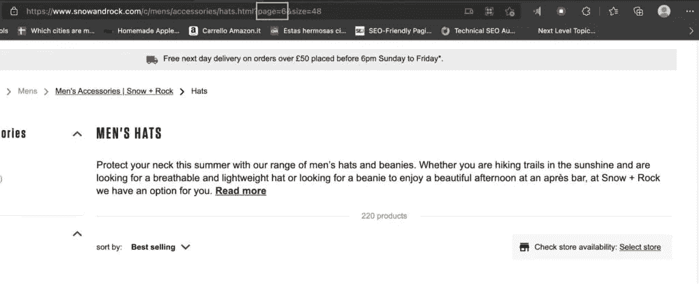

# 如何处理 Python 分步指南中的分页[完整代码]

> 原文：<https://medium.com/codex/how-to-deal-with-pagination-in-python-step-by-step-guide-full-code-6c4f4ef3be84?source=collection_archive---------11----------------------->

原载于

****

**如果你正在做一个大型的网络抓取项目(比如抓取产品信息)，你可能会偶然发现分页页面。电子商务和内容网站的标准做法是将内容分成多个页面，以改善用户体验。然而，网页抓取分页给我们的工作增加了一些复杂性。**

**在本文中，您将学习如何在几分钟内构建一个分页 web 抓取器，并且不会被任何反抓取技术所阻碍。**

**尽管你可以在没有任何先验知识的情况下阅读本教程，但在你开始之前，最好先看看我们的[初学者指南](https://www.scraperapi.com/blog/scrapy-web-scraping/)以获得对该框架更深入的解释。**

**事不宜迟，让我们直接开始吧！**

# **使用 Python Scrapy 抓取带有分页的网站**

**对于本教程，我们将抓取 [SnowAndRock](https://www.snowandrock.com/) 男式帽子类别，提取所有产品名称、价格和链接。**

**一个小小的免责声明——我们是用 Mac 写这篇文章的，所以你必须做一点调整才能在 PC 上工作。除此之外，一切都应该是一样的。**

****TLDR:这里有一个使用“下一步”按钮在 Scrapy 中处理分页的快速代码片段**:**

**`next_page = response.css('a[rel=next]').attrib['href']`**

**`if next_page is not None:`**

**`yield response.follow(next_page, callback=self.parse)`**

**请继续阅读关于如何在您的脚本中实现该代码的深入解释，以及如何在没有下一步按钮的情况下处理页面*。***

# **1.设置您的开发环境**

**在我们开始编写任何代码之前，我们需要设置我们的环境来使用 [Scrapy](https://scrapy.org/) ，这是一个为 web 抓取而设计的 Python 库。它允许我们从网站抓取和提取数据，将原始数据解析为结构化格式，并使用 CSS 和/或 XPath 选择器选择元素。**

**首先，让我们创建一个新目录(我们称之为 pagination-scraper ),并使用命令 python -m venv venv 在其中创建一个 python 虚拟环境。其中第二个 venv 是您的环境的名称——但是您可以随意称呼它。**

**要激活它，只需输入 source venv/bin/activate。您的命令提示符应该如下所示:**

****

**现在，安装 Scrapy 就像输入 pip3 install scrapy 一样简单——下载并安装它可能需要几秒钟。**

**一旦准备好了，我们将输入 cd venv 并创建一个新的 Scrapy 项目:`scrapy startproject scrapypagination`。**

****

**现在你可以看到 Scrapy 通过安装所有必要的文件为我们启动了我们的项目。**

****

# **2.设置 ScraperAPI 以避免禁令**

**处理分页页面最难的部分不是编写脚本本身，而是如何不让我们的 bot 被服务器阻塞。**

**为此，我们需要创建一个函数(或一组函数)，在多次尝试后轮换我们的 IP 地址(这意味着我们还需要访问一个 IP 地址池)。此外，一些网站使用先进的技术，如验证码和浏览器行为分析。**

**为了节省我们的时间和麻烦，我们将使用 ScraperAPI，这是一个 API，它使用机器学习、巨大的浏览器农场、第三方代理和多年的统计分析来处理我们的脚本可能会自动遇到的每一个反机器人机制。**

**最棒的是，[在我们的项目](https://www.scraperapi.com/blog/web-scraping-best-practices/)中设置 ScraperAPI 非常简单:**

**`import scrapy`**

**`from urllib.parse import urlencode`**

**`API_KEY = '51e43be283e4db2a5afb62660xxxxxxx'`**

**`def get_scraperapi_url(url):`**

**`payload = {'api_key': API_KEY, 'url': url}`**

**`proxy_url = 'http://api.scraperapi.com/?' + urlencode(payload)`**

**`return proxy_url`**

**正如您所看到的，我们正在定义 get_scraperapi_url()方法来帮助我们构造将向其发送请求的 url。首先，我们在顶部添加了我们的依赖项，然后添加了包含我们的 API 密钥的 API_KEY 变量——要获得您的密钥，只需[注册一个免费的 ScraperAPI 帐户](https://www.scraperapi.com/signup),您就会在您的仪表板上找到它。**

**该方法将为我们的抓取器找到的每个 URL 的请求构建 URL，这就是为什么我们这样设置它，而不是像这样直接将所有参数添加到 URL 中的更直接的方法:**

**`start_urls = ['http://api.scraperapi.com?api_key={yourApiKey}&url={URL}']`**

# **3.了解网站的 URL 结构**

**每个网站的 URL 结构都非常独特。开发人员倾向于使用不同的结构，以使导航更容易，在某些情况下，优化搜索引擎爬虫(如 Google)和真实用户的导航体验。**

**要抓取分页的内容，我们需要了解它是如何工作的，并相应地进行规划，没有比检查页面并查看 URL 本身如何从一个页面变化到下一个页面更好的方法了。**

**因此，如果我们转到[https://www.snowandrock.com/c/mens/accessories/hats.html](https://www.snowandrock.com/c/mens/accessories/hats.html)并滚动到列出的最后一个产品，我们可以看到它使用了一个编号分页和一个“下一步”按钮。**

****

**这是一个好消息，因为在每一页上选择下一页按钮将比循环浏览每一页更容易。尽管如此，让我们看看当点击第二页时 URL 是如何变化的。**

**以下是我们的发现:**

*   **第 1 页:[https://www.snowandrock.com/c/mens/accessories/hats.html?page=0 & size=48](https://www.snowandrock.com/c/mens/accessories/hats.html?page=0&size=48)**
*   **第 2 页:[https://www.snowandrock.com/c/mens/accessories/hats.html?page=1 & size=48](https://www.snowandrock.com/c/mens/accessories/hats.html?page=1&size=48)**
*   **第 3 页:[https://www.snowandrock.com/c/mens/accessories/hats.html?page=2 & size=48](https://www.snowandrock.com/c/mens/accessories/hats.html?page=2&size=48)**

**请注意，当您使用导航返回页面时，第一页的 URL 会发生变化，变为 page=0。尽管我们将使用“下一步”按钮来导航该网站的分页，但这并不总是那么简单。**

**理解这种结构将有助于我们构建一个函数来改变 URL 中的页面参数并将其增加 1，从而允许我们在没有下一页按钮的情况下进入下一页。**

****注意:**并非所有页面都遵循相同的结构，因此请确保始终检查哪些参数发生了变化以及如何变化。**

**现在我们知道了请求的初始 URL，我们可以创建一个定制的蜘蛛。**

# **4.使用 Start_Requests()方法发送初始请求**

**对于最初的请求，我们将创建一个蜘蛛类，并将其命名为`Pagi`:**

**`class PaginationScraper(scrapy.Spider):`**

**`name = "pagi"`**

**然后，我们定义 start_requests()方法:**

**`def start_requests(self):`**

**`start_urls = ['https://www.snowandrock.com/c/mens/accessories/hats.html']`**

**`for url in start_urls:`**

**`yield scrapy.Request(url=get_scraperapi_url(url), callback=self.parse)`**

**现在，在运行我们的脚本之后，它将把找到的每个新 URL 发送给这个方法，其中新 URL 将与`get_scraperapi_url()`方法的结果合并，通过 ScraperAPI 服务器发送请求，并对我们的项目进行防弹处理。**

# **5.构建我们的解析器**

**在用 [Scrapy Shell](https://docs.scrapy.org/en/latest/topics/shell.html) 测试了我们的选择器之后，这些是我们想到的选择器:**

**`def parse(self, response):`**

**`for hats in response.css('div.as-t-product-grid__item'):`**

**`yield {`**

**`'name': hats.css('.as-a-text.as-m-product-tile__name::text').get(),`**

**`'price': hats.css('.as-a-price__value--sell strong::text').get(),`**

**`'link': hats.css('a').attrib['href'],`**

**`}`**

**如果你不熟悉 Scrapy Shell 或 Scrapy，查看我们的[完整 Scrapy 教程](https://www.scraperapi.com/blog/scrapy-web-scraping/)可能是个好主意，在那里我们涵盖了你需要知道的所有基础知识。**

**然而，我们基本上是选择所有包含我们想要的信息的 divs】，然后提取名称、价格和产品链接。**

# **4.让 Scrapy 在分页中移动**

**太好了！我们已经从第一页得到了我们需要的信息，现在做什么呢？嗯，我们需要告诉我们的解析器以某种方式找到新的 URL，并将其发送给我们之前定义的`start_requests()`方法。换句话说，我们需要找到一个 ID 或类来获取 next 按钮内部的链接。**

****

**从技术上讲，我们可以使用类`‘.as-a-btn.as-a-btn--pagination as-m-pagination__item’`，但是幸运的是，我们有一个更好的目标:rel=next。它不会与任何其他选择器混淆，用 Scrapy 选择属性很简单。**

**`next_page = response.css('a[rel=next]').attrib['href']`**

**`if next_page is not None:`**

**`yield response.follow(next_page, callback=self.parse)`**

**现在，它将在页面之间迭代，直到分页中不再有页面——所以我们不需要设置任何其他停止机制。**

**如果您一直在跟进，您的文件应该是这样的:**

**`import scrapy`**

**`from urllib.parse import urlencode`**

**`API_KEY = '51e43be283e4db2a5afb62660xxxxxx'`**

**`def get_scraperapi_url(url):`**

**`payload = {'api_key': API_KEY, 'url': url}`**

**`proxy_url = 'http://api.scraperapi.com/?' + urlencode(payload)`**

**`return proxy_url`**

**`class PaginationScraper(scrapy.Spider):`**

**`name = "pagi"`**

**`def start_requests(self):`**

**`start_urls = ['https://www.snowandrock.com/c/mens/accessories/hats.html']`**

**`for url in start_urls:`**

**`yield scrapy.Request(url=get_scraperapi_url(url), callback=self.parse)`**

**`def parse(self, response):`**

**`for hats in response.css('div.as-t-product-grid__item'):`**

**`yield {`**

**`'name': hats.css('.as-a-text.as-m-product-tile__name::text').get(),`**

**`'price': hats.css('.as-a-price__value--sell strong::text').get(),`**

**`'link': hats.css('a').attrib['href'],`**

**`}`**

**`next_page = response.css('a[rel=next]').attrib['href']`**

**`if next_page is not None:`**

**`yield response.follow(next_page, callback=self.parse)`**

**它现在可以运行了！**

# **处理没有下一步按钮的分页**

**到目前为止，我们已经看到了如何构建一个 web scraper，它使用 next 按钮内的链接在分页中移动——请记住，Scrapy 实际上不能与页面进行交互，因此如果必须单击按钮才能显示更多内容，它将不起作用。**

**然而，当它不是一个选项时会发生什么呢？换句话说，我们如何在没有下一步按钮的情况下导航分页。**

**理解网站的 URL 结构就派上了用场:**

*   **第 1 页:[https://www.snowandrock.com/c/mens/accessories/hats.html?page=0 & size=48](https://www.snowandrock.com/c/mens/accessories/hats.html?page=0&size=48)**
*   **第二页:【https://www.snowandrock.com/c/mens/accessories/hats.html? page=1 & size=48**
*   **第 3 页:[https://www.snowandrock.com/c/mens/accessories/hats.html?page=2 & size=48](https://www.snowandrock.com/c/mens/accessories/hats.html?page=2&size=48)**

**URL 之间唯一变化的是 page 参数，每下一页增加 1。这对我们的剧本意味着什么？首先，我们必须通过添加一个新变量来改变发送初始请求的方式:**

**`class PaginationScraper(scrapy.Spider):`**

**`name = "pagi"`**

**`page_number = 1`**

**`start_urls = ['http://api.scraperapi.com?api_key=51e43be283e4db2a5afb62660xxxxxxx&url=https://www.snowandrock.com/c/mens/accessories/hats.html?page=0&size=48']`**

**在这种情况下，我们还使用了 ScraperAPI 的直接 cURL 结构，因为我们只是改变了一个参数——这意味着没有必要构建一个全新的 URL。这样每次它改变时，它仍然会通过 ScraperAPI 的服务器发送请求。**

**接下来，我们需要在最后改变我们的条件来匹配新的逻辑:**

**`next_page = 'http://api.scraperapi.com?api_key=51e43be283e4db2a5afb62660xxxxxxx&url=https://www.snowandrock.com/c/mens/accessories/hats.html?page=' + str(PaginationScraper.page_number) + '&size=48'`**

**`if PaginationScraper.page_number < 6:`**

**`PaginationScraper.page_number += 1`**

**`yield response.follow(next_page, callback=self.parse)`**

**这里发生的事情是，我们从`PaginationScraper()`方法中访问 page_number 变量来替换 URL 中的 page 参数值。**

**之后，它将检查 page_number 的值是否小于 6——因为在第 5 页之后就没有结果了。**

****

**只要满足条件，就会将`page_number`值加 1 并发送 URL 进行解析和抓取，以此类推，直到`page_number`为 6 或更大。**

**下面是没有下一步按钮的情况下抓取分页页面的完整代码:**

**`import scrapy`**

**`class PaginationScraper(scrapy.Spider):`**

**`name = "pagi"`**

**`page_number = 1`**

**`start_urls = ['http://api.scraperapi.com?api_key=51e43be283e4db2a5afb62660xxxxxxx&url=https://www.snowandrock.com/c/mens/accessories/hats.html?page=0&size=48']`**

**`def parse(self, response):`**

**`for hats in response.css('div.as-t-product-grid__item'):`**

**`yield {`**

**`'name': hats.css('.as-a-text.as-m-product-tile__name::text').get(),`**

**`'price': hats.css('.as-a-price__value--sell strong::text').get(),`**

**`'link': 'https://www.snowandrock.com/' + hats.css('a').attrib['href']`**

**`}`**

**`next_page = 'http://api.scraperapi.com?api_key=51e43be283e4db2a5afb62660fc6ee44&url=https://www.snowandrock.com/c/mens/accessories/hats.html?page=' + str(PaginationScraper.page_number) + '&size=48'`**

**`if PaginationScraper.page_number < 6:`**

**`PaginationScraper.page_number += 1`**

**`yield response.follow(next_page, callback=self.parse)`**

# **包扎**

**无论你是在[汇编房地产数据](https://www.scraperapi.com/blog/real-estate-web-scraping/)还是[抓取像 Etsy](https://www.scraperapi.com/blog/how-to-scrape-etsy/) 这样的电子商务平台，处理分页都是常事，你需要准备好变得有创意。**

**替代数据已经成为世界上几乎每个行业的必备工具，拥有创建复杂高效的刮刀的能力将为您带来巨大的竞争优势。**