# 开发过程中如何调试 Ionic 手机 app？

> 原文：<https://medium.com/codex/how-to-debug-ionic-apps-during-development-19d5df51c6bf?source=collection_archive---------2----------------------->

本文是关于如何调试 ionic 应用程序的两部分文章的第一部分。如果您的应用程序处于调试模式，这里描述的技术会很有帮助。如果你正在寻找在 prod(签名发布)中调试应用程序的方法，请查看本文的第二部分。

## 1-使用 Web 视图在开发期间进行远程调试

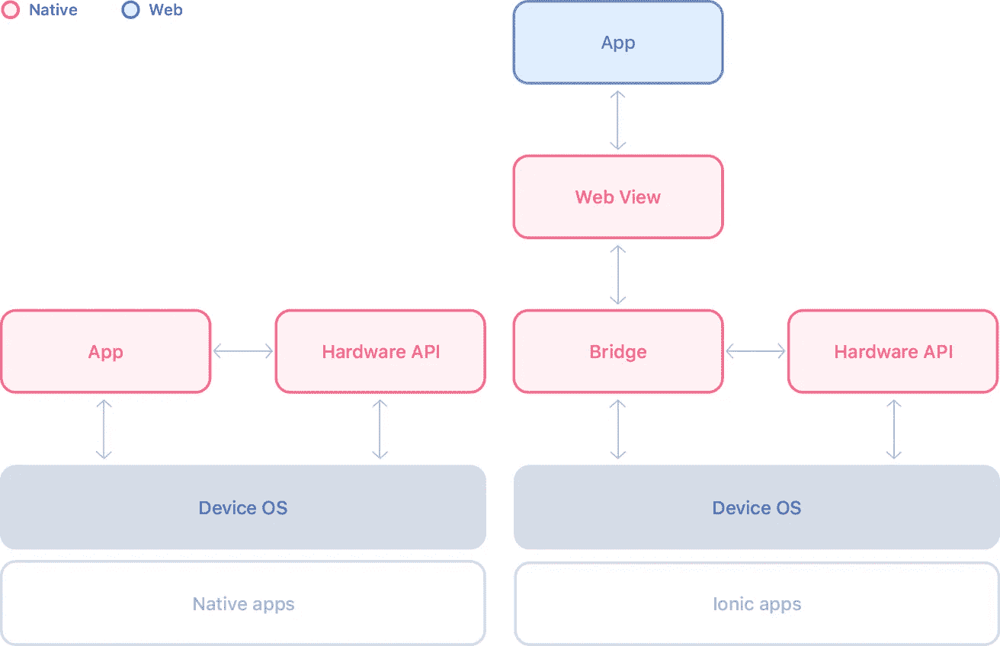

来自 Ionic 网站:[网络浏览量为本地设备上的网络应用提供动力](https://ionicframework.com/docs/core-concepts/webview)

Ionic apps(原生应用)是在嵌入式浏览器中运行的 web 应用，因此您可以使用 Android 上的 chrome dev tools 或 iOS 上的 Safari Web Inspector 进行远程调试，以调试 JavaScript、HTML 和 CSS。

您可以使用实际设备或模拟器进行远程调试。如果使用真实设备，请确保从设备和远程浏览器都启用了调试。

在 Android 中，你需要先进入设置并启用开发者模式，然后在开发者选项菜单下进行 USB 调试。
如果您没有看到开发者选项菜单，您需要首先启用它。为此，请转到`About phone > Software information`找到内部版本号并点击它，直到您得到启用开发者选项的确认。然后`Developer options`菜单将与`About phone`菜单选项处于同一级别。

为 android 启用远程调试。打开一个新的 chrome 标签并输入`chrome://inspect`，这将显示所有可用于调试的网页视图，按应用程序名称分组。

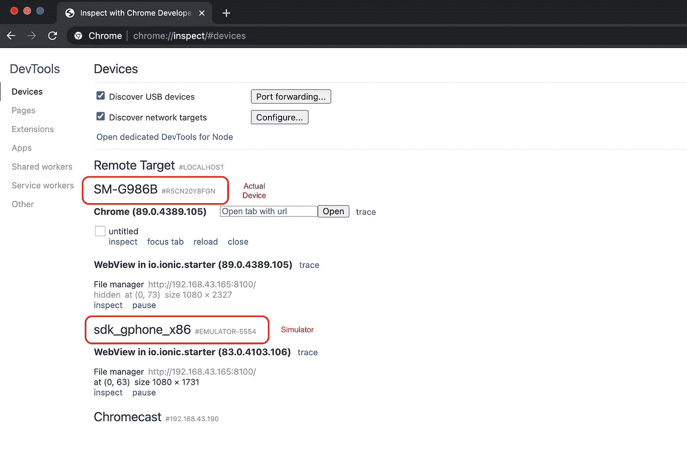

Chrome inspect 设备标签，显示可以在模拟器和实际设备上调试的应用程序

iOS 很像。打开 Safari，从那里找到写着`Develop`的菜单；找到要调试的设备。打开设备菜单，你会看到所有可用的应用程序(网络视图)进行调试。如果您没有看到`Develop`菜单，您需要转到 Safari 偏好设置并从高级设置中启用开发者模式。此外，请确保在用于调试的实际设备上启用了 developer 选项。

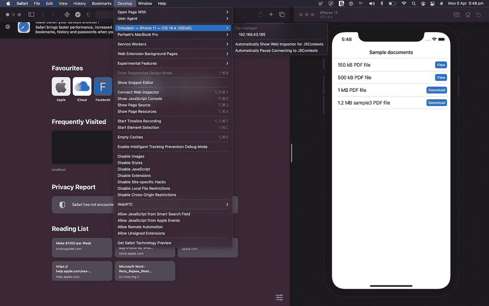

Safari 桌面中的开发菜单

您可以使用 console.log 等控制台方法，并查看运行时日志来了解您的应用程序是如何工作的。此外，您可以像使用标准 web 应用程序一样使用 JS 调试器。您可以检查 DOM 并操作 HTML 和 CSS 进行调试。

下面是一个使用 Safari web inspector 在 iOS simulator 上运行应用程序进行远程调试的示例。

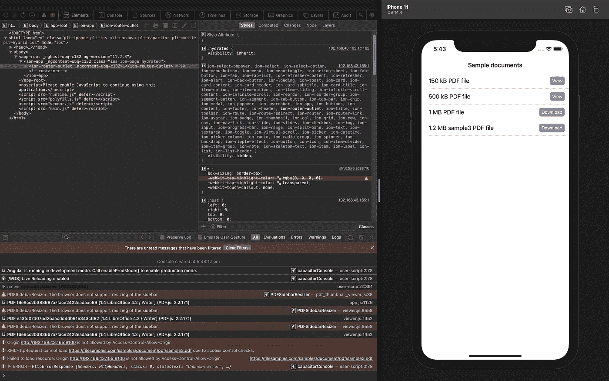

使用在 iOS 模拟器上运行应用程序的 Safari web inspector 进行远程调试

下面是一个使用 Chrome DevTools 在 Android 模拟器上运行应用程序进行远程调试的例子。

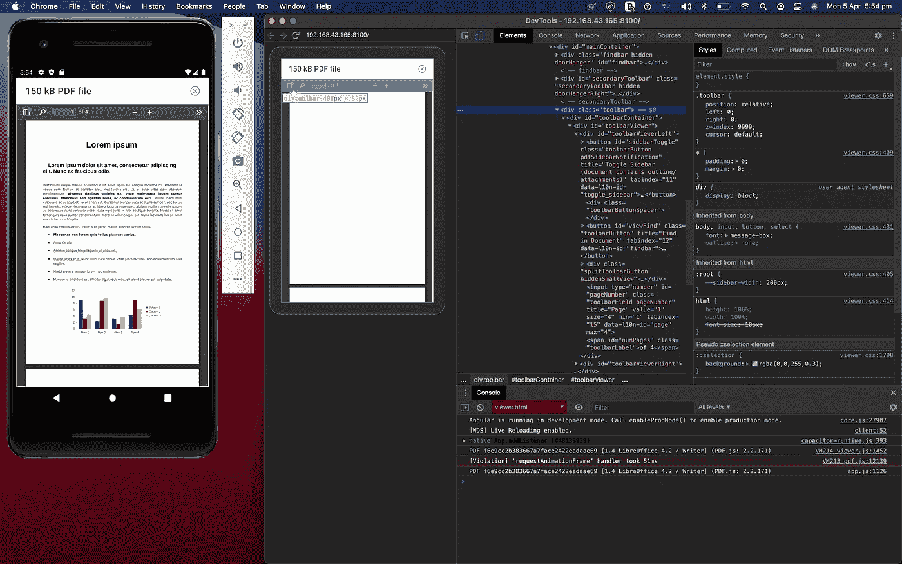

使用 Chrome DevTools 在 Android 模拟器上运行应用程序进行远程调试

如果您喜欢使用 IDE 进行远程调试，VSCode 已经支持此功能。因此，不用在 JS 中放置调试器或添加控制台日志，您可以简单地在 IDE 中的代码中放置一个断点，运行时将暂停您的断点。Ionic 调试指南中有一节是关于这种方法的。
[https://ionicframework . com/docs/trouble shooting/debugging # debugging-with-visual-studio-locally-in-chrome-both-Android-IOs-](https://ionicframework.com/docs/troubleshooting/debugging#debugging-with-visual-studio-locally-in-chrome-both-android-ios-)

## 2-在开发期间使用浏览器进行调试

如果您将 Ionic 与 Cordova 或 Capacitor 一起使用，一些原生功能将仅在应用程序在设备或模拟器上原生运行时可用。这个限制意味着你不能简单地使用桌面浏览器来提供应用。为了避免这个问题，我通常尝试包装我的本地服务调用。许多插件已经提供了一个 web 实现，比如地理定位，它退回到使用浏览器地理定位 API。对于其他插件，你可以模仿 web 的插件行为，或者将插件调用封装在忽略 web 调用的服务/功能中。

以下代码是在设备上使用 Capacitor Haptics 插件并忽略 web 上的调用的示例。这样，如果我在桌面浏览器中提供应用程序，我就不会在控制台中得到触觉调用的错误。或者，我可以使用 [Navigator.vibrate()](https://developer.mozilla.org/en-US/docs/Web/API/Navigator/vibrate) 来复制相同的行为，但是在这种情况下，我没有用于部署的 web 目标。

在 chrome 这样的常规浏览器上调试可以帮助你使用你最喜欢的调试工具和扩展。例如，我使用 redux DevTools 来查看我在应用程序工作流中的状态变化。使用 chrome 开发工具来模拟不同的屏幕尺寸来测试你的 UI 和应用程序的布局响应要容易得多。
这种方法的另一个好处是更快的反馈循环，因为变化只是刷新。不适合涉及本机 API 访问的调试。

与远程调试相比，其他有用的额外工具是 performance audit 选项卡(lighthouse ),用于测试您的性能、可访问性、PWA 分数或动画调试器。

下面是一个调试 app 的例子，用的是 ionic v5 和 Angular v9。

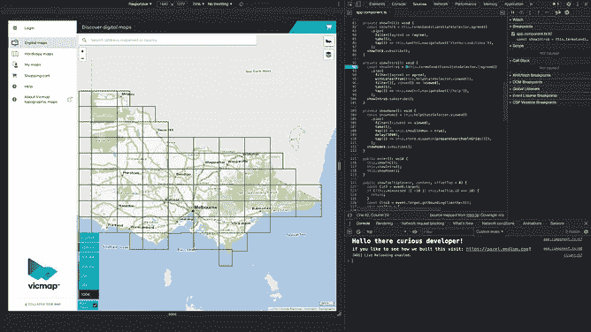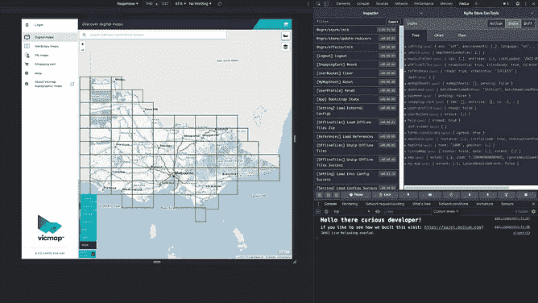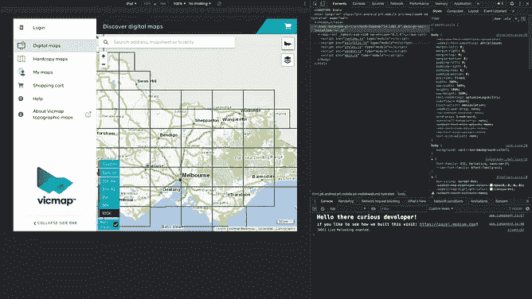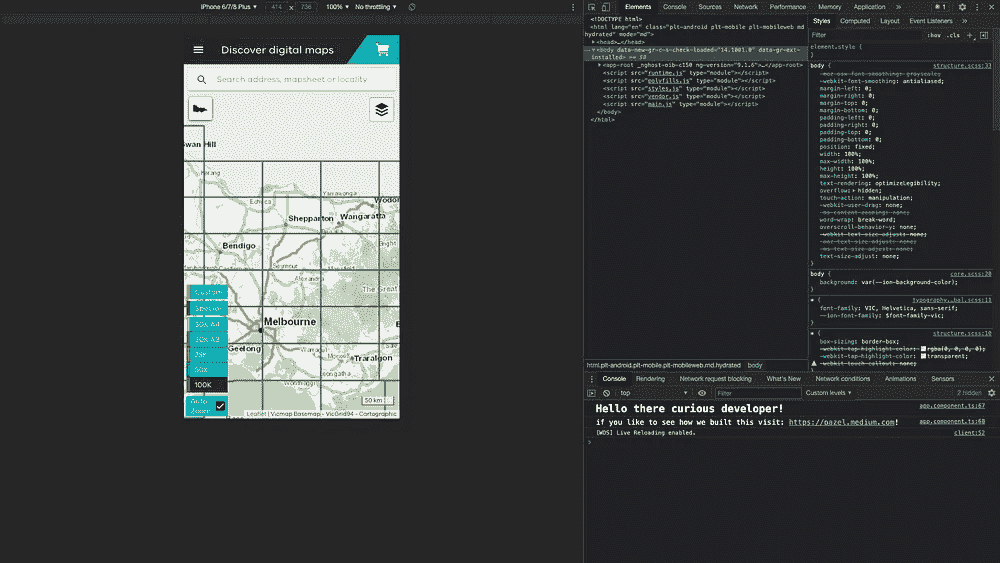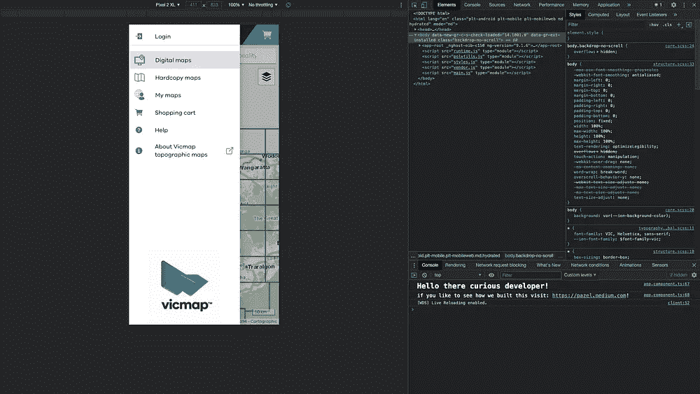

使用 Chrome DevTools 调试应用布局

## 3-使用本机 ide 在开发期间进行调试

如果您使用 Xcode 或 Android Studio 在实际设备或模拟器上运行您的应用程序，您可以在 IDE 中查看调试日志输出。这种方法有利于调试发生在本机级别的问题。有时这些问题发生在应用程序启动的早期，这意味着你的网络视图甚至没有机会加载。所以以前的方法是行不通的。

此外，如果您使用插件来访问本机功能，您可以快速地在 Swift (Objective C)或 Java 代码中放置一个断点，以找出由插件中的 bug 引起的问题。

使用本机 IDE 运行应用程序是 Ionic & Capacitor 的主要工作方式。使用 Ionic & Cordova，您需要进入生成的 iOS 或 Android 项目，并在相应的 IDE 中打开它进行调试。

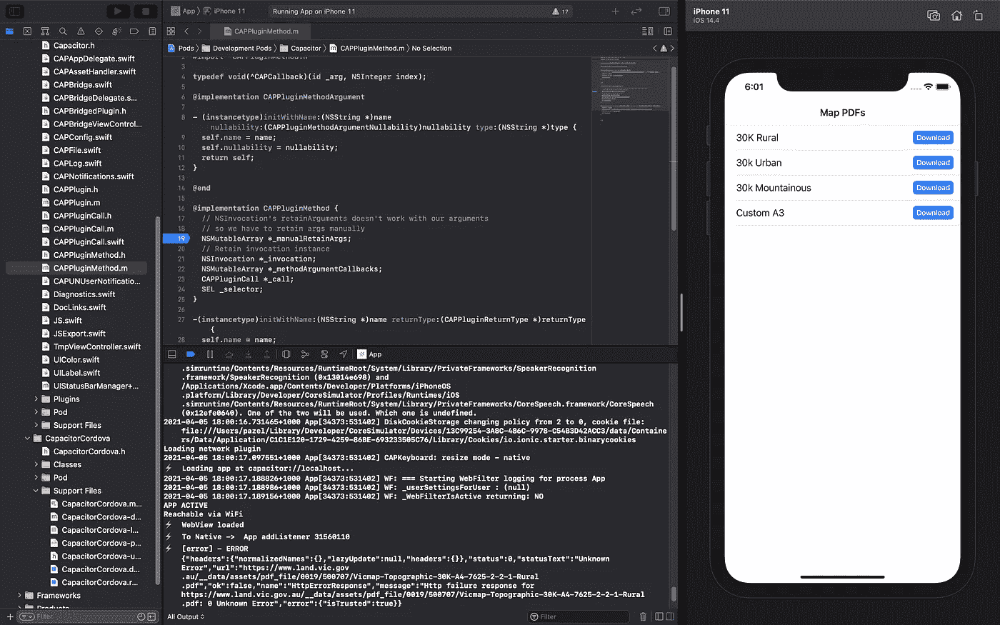

使用 Xcode 调试

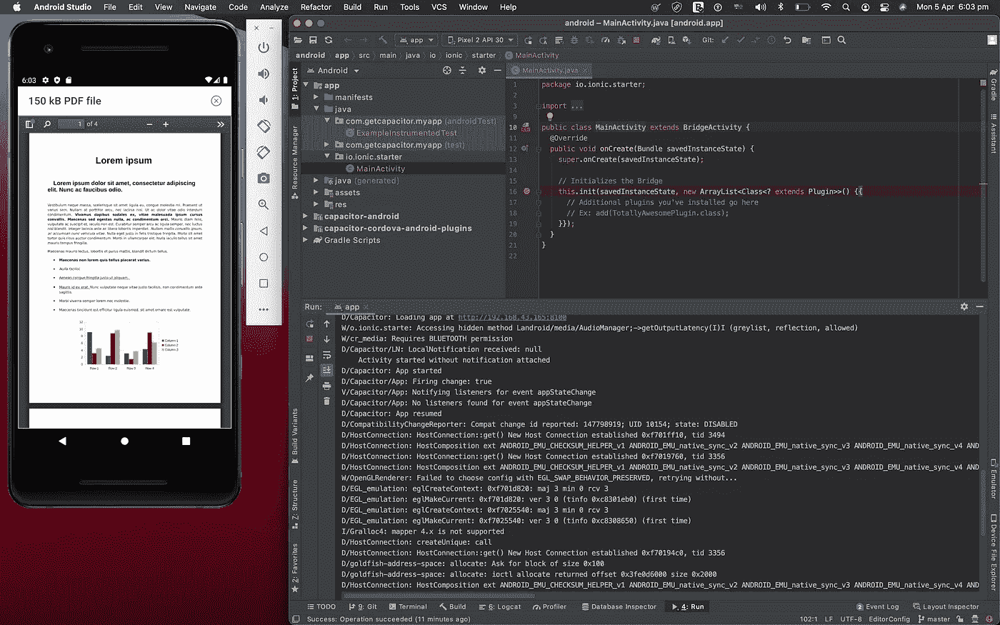

使用 Android Studio 调试

还有许多用于调试的工具。例如，使用桌面浏览器或本机模拟器，您可以调节网络来模拟间歇性网络条件或模拟 GPS 位置，以便调试与在某条路径上或以某个速度移动的设备相关的问题。

我希望你喜欢阅读这篇文章，请查看本文第二部分。

如果您在 Ionic apps 调试中有任何问题或需要帮助，请留下您的评论。