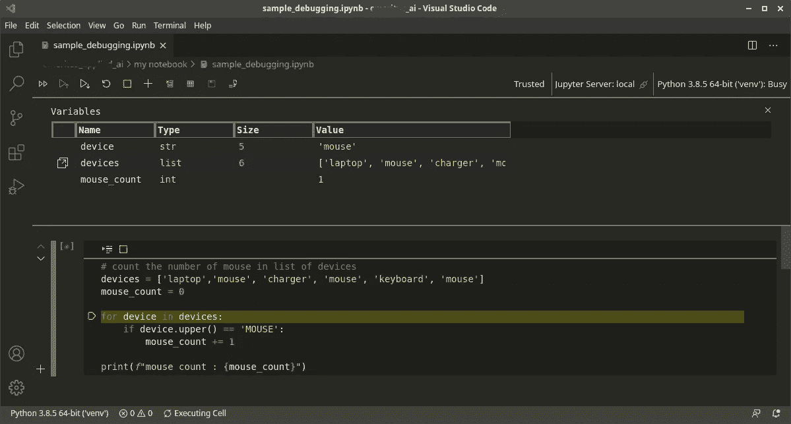
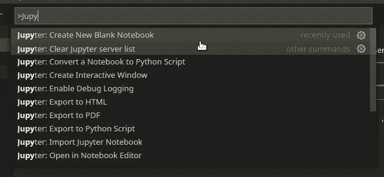
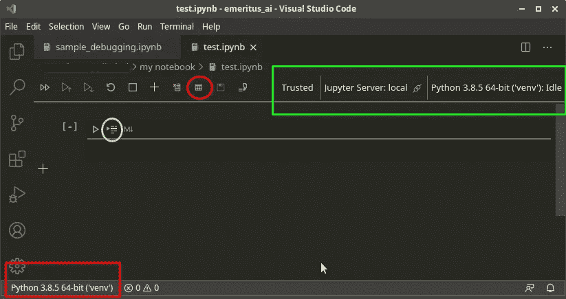

# 如何在 Visual Studio 代码中调试 Jupyter 笔记本

> 原文：<https://medium.com/codex/how-to-debug-jupyter-notebooks-in-visual-studio-code-3d36039c6f86?source=collection_archive---------3----------------------->



笔记本调试会话

调试代码是开发人员的一项常见活动。在我的日常工作中，我大部分时间都在对代码做 F10 式的工作，观察变量的值的变化——这是一个使用 Visual Studio 的软件维护人员的悲伤故事。所以当我开始使用 Jupyter Notebook 时，我的第一个问题是——我如何一步一步地调试代码？。我得到的最常见的回答是，“好吧，如果你坚持使用 Jupyter，就使用 print”。对大多数基本任务来说，是的。简单的打印是我们所需要的，但是当你深入到使用笔记本创建复杂程序的世界时，你需要的不仅仅是打印。

幸运的是，Visual Studio 代码有一个很好的方法来做到这一点。因此，在我们开始 F10 化我们的代码之前，有一些先决条件:

*   [Visual Studio 代码](https://code.visualstudio.com/) —它是免费的，它是伟大的，它是令人敬畏的。
*   [Jupyter 笔记本](https://jupyter.org/)——我们这篇博文的主角。

我假设已经安装了 Python，并且如果您正在使用虚拟环境，virtualenv 已经启动并运行。

使用 Visual Studio 代码，您可以将您的 Jupyter 笔记本无缝地托管到编辑器中，并利用其丰富的功能，如智能感知、代码完成、林挺和美丽的主题(因为有时 Jupyter 笔记本的白色画布很无聊，但您也可以通过阅读[这篇 stackoverflow 讨论](https://stackoverflow.com/questions/46510192/change-the-theme-in-jupyter-notebook))来更改主题)。让我们看看您需要安装的这两个扩展。

*   Python extension for Visual Studio Code—这是一个 Visual Studio 代码扩展，对 Python 语言提供了丰富的支持(适用于该语言所有积极支持的版本:> =3.6)，包括智能感知、林挺、调试、代码导航、代码格式化、重构、变量资源管理器、测试资源管理器等功能！
*   Jupyter Extension for Visual Studio Code——这是一个 Visual Studio 代码扩展，为当今 Jupyter 笔记本中支持的语言内核提供基本的笔记本支持。

一旦你安装了这些，我们就可以开始了。

## 开始我们的 Jupyter 笔记本

要使用 Jupyter，您需要使用下面的命令启动 Jupyter 服务器

```
$ > jupyter notebook
```

这将启动您系统上的 Jupyter 服务器。请注意，您运行“jupyter 笔记本”的位置或目录将是您在笔记本中的基本目录。一旦服务器启动，您可以使用下面的命令在启动 Jupyter 笔记本的同一目录中打开 Visual Studio 代码。

```
$ > code .
```

## 为调试准备好 Visual Studio 代码

通过使用 Jupyter 命令创建文件或使用*手动创建新文件来创建新文件。ipynb 扩展。



VSCode 中的 jupyter 菜单

一旦笔记本文件在 VSCode 中打开，系统将连接到 Jupyter 笔记本的运行实例。VSCode 界面将为用户提供以下状态:

*   用来运行笔记本的内核。在下图中，你会看到我在虚拟环境“venv”中使用 Python 3.8.5。请参见下图绿色方框中的部分。
*   在我的例子中，Jupyter 服务器的位置是本地的。
*   笔记本的状态是可信还是不可信。VSCode 将在开始时提示您信任笔记本。



虚拟代码

## 让我们编码和调试

为了感受一下如何在 VSCode 中调试 notebook，我们将使用下面的示例代码。

在你的新笔记本上创建一个代码单元格，并使用上面的代码。我们将单步执行代码，并观察所有变量的内容。选择单元格，我们不点击“运行”按钮，而是点击“调试”按钮(这是上图中用黄色圈出的按钮)。这将启动调试会话。“监视”窗口将对我们可见，我们可以在单步执行代码时查看这些值。如果观察部分不可见，您可以单击“显示变量”按钮(见上图中红色圆圈内的按钮)。要继续单步调试代码，只需点击“调试”按钮或按 F10。

如您所见，我可以在逐行运行代码时分析变量。我甚至可以用数据浏览器查看数据。如果您在代码中处理更复杂的数据结构，这将非常重要。

开始用 Visual Studio 代码调试您的笔记本吧。我听说 JupyterLab 也有这个功能。我来自一个在大部分工作中使用 VSCode 的背景，所以我选择使用 Visual Studio 代码。

您是否使用 VSCode 完成 Jupyter 笔记本任务？如何在 VSCode 中找到调试笔记本？请在下面的评论区告诉我。

请在下面留下您的评论、建议或问题！

*原载于我的* [*个人博客*](https://trashvin.github.io/2021/03/31/how-debug-notebook-in-vscode/) *。*

如果这篇文章对你有任何帮助，请点击拍手👏按钮下面几下，以示支持！

*在 Markdown 中写介质？试试*[](https://markdium.dev/)**！**