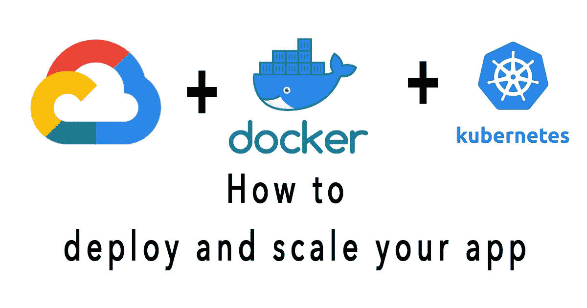

# 如何在 GCP 使用 Kubernetes 和 Docker 容器部署和扩展您的应用

> 原文：<https://medium.com/codex/how-to-deploy-and-scale-your-app-with-kubernetes-and-docker-containers-in-gcp-7e046421d10e?source=collection_archive---------3----------------------->

## [法典](http://medium.com/codex)

Kubernetes 是一个开源项目(可在 [kubernetes.io](http://kubernetes.io/) 上获得)，它可以在许多不同的环境上运行，从笔记本电脑到高可用性多节点集群，从公共云到内部部署，从虚拟机到裸机。