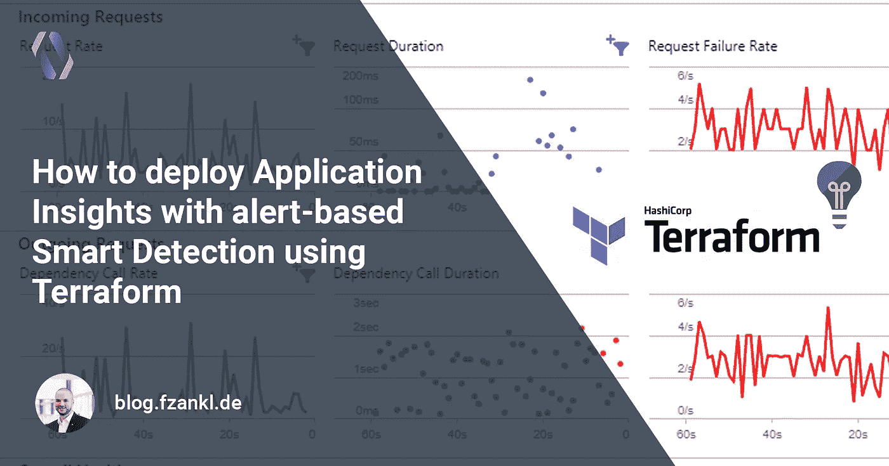
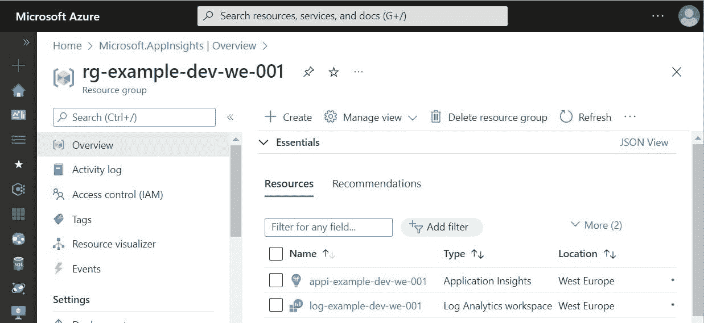
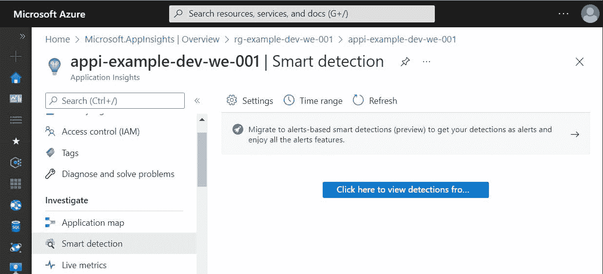
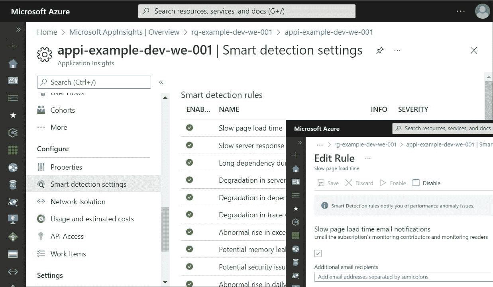
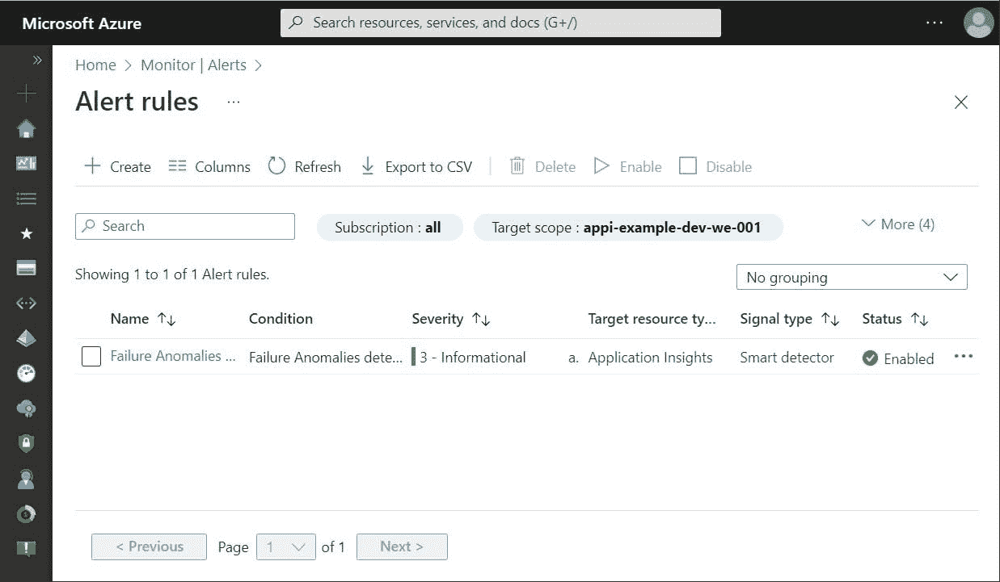
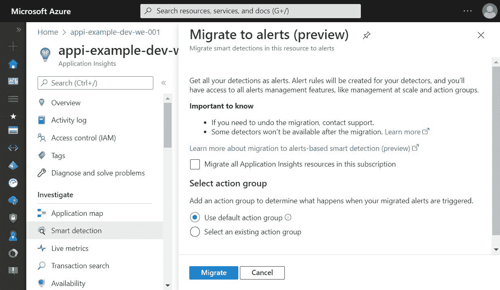
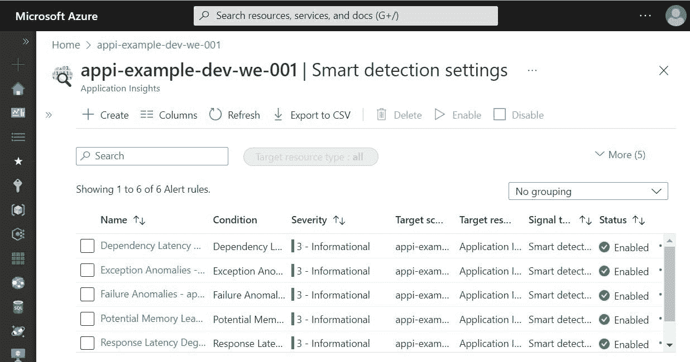

# 如何使用 Terraform 通过基于警报的智能检测部署应用洞察

> 原文：<https://medium.com/codex/how-to-deploy-application-insights-with-alert-based-smart-detection-using-terraform-c22685204126?source=collection_archive---------7----------------------->



Azure Monitor 是 Azure 服务之一，涵盖了负责收集、分析和执行来自各种环境的遥测数据的横切关注点。Application Insights 作为 Azure Monitor 的一部分，为各种类型的应用程序提供可扩展的应用程序性能管理和监控。

Application Insights 的一个支柱是智能检测机制，它可以自动警告潜在的性能问题和故障异常。由于 Azure 的历史，该功能有一个非常有限的通知机制。一个例外是故障异常检测器，它是警报管理的一部分。作为 Azure Monitor 的一部分，警报管理提供了各种配置选项，如警报规则的粒度定义、具有特定通知机制的操作组的定义以及警报处理规则的定义。

使用新的预览功能，智能检测规则现在可以集成到 Azure Monitor 的警报管理中。本指南展示了如何使用 Terraform 通过基于警报的智能检测自动部署应用洞察。

# Azure Monitor 警报概述

Azure Monitor 中的警报功能基于指标或捕获的日志主动通知关键情况。预警管理主要由三个支柱组成:预警规则、行动组和预警处理规则:

*   警报规则
    警报通知违反监控数据的条件。警报规则指定监控所需的所有相关参数，如条件或在违规情况下应通知的操作组。
*   行动组
    一个行动组指定了应该向谁发出警报以及如何发出通知。
*   警报处理规则
    这些类型的规则允许您对引发的警报进行处理，如应用过滤器、修改操作组或抑制通知等。

关于 Azure Monitor 特性的更深入的见解和详细信息可以在[微软文档](https://docs.microsoft.com/en-US/azure/azure-monitor/overview)中找到。

# 地形部署

## 步骤 1:创建应用洞察

要开始使用 Terraform，必须首先配置相应的提供者。在我们的例子中，我们使用提供者`azurerm`和`azapi`。`providers.tf`文件的结果部分看起来像下面的代码片段。像身份验证和状态管理这样的事情不在本指南的讨论范围之内。如果您不熟悉 azurerm 提供程序的配置，请简要浏览一下 [Terraform 文档](https://learn.hashicorp.com/tutorials/terraform/azure-build?in=terraform/azure-get-started)。

```
terraform {
  required_version = ">=1.2.8"

  required_providers {
    azurerm = {
      source  = "hashicorp/azurerm"
      version = "~>3.20.0"
    }
    azapi = {
      source  = "azure/azapi"
      version = "~>0.5.0"
    }
  }
}
```

提供者`azurerm`用于部署不同资源的基本实例。`azapi`提供商是必需的，因为我们将使用`azurerm`提供商尚未涵盖的功能。

有了提供者配置，我们现在可以编写我们的 Terraform 块了。我们从包含基于日志分析工作区的应用洞察实例的资源组开始。

> 日志分析是 Azure Monitor 的一部分，提供存储、保留和查询从受监控资源收集的数据的功能。工作区是保存数据的逻辑存储单元。日志分析工作区应该是创建应用洞察的首选方式，因为经典模式已过时，将于 2024 年 2 月 29 日退役。

该步骤中使用的所有资源都可以在`azurerm`提供程序中获得。以下代码片段显示了 Terraform 配置。

```
resource "azurerm_resource_group" "example" {
  name     = "rg-example-dev-we-001"
  location = "westeurope"
}

resource "azurerm_log_analytics_workspace" "example" {
  name                = "log-example-dev-we-001"
  location            = azurerm_resource_group.example.location
  resource_group_name = azurerm_resource_group.example.name
  sku                 = "PerGB2018"
}

resource "azurerm_application_insights" "example" {
  name                = "appi-example-dev-we-001"
  location            = azurerm_resource_group.example.location
  resource_group_name = azurerm_resource_group.example.name
  workspace_id        = azurerm_log_analytics_workspace.example.id
  application_type    = "web"
}
```

执行 Terraform 脚本后，Azure 中创建的资源如下图所示:



在 Application Insights 实例中，智能检测分为两个视图。第一个显示了引发的警报和一个关于新的基于警报的方法的小提示。



在有关智能检测设置的视图中，会显示所有可用的规则。在编辑对话框中，我们可以配置通知。



如上所述，故障异常规则一直是一种特殊的智能检测。它是作为 Azure Monitor 中的警报规则自动创建的。



当前的方法有几个缺点:

*   无论是否需要，都会创建智能检测规则
*   智能检测通知机制受到限制，无法根据需要进行配置
*   无法阻止故障异常规则的创建，并且应用的通知接收者通常是错误的人

但也有好消息。在新的预览版中，许多问题都将得到改善。接下来的部分将涵盖这些主题。

## 步骤 2:创建和配置警报

## **部署行动小组**

使用 Terraform，可以使用`azurerm_monitor_action_group`块创建一个动作组。下面的代码片段将使用邮件接收器创建一个新的操作组，作为许多可用的可能性之一，如调用 Azure 函数、执行 Logic App 或运行自动化 Runbook。

```
resource "azurerm_monitor_action_group" "example" {
  name                = "ag-example-dev-we-001"
  resource_group_name = azurerm_resource_group.example.name
  short_name          = "ag-example"

  dynamic "email_receiver" {
    for_each = [{ name = "receiver", mail = "receiver@example.com" }]

    content {
      name                    = "Send to (${lookup(email_receiver.value, "name", null)})"
      email_address           = lookup(email_receiver.value, "mail", null)
      use_common_alert_schema = true
    }
  }
}
```

使用上面的代码片段，您可以轻松地将多个接收者添加到操作组中，而无需重复使用`email_receiver`块。因此，由于`for_each`只能在特定的块类型中使用，我们必须使用一个[动态块](https://www.terraform.io/language/expressions/dynamic-blocks)。

## 部署智能检测警报规则

指定操作组后，我们现在可以创建警报规则。在智能检测规则的情况下，必须使用 Terraform 块`azurerm_monitor_smart_detector_alert_rule`。对于公制警报，`azurerm_monitor_metric_alert`是正确的选择。由于我们关注的是应用洞察和智能检测，该片段展示了如何使用 Terraform 创建智能检测警报规则的示例。

```
resource "azurerm_monitor_smart_detector_alert_rule" "request_performance_degradation_detector" {
  name                = "Response Latency Degradation - ${azurerm_application_insights.example.name}"
  description         = "Notifies you of an unusual increase in latency in your app response to requests."
  resource_group_name = azurerm_resource_group.example.name
  severity            = "Sev3"
  scope_resource_ids  = [azurerm_application_insights.example.id]
  frequency           = "P1D"
  detector_type       = "RequestPerformanceDegradationDetector"
  enabled             = true

  action_group {
    ids = [azurerm_monitor_action_group.example.id]
  }
}
```

如您所见，该规则适用于之前创建的 application insights 实例，并通知我们的操作组。通过字段`detector_type`可以选择智能检测规则。目前可以使用以下检测器类型:

*   故障异常检测器
*   RequestPerformanceDegradationDetector
*   DependencyPerformanceDegradationDetector
*   ExceptionVolumeChangedDetector
*   TraceSeverityDetector
*   内存泄漏检测器

## 步骤 3:切换智能检测

我们几乎成功地切换到新的警报基础智能检测机制。还需要最后一个重要步骤。我们必须告诉 Application Insights，内部智能检测评估已经被 Azure Monitor alerts 中可用的检测器所取代。

这个步骤可以例如通过 Azure 门户来执行。然后它隐式地启用资源类型`Microsoft.Insights/components/ProactiveDetectionConfigs`的`migrationToAlertRulesCompleted`。



但是，由于我们想要一个自动化的部署，我们必须寻找一种不同的方式。`azurerm`不支持`ProactiveDetectionConfigs`的部署。这就是为什么我们使用`azapi`提供者，它允许自动部署`azurerm`没有覆盖的资源。

下面的块使用`azapi_update_resource`来添加或修改`migrationToAlertRulesCompleted`资源。

```
resource "azapi_update_resource" "application_insights_migrate_to_alerts" {
  type      = "Microsoft.Insights/components/ProactiveDetectionConfigs@2018-05-01-preview"
  name      = "migrationToAlertRulesCompleted"
  parent_id = azurerm_application_insights.example.id

  body = jsonencode({
    properties = {
      Name                           = "migrationToAlertRulesCompleted"
      SendEmailsToSubscriptionOwners = false
      Enabled                        = true
      CustomEmails                   = []
    }
  })

  depends_on = [
    azurerm_monitor_smart_detector_alert_rule.request_performance_degradation_detector
  ]
}
```

随着`migrationToAlertRulesCompleted`资源启用，Application Insight 现在了解 Azure Monitor 中的智能检测。Application Insights 中的设置刀片现在显示新的 Azure Monitor 警报规则，而不是显示内部智能检测机制。



# 特殊情况:“故障异常”

智能检测器`FailureAnomaliesDetector`是 Azure 在创建新的应用洞察实例时创建的。在此创建过程中，默认操作组应用于规则。使用该组，当警报发生时，分配给订阅的角色为“监视参与者”和“监视读者”的所有身份都会得到通知。目前没有办法阻止或改变这种行为。但是 Terraform 和`azapi`提供救援。

由于`azurerm`提供者[版本 3.0.0](https://github.com/hashicorp/terraform-provider-azurerm/releases/tag/v3.0.0) Terraform 可以使用`disable_generated_rule`标志禁用警报规则。

```
provider "azurerm" {
  features {
    application_insights {
      disable_generated_rule = true
    }
  }
}
```

设置了此标志后，仍会使用默认操作组创建警报规则“故障异常”。但是，默认情况下，该规则是禁用的。

但是如果我们想使用智能探测器，这不是正确的方法。相反，我们需要在我们的自动化 Terraform 部署中调整规则。由于我们无法创建规则(因为它是通过 Application Insights 隐式创建的)，我们可以将其导入 Terraform 状态，或者通过再次使用`azapi` Terraform 提供程序来调整规则。

下一个代码块可用于修改故障异常规则。在本例中，操作组被映射到我们之前创建的组，并且规则被启用。

```
resource "azapi_update_resource" "failure_anomalies_detector" {
  type      = "Microsoft.AlertsManagement/SmartDetectorAlertRules@2021-04-01"
  name      = "Failure Anomalies - ${azurerm_application_insights.example.name}"
  parent_id = azurerm_resource_group.example.id body = jsonencode({
    properties = {
      state: "Enabled",
      actionGroups = {
        groupIds = [
          azurerm_monitor_action_group.example.id
        ]
      }
    }
  }) depends_on = [
    azurerm_application_insights.default
  ]
}
```

# 包扎

在本文中，我向您解释了如何为 Application Insights 创建 Terraform 部署。使用新的基于警报的智能检测功能，现在可以根据需要配置警报，并使用操作组通知合适的人员。由于在`azurerm` Terraform provider 中并非所有需要的功能都可用，我们还使用了`azapi` provider，该 provider 支持使用`azurerm` provider 尚未涵盖的功能。因此，我们可以使用完全自动化的部署作为基础设施和代码来创建和配置应用洞察。

如果你喜欢这篇文章，并希望看到更多与编码相关的内容，请在我的社交档案中关注我。