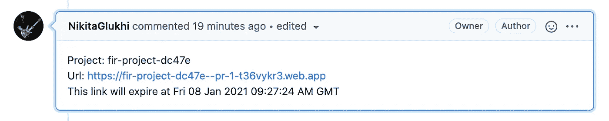

# 如何在 Travis CI 上部署 Firebase 预览频道

> 原文：<https://medium.com/codex/how-to-deploy-firebase-preview-channels-on-travis-ci-f97ae6bd8d5b?source=collection_archive---------14----------------------->

Valor Software 的软件工程师 Nikita Glukhi 好心地提供了这个故事和解决方案。

Firebase 发布了期待已久的预览频道功能，允许测试更新。所有 Firebase(不是 Firestore！)用户可以从这个托管功能中受益。你可能会问 Travis CI 或其他主机用户呢？他们也可以使用预览频道吗？

在本文发表时，GitHub Actions 还没有为 GitHub 中的 Travis CI 提供自动化过程。下面是一个在您现有的 [Travis CI](https://travis-ci.org/) 部署环境中使用 Firebase 预览频道的解决方案。


# 检查更新，不影响用户体验

让我们面对现实吧，为了检查你在生产环境中改进和测试过的更新的行为，你必须把它们真正推向生产环境。然后，万一失败了，回到以前的版本。应用程序用户可能已经注意到了不适当的系统行为，这很遗憾。为了摆脱这种工作状态，我们现在可以使用预览频道。应用这一新的 Firebase 特性来自动部署更新并观察它们的行为，而不会给真实用户的体验带来任何风险。此外，您可以轻松地为您的更新留下评论，并与您的团队一起修改它们。最好的事情是，这个临时存储将在预览频道链接到期后自行移除。没有存储空间！

# 先决条件:

1.  您需要了解 Travis CI，并有使用配置文件的经验。
2.  您需要知道如何编写 Bash 脚本，并知道为预览通道运行 Bash 脚本的正确阶段。

# 复制步骤:

1.  创建新的本地存储库。
2.  创建一个新的 GitHub 资源库。
3.  运行“git remote add”命令，将您的本地存储库连接到 GitHub 存储库。
4.  [建立消防基地](https://firebase.google.com/docs/web/setup)项目。
5.  [为 GitHub 库设置 Travis CI](https://docs.travis-ci.com/user/tutorial/#to-get-started-with-travis-ci-using-github) 。

设置配置变量—在 Travis CI 中添加[环境变量。您需要设置的变量是使用 Firebase 和 GitHub 的两个访问令牌:](https://docs.travis-ci.com/user/environment-variables/)

*   要获取 FIREBASE_TOKEN，请使用命令:firebase login:ci

如果命令不起作用，那可能是因为您没有 firebase-tools

已安装。对于安装，运行以下命令:npm i -g firebase-tools 或 curl-sL[https://firebase . tools](https://firebase.tools/)| bash

然后—运行 firebase login 命令，然后— firebase login:ci。后一个命令为您提供了一个 Firebase 访问令牌，您希望将它用作该步骤的值(以获取 FIREBASE_TOKEN…)。

*   使用以下链接获取 GITHUB _ TOKEN】创建个人访问令牌

然后，将这个值应用于 GITHUB_TOKEN 变量。

1.  在您的本地存储库中，运行“firebase init hosting”命令，从已经存在的项目列表中选择您的 firebase 项目，并[配置 firebase.json 文件。](https://firebase.google.com/docs/hosting/full-config)
2.  在本地存储库中创建. travis.yml 文件。
3.  创建一个 Bash 脚本—【https://devdocs.io/bash/. 
4.  将 job 添加到. travis.yml 文件中，该文件将调用我们在步骤 8 中创建的脚本。

需要插入到. travis.yml 文件中的作业:

```
stages:
 - name: "Deploy to Firebase preview channel"
   if: branch = master AND type = pull_requestjobs:
 include:
 - stage: "Deploy to Firebase preview channel"
   skip_cleanup: true
   provider: firebase
   project: fir-project-dc47e
   before_script:
     - sudo apt-get install jq
     - npm install firebase-tools -g
     - npm run build:prod
   script: bash deploy-to-firebase-preview-channels.sh
```

这里是 fir-project-dc47e —您的 Firebase 项目的 ID

1.  将更改推送到 GitHub 并创建一个拉请求。

现在，回到解决我们的 Travis CI 问题，并使其与预览频道 Firebase 功能一起使用。在存储库中找到我想到的解决方案: [Travis CI 和 Firebase 预览频道解决方案。](https://github.com/NikitaGlukhi/travis-ci-and-firebase-preview-channels)

或者 gist: [.travis.yml:预览频道部署上的一个简短版本。](https://gist.github.com/NikitaGlukhi/f094a6a8e6812d104d779e37d6560705)

我将把脚本分成几个部分，并在下面描述每个步骤。要成功部署，请按照我的指导一步一步来。

我从部署到预览频道开始:

```
#!/usr/bin/env bash
DEPLOY_TO_PREVIEW_CHANNEL_RESULT=$(firebase hosting:channel:deploy pr-$TRAVIS_PULL_REQUEST --expires 30d --token $FIREBASE_TOKEN --json)
```

运行 deploy 命令后，我得到一个包含数据的对象的响应，结果如下:

```
{
 "status": "success",
 "result": {
   "fir-project-dc47e": {
     "site": "fir-project-dc47e",
     "url": "https://fir-project-dc47e--pr-1-t36vykr3.web.app",
     "expireTime": "2021-01-08T09:27:24.847798020Z"
   }
 }
}
```

这里是 fir-project-dc47e —您的 Firebase 项目的 ID

我将这个对象添加到 DEPLOY _ TO _ PREVIEW _ CHANNEL _ RESULT 变量中。该对象有一个. result 参数，包含未来操作所需的所有数据。

接下来，我从。结果参数，并将其添加到与参数名称对应的单独变量中。该变量将包含一个关键字为 ngx-bootstrap-demo 的对象。

```
RESULT=`echo ${DEPLOY_TO_PREVIEW_CHANNEL_RESULT} | jq -r '.result'`
```

对于下一步，我从结果变量中提取 fir-project-dc47e 对象:

```
RESULT_DATA=`echo ${RESULT} | jq -r '."fir-project-dc47e"'`
```

以下是结果数据:

```
{
     "site": "fir-project-dc47e",
     "url": "https://fir-project-dc47e--pr-1-t36vykr3.web.app",
     "expireTime": "2021-01-08T09:27:24.847798020Z"
   }
```

现在，我从 RESULT_DATA 变量中提取一个网站名称。结果将转到站点变量:

```
SITE=`echo ${RESULT_DATA} | jq -r '."site"'`
```

我从 RESULT_DATA 变量中提取了一个预览频道 URL，结果将传递给 URL 变量:

```
URL=`echo ${RESULT_DATA} | jq -r '."url"'`
```

然后—从 RESULT_DATA 变量中提取带有到期时间的数据。我把它写到 EXPIRE_TIME_UTC 变量中。UTC 格式是一种默认格式，所以我将其转换为所需的格式，在我的例子中是 GMT。

```
EXPIRE_TIME_UTC=`echo ${RESULT_DATA} | jq -r .expireTime`
EXPIRE_TIME=$(TZ='GMT' date -d $EXPIRE_TIME_UTC +%c)
```

NEW_COMMENT 变量创建一个带有项目名称、预览频道链接及其生命周期的文本。稍后我会将这个注释文本添加到一个拉请求中(TRAVIS_PULL_REQUEST/comments)。

然后，我使用对 GitHub API 的请求，从我想要处理的 pull 请求中提取所有的注释。结果进入注释变量。对象数组将对每个注释有一个描述。

```
COMMENTS=$(curl -H "Authorization: token $GITHUB_TOKEN" -X GET "https://api.github.com/repos/$TRAVIS_REPO_SLUG/issues/$TRAVIS_PULL_REQUEST/comments")
```

我为测试周期声明变量。使用 SUBSTRING 变量，我搜索之前可能已经添加的注释，并用最新的注释替换它。

默认情况下，COMMENT_ID 等于-1。以后，我会给它分配一个我找到的评论 ID。如果没有出现重叠，该值保持为默认值。

```
SUBSTRING="Project: fir-project-dc47e"
COMMENT_ID=-1
```

在这个循环中，我整理了注释数组，提取了每个注释的主体——它的文本，并在这个主体中搜索子字符串。如果检测到重叠，我将获取注释 ID 并将其赋给 COMMENT_ID 变量。如果没有检测到重叠，则不分配任何内容，循环只是像以前一样运行。

```
for row in $(echo "${COMMENTS}" | jq -r '.[] | @base64'); do
echo ${row}
  _jq() {
     echo ${row} | base64 --decode | jq -r ${1}
  }
  BODY=$(_jq '.body')  if [[ ${BODY} == *"$SUBSTRING"* ]]; then
    COMMENT_ID=$(_jq '.id')
  fi
done
```

最后，我运行一个 COMMENT_ID 测试，如果它等于 0 或者大于 0，就意味着像这样的注释存在，我需要刷新它。然后，我参考 GitHub API (GITHUB_TOKEN)。如果没有注释——该命令会在 pull 请求中创建新的注释(GitHub API 也是如此)。

```
if [[ ${COMMENT_ID} -ge 0 ]];
 then
   curl -H "Authorization: token $GITHUB_TOKEN" -X PATCH -d "{\"body\": \"$NEW_COMMENT\"}" "https://api.github.com/repos/${TRAVIS_REPO_SLUG}/issues/comments/${COMMENT_ID}"
 else
   curl -H "Authorization: token $GITHUB_TOKEN" -X POST -d "{\"body\": \"$NEW_COMMENT\"}" "https://api.github.com/repos/${TRAVIS_REPO_SLUG}/issues/${TRAVIS_PULL_REQUEST}/comments"
fi
```

结果，我得到了带有评论的预览频道的链接。而且，我们从前面的操作中得到的注释来自于我们使用哪个令牌的人。



# 有什么问题吗？

如果您在部署脚本时有任何问题或困难，请随时联系我:[nikita.glukhi@valor-software.com。](mailto:nikita.glukhi@valor-software.com)

# 有用的链接:

[为存储库发布评论](https://developer.github.com/v3/issues/comments/#list-issue-comments-for-a-repository) —提取存储库的所有评论(以及预览频道，但文档中没有示例)

[创建问题评论](https://docs.github.com/en/free-pro-team@latest/rest/reference/issues#create-an-issue-comment) —创建新评论

[更新问题注释](https://docs.github.com/en/free-pro-team@latest/rest/reference/issues#update-an-issue-comment) —刷新现有注释