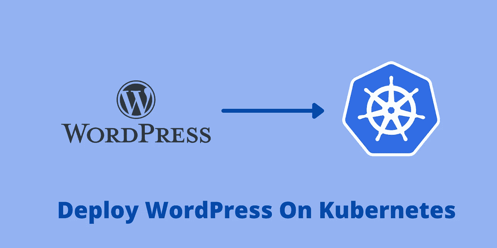

# 如何在 Kubernetes 上部署 WordPress 第 2 部分

> 原文：<https://medium.com/codex/how-to-deploy-wordpress-on-kubernetes-part-2-df1cc9cbaa2e?source=collection_archive---------1----------------------->

## 了解如何在 Kubernetes 上部署 WordPress 并与 MySQL Pod 连接。

Kubernetes 上的 WordPress

WordPress 需要 MySQL 来存储数据(文本内容)。在[之前的文章](/codex/how-to-deploy-wordpress-on-kubernetes-part-1-62cc5bd74410)中，您已经学习了如何在 Kubernetes 上部署 MySQL。如果你还没有完成 MySQL 设置，那么请访问这个[链接](/codex/how-to-deploy-wordpress-on-kubernetes-part-1-62cc5bd74410)并创建 MySQL Pod。在本教程中，您将学习如何…