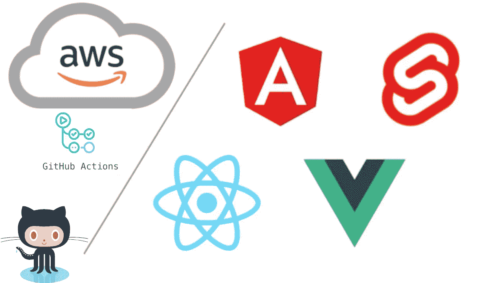

# 如何使用 GitHub 操作部署您的 AWS Web 应用程序

> 原文：<https://medium.com/codex/how-to-deploy-your-aws-web-app-with-github-actions-1fe8e4f36694?source=collection_archive---------5----------------------->

**Github Actions** 帮助您直接在 **Github** 资源库中启用和创建定制的软件开发生命周期工作流。在本文中，我将通过在部署到主分支时自动更新我的 **AWS S3** 桶来做到这一点。

> 为了能够自动部署到 AWS，您应该已经有了…