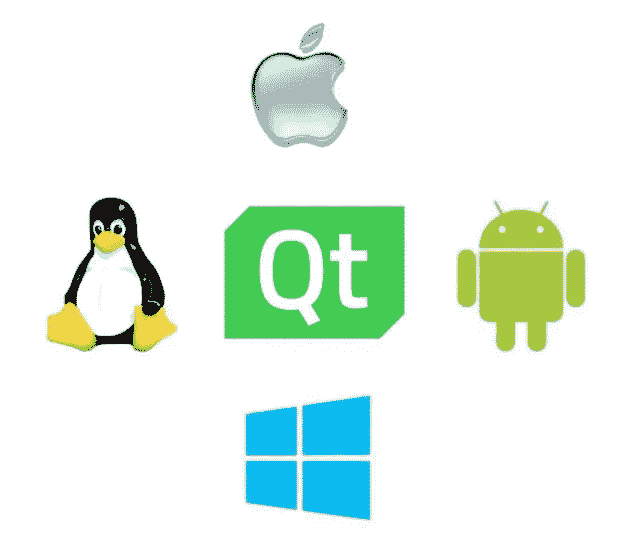

# 如何使用 macdeployqt 将 Qt 跨平台应用程序部署到 macOS 操作系统

> 原文：<https://medium.com/codex/how-to-deploy-your-qt-cross-platform-applications-to-macos-operating-system-using-macdeployqt-281614688dcf?source=collection_archive---------0----------------------->

## 本教程解释了使用 **macdeployqt** 将使用 Qt 框架制作的跨平台项目部署到 macOS 操作系统的方式。

# 设置环境