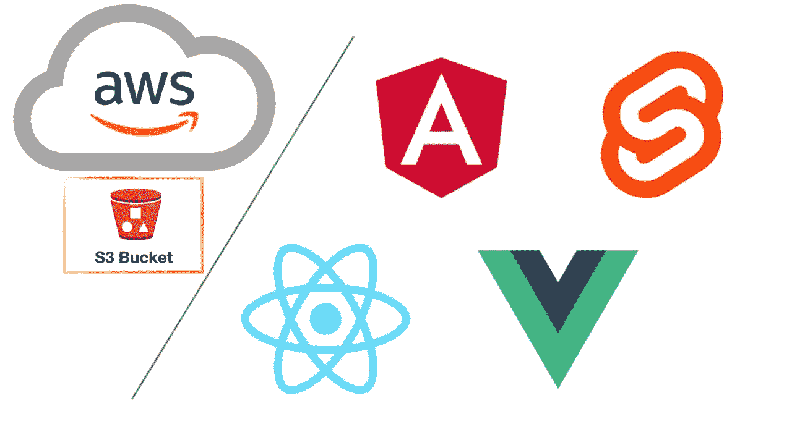

# 如何将您的 web 框架或库部署到 AWS S3 bucket

> 原文：<https://medium.com/codex/how-to-deploy-your-web-framework-or-library-to-aws-s3-bucket-d841f6084e45?source=collection_archive---------9----------------------->

如你所知，AWS S3 可以用来托管静态网站。回想起来，通过 **AWS** web 控制台设置这样一个存储桶需要几分钟时间，但有几个步骤需要考虑，有时在典型指南中会被忽略，因此我希望这个指南能帮助你。