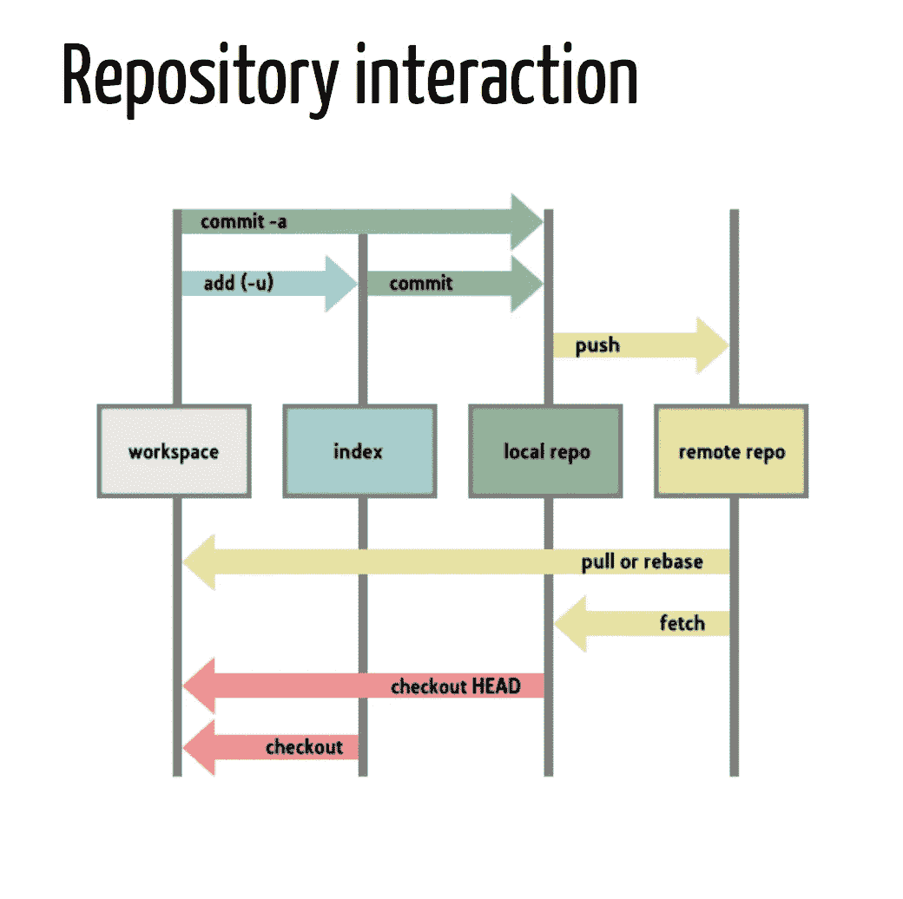
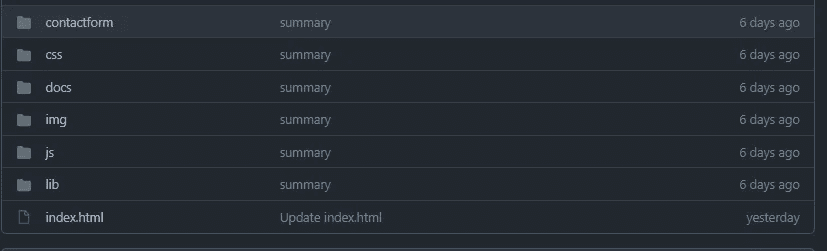
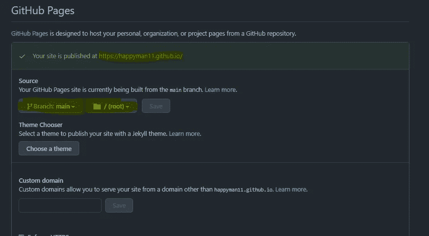

# 如何在 Github 中部署你的网站？

> 原文：<https://medium.com/codex/how-to-deploy-your-websites-in-github-446b0a401cab?source=collection_archive---------18----------------------->


照片由 [Richy Great](https://unsplash.com/@richygreat?utm_source=medium&utm_medium=referral) 在 [Unsplash](https://unsplash.com?utm_source=medium&utm_medium=referral) 上拍摄

在本文中，我们将了解如何在 Github 中部署 html 或静态代码 Github 是一个存储库，我们可以在其中存储代码并通过 Git-CLI 或 Git GUI 管理代码。

有关 AL/ML 模型部署的文章，请访问以下文章:

## [1。如何部署 AI 模型？—第一部分](https://becominghuman.ai/how-to-deployement-ai-models-part-1-49c2c334df18)

## [2。如何部署 AI 模型？—第 2 部分为 Herolu 和 Streamlit 设置 Github](https://becominghuman.ai/how-to-deploy-ai-models-part-2-setting-up-the-github-for-herolu-and-streamlit-9bf5b847eb97)

## [3。使用 Flask 和 Json 部署 AI 模型——第 3 部分](https://becominghuman.ai/deploy-ai-models-deployment-part-3-deploy-model-locally-using-flask-and-json-3d355891b0af)

## [4。如何部署 AI 模型？第 4 部分-通过 Github 在 Heroku 上部署 Web 应用程序](https://becominghuman.ai/how-to-deploy-ai-models-part-4-deploying-web-application-on-heroku-627b4b2207ff)

## [5。如何部署 AI 模型？第 5 部分-在 Heroku-CLI 上部署 Web 应用程序](https://becominghuman.ai/how-to-deploy-ai-models-part-5-deploying-web-application-on-heroku-cli-bc4418f57a83)

# 1.开源代码库

Git 是一个版本控制系统，它自动跟踪并记录一段时间以来在存储库(本地或远程)上执行的更改。下图总结了带有本地存储库和远程存储库的 git 的工作流程。



图 1 Git 工作流程

关于 Git 的细节可以在文章 [**如何部署 AI 模型中找到？——第 1 部分**](https://becominghuman.ai/how-to-deployement-ai-models-part-1-49c2c334df18) **，我已经讨论过版本**

# 2.静态页面

也称为静态页面，它被传送到客户端 web 浏览器，确切地说，它存储在服务器中，而不是动态生成网页。

静态页面通常是 HTML 档案，作为文档放在记录框架中，web 工作人员可以通过 HTTP(所有被认为是 URL 的东西都以“.”结尾)进行访问。html”通常不是静态的)。在任何情况下，该术语的免费翻译都可以包含放在信息库中的站点页面，甚至可以包含利用布局组织并通过应用程序工作人员提供的页面，只要提供的页面是永久的，并且基本上是在放入时介绍的。

静态网站页面适用于从不刷新或很少刷新的内容，然而，当前的 web 格式框架正在对此进行改进。如果没有机械化的设备，比如静态站点生成器，将大量的静态页面作为文档保存是不合逻辑的。另一种监督静态页面的方法是在线整合源代码丛林健身房，例如 GatsbyJS 和 GitHub 可以用来将 WordPress 网页重新定位到静态网站页面。任何个性化或智能化都需要运行客户端，这是有限制的。

# **3。创建站点**

本文致力于 Github 上的静态页面部署，所以在这一节中，我假设你们都习惯于 web 开发。但是，我会链接一些 Github 库，在那里你可以找到静态网页。在这些静态页面中，我们应该使用相对路径而不是绝对路径，主页或登录页面应该命名为 index.html

# **4。创建回购**

这是起主要作用的部分，我们都知道如何在 GitHub 中管理我们的库，如果没有，你可以访问[如何部署人工智能模型？—第 2 部分为 Herolu 和 Streamlit](https://becominghuman.ai/how-to-deploy-ai-models-part-2-setting-up-the-github-for-herolu-and-streamlit-9bf5b847eb97) 设置 GitHub 以获取深入知识。在为网页开发存储库时，我们通过添加“.”来命名存储库。io”就像“myprofile.io”一样，如果你可以使用带有后缀. io 的 GitHub 用户名。

# **5。推送您的代码**

如第 3 节所述，开发完整的网页后，本地存储库应该如下图所示:



图 2 存储库概述

现在我们必须将所有文件添加到 staging 区域，提交目录并将其推入 Github 存储库。以下是上述步骤的命令:

```
# get inside the local repository*Command:* git init*Command:* git add .*Command:* git commit -m “Type your comments here”*Command :* git remote add origin <repo link>*Command :* git push -u origin master
```

关于上述命令的详细信息，您可以访问文章:[如何部署人工智能模型？—第 2 部分为 Herolu 和 Streamlit 设置 GitHub](https://becominghuman.ai/how-to-deploy-ai-models-part-2-setting-up-the-github-for-herolu-and-streamlit-9bf5b847eb97)

# **6 最终部署**

现在我们已经完成了所有需要的过程，我们必须打开 github 存储库，导航到设置，在 Github 页面下选择分支 main 或 master，然后选择/root，如图所示:



图三。Github 页面设置

祝贺你们！！！，您已经在 Github 上部署了静态网页。

**Github 网页链接:**【https://happyman11.github.io/ 

# **特别感谢:**

> 正如我们所说的，没有好的引擎，汽车是没有用的。我要感谢我的导师以及我的偶像"***p . supra ja 博士"--在整个旅程中引导我，发自内心*** *。作为一个古鲁，她为我照亮了最好的道路，每当我遇到失败或障碍时激励我——没有她的支持和激励，这对我来说是不可能的任务。*

# 参考:

> *YouTube:**[*林*](https://www.youtube.com/channel/UCFG5x-VHtutn3zQzWBkXyFQ) *k**
> 
> **部署应用:* [*链接*](https://mycentralisedapplication.herokuapp.com/)*
> 
> **Github 页面* : [链接](https://happyman11.github.io/)*

**如果您有任何疑问，请随时通过以下选项与我联系:**

> ****网址:***[*www.rstiwari.com*](http://www.rstiwari.com/)*
> 
> ****中等****:*[*https://tiwari11-rst.medium.com*](https://tiwari11-rst.medium.com/)*
> 
> ****谷歌表单:***[*https://forms.gle/mhDYQKQJKtAKP78V7*](https://forms.gle/mhDYQKQJKtAKP78V7)*